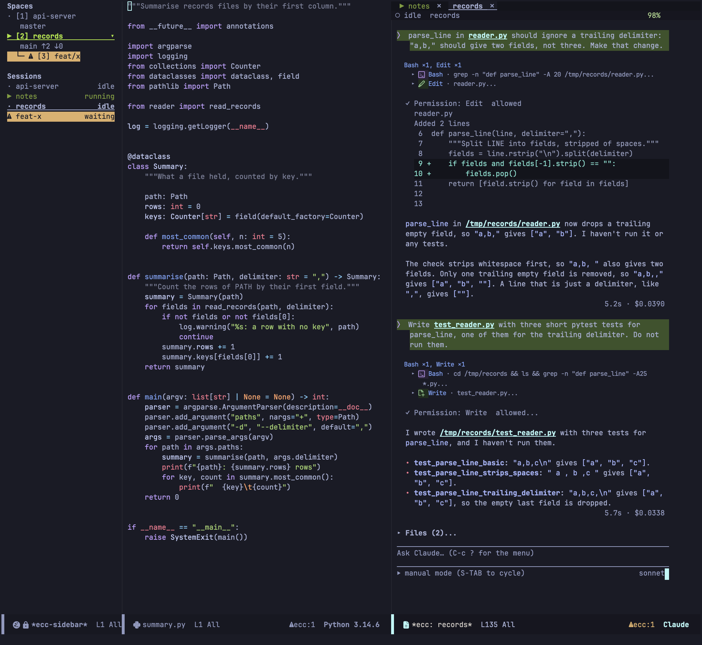

[English](README.md) | **日本語**

---

# Emacs Client for Claude Code

Claude Code CLI 向けの Emacs クライアントです。対話は通常の Emacs バッファの中で進みます。




**ドキュメント:** <https://wakamenod.github.io/emacs-claude-code/ja/>

> **1.0 未満です。** ecc はまだ安定版ではなく、破壊的変更が入る可能性が高い段階です。コマンド、キーバインド、設定はリリースをまたいで変更・削除されることがあります。更新する前に [CHANGELOG.md](CHANGELOG.md) を確認してください。

## 概要

ecc は `claude` をヘッドレスモードで実行し、パイプ越しに stream-json プロトコルで通信して、対話を標準の Emacs バッファに描画します。

対話履歴は通常のバッファテキストなので、検索、`occur`、ナローイング、コピー、Markdown へのエクスポートといった Emacs の操作がそのまま使えます。
face は挿入時に付き、`M-x customize` でカスタマイズできます。

### スコープとトレードオフ

- **ターミナルエミュレーションなし:** CLI のターミナル UI は再現しません。`ecc-tui-open` で実行中のセッションをターミナルへ引き渡し、終わったら戻せます。
- **Claude Code 専用:** Claude Code のプロトコルと直接通信します。汎用の LLM フロントエンドではありません。
- **軽量な描画処理:** Markdown、表、diff は外部パッケージではなく、ecc 内蔵の小さなパーサーで描画します。
- **プロトコルの直接反映:** 権限の確認要求、利用状況（`get_usage`）、会話ログは、推測ではなく CLI が報告するものをそのまま使います。

### 主な機能

- **[Diff レビュー](https://wakamenod.github.io/emacs-claude-code/ja/features/review/):** セッション中の変更を、編集・シェルコマンド・スクリプトのどれによるものでも、すべて 1 つの `diff-mode` バッファで確認できます。ハンクにインラインコメントを付け、まとめて 1 つのプロンプトとして送信できます。`ecc-review-style` を設定すると、同じレビューを ediff で開き、全ファイルを 1 つのセッションで左右に並べて表示できます。
- **[インタラクティブな編集](https://wakamenod.github.io/emacs-claude-code/ja/features/review/#適用前の提案をレビューする):** 提案されたファイル編集を適用前に確認・修正できます。
- **[ソースへジャンプ](https://wakamenod.github.io/emacs-claude-code/ja/features/prompt/#ソースを開く):** diff の行、ファイルを扱うツール呼び出しの見出し、Claude の返答中のパス（`foo.el:12`）で `RET` を押すかクリックすると、そのファイルを該当行で開きます。あとから同じファイルが変更されても、行番号はそれに合わせて補正します。
- **[プランモード](https://wakamenod.github.io/emacs-claude-code/ja/features/review/#プランモード):** 提案された計画を、編集可能なバッファで確認・調整できます。
- **[グローバル操作](https://wakamenod.github.io/emacs-claude-code/ja/reference/key-bindings/):** どのバッファからでも保留中のツール実行リクエストを許可・拒否できます。
- **[セッション管理](https://wakamenod.github.io/emacs-claude-code/ja/features/sessions/):** 同時に動いている複数のセッションをダッシュボードから管理できます。
- **[Space と worktree](https://wakamenod.github.io/emacs-claude-code/ja/features/spaces/):** プロジェクトごとに Emacs のタブ（Space）が割り当てられ、その中のウィンドウ配置は並べたまま保たれます（`ecc-use-spaces`、既定で有効）。サイドバーには全プロジェクトとセッションが動作状況とともに並び、`ecc-start-worktree` はリポジトリの隣にブランチをチェックアウトして独立した Space として開きます。
- **安全なデフォルト設定:** 自動承認は存在せず、勝手に許可されることはありません。答えられなくなったリクエストは拒否として記録されます。内蔵のループバック MCP サーバーは既定で無効で、Elisp の評価には明示的な有効化が必要です。

## 動作要件

- **Emacs 29.1 以上**（`transient` は Emacs に同梱されています。必須の外部パッケージはありません）
- **[Claude Code CLI](https://docs.claude.com/en/docs/claude-code)**（`PATH` 上に配置されているか、`ecc-executable` で指定されていること）

### 任意の依存関係

以下のパッケージは、インストールされていれば使います。なくても動作します。

- [ghostel](https://github.com/dakra/ghostel) — `ecc-tui-open` で引き渡したセッションのターミナルエミュレーター
- [posframe](https://github.com/tumashu/posframe) — `/btw` や利用状況のポップアップ表示
- [nerd-icons](https://github.com/rainstormstudio/nerd-icons.el) — ツールアイコンの表示
- [markdown-mode](https://github.com/jrblevin/markdown-mode) — プランバッファおよびレビューバッファのメジャーモード

## インストール

ecc は MELPA に登録されていません。本リポジトリから直接インストールしてください。

### Emacs 30 以上（`use-package` と `:vc`）

```elisp
(use-package ecc
  :ensure t
  :vc (:url "https://github.com/wakamenod/emacs-claude-code" :rev :newest))
```

*※ 特定のコミットに固定するには `:rev "<commit-sha>"` を指定します。*

### Emacs 29（`package-vc-install`）

```
M-x package-vc-install RET https://github.com/wakamenod/emacs-claude-code RET
```

その後、通常の `use-package` 宣言（`:vc` なし）で設定します。

<details>
<summary>straight.el、Elpaca</summary>

リポジトリ名（`emacs-claude-code`）とパッケージ名（`ecc`）が異なります。リポジトリの URL からパッケージ名を推測するパッケージマネージャーでは、パッケージ名を明示的に指定してください。

```elisp
;; straight.el
(use-package ecc
  :straight (ecc :type git :host github :repo "wakamenod/emacs-claude-code"))

;; Elpaca
(use-package ecc
  :ensure (ecc :host github :repo "wakamenod/emacs-claude-code"))
```
</details>

## 設定例

```elisp
(use-package ecc
  :ensure t
  :vc (:url "https://github.com/wakamenod/emacs-claude-code" :rev :newest)
  :bind-keymap ("C-c c" . ecc-global-map)
  :custom
  (ecc-permission-mode "auto")
  (ecc-notify-level 'pulse)
  (ecc-usage-display 'posframe)
  (ecc-btw-display 'posframe)
  (ecc-prompt-suggestions-enabled t)
  ;; ediff でレビューしたい場合はコメントを外す (既定は diff-mode バッファ)。
  ;; (ecc-review-style 'ediff)
  ;; Emacs の MCP サーバー。xref・imenu・flymake を Claude から参照でき、
  ;; 作業を worktree のセッションに引き渡すツールも有効になる。
  (ecc-mcp-enabled t))
```

その他の設定は[設定リファレンス](https://wakamenod.github.io/emacs-claude-code/ja/reference/configuration/) を参照してください。

## クイックスタート

1. プロジェクト内のバッファで `M-x ecc-start` を実行してセッションを開始します。
2. 画面下部のプロンプト領域にメッセージを入力します。
3. `C-c C-c` で送信します（`RET` は改行）。
4. Claude がツール実行の権限を求めてきたら、`C-c C-a` で許可、`C-c C-d` で拒否します。
5. `C-c ?` でコマンドメニューを開きます。

## キーバインド

プロンプト領域やトランスクリプト固有のキーバインドは
[プロンプトとトランスクリプト](https://wakamenod.github.io/emacs-claude-code/ja/features/prompt/) を、
任意のバッファから利用できるグローバルキーバインドは
[キーバインド一覧](https://wakamenod.github.io/emacs-claude-code/ja/reference/key-bindings/) を参照してください。

## 謝辞

ecc は以下のプロジェクトから着想を得ています。

* **[claude-code-ide.el](https://github.com/manzaltu/claude-code-ide.el)** — IDE 側における CLI 統合パターンの設計。
* **[claude-code.el](https://github.com/stevemolitor/claude-code.el)** — Emacs におけるターミナルバッファの操作性向上。
* **[eca-emacs](https://github.com/editor-code-assistant/eca-emacs)** — バッファベースのチャット描画とインラインオーバーレイの構造。
* **[emacs-gravity](https://github.com/gdanov/emacs-gravity)** — 構造化ツリーナビゲーション、プランレビュー、承認ワークフロー。

## 他プロジェクトとの比較

Claude Code 向け Emacs パッケージの比較：

| プロジェクト | 通信プロトコル / 経路 | UI 形式 | 外部依存パッケージ | 必要 Emacs バージョン | 入手先 |
| --- | --- | --- | --- | --- | --- |
| [claude-code-ide.el](https://github.com/manzaltu/claude-code-ide.el) | CLI TUI + WebSocket MCP サーバー | ターミナルエミュレーター | `websocket`, `transient`, `web-server` | 28.1 | GitHub |
| [claude-code.el](https://github.com/stevemolitor/claude-code.el) | CLI TUI | ターミナルエミュレーター | `transient`, `inheritenv` | 30 | GitHub |
| [eca-emacs](https://github.com/editor-code-assistant/eca-emacs) | 独立した `eca` バイナリとの JSON-RPC | Markdown バッファ + オーバーレイ | `dash`, `s`, `f`, `markdown-mode`, `compat` | 28.1 | MELPA |
| [emacs-gravity](https://github.com/gdanov/emacs-gravity) | プラグインフック + Node シム + ソケット | Magit-section ツリー | `magit-section`, `transient`, Node.js | 27.1 | GitHub |
| **ecc** | ヘッドレス `claude` とのパイプ経由 stream-json | 標準バッファ（履歴 + プロンプト） | なし | 29.1 | GitHub |

外部依存パッケージの列は、各プロジェクトの `Package-Requires` が Emacs 本体以外に挙げているものです（2026-09-18 に各プロジェクトを確認）。`transient` は Emacs 28.1 以降に同梱されているため、同梱版で足りるパッケージは依存として宣言しません。ここで `transient` を挙げている 3 つは、対象 Emacs の同梱版より新しいものを要求しています。ecc は `posframe` と `nerd-icons` がインストールされていれば使いますが、どちらがなくても動作するため、依存には含みません。

### 設計上の特徴

* **claude-code-ide.el:** ターミナルバッファ内でネイティブ TUI を保持しつつ、IDE 側の完全な MCP 統合を提供。
* **claude-code.el:** ネイティブ CLI TUI を Emacs のターミナルバッファ内で直接動作させる軽量ラッパー。
* **eca-emacs:** 外部サーバーバイナリに依存し、特定のベンダーに固定されない設計。
* **emacs-gravity:** プラグインフックを用いて Emacs、tmux、システムトレイを横断し、外部セッションまで捉える高度な統合。
* **ecc:** ターミナルエミュレーターを使用せず、CLI ストリームを直接標準の編集可能な Emacs テキストバッファに変換。

## ライセンス

GPL-3.0-or-later。[LICENSE](LICENSE) を参照してください。
