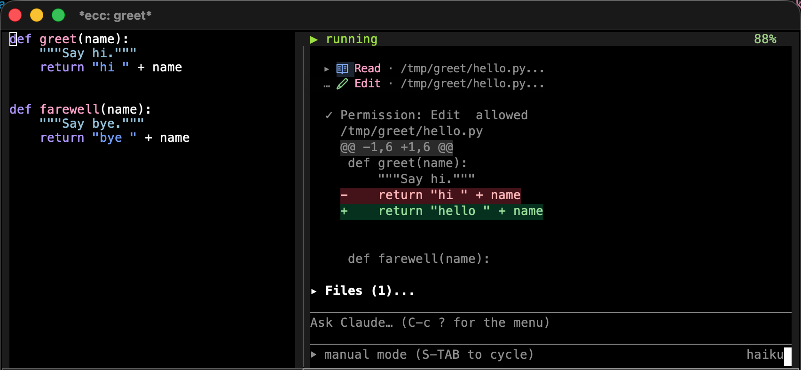

**English** | [日本語](README.ja.md)

---

# ecc

An Emacs client for the Claude Code CLI. Conversations run directly inside ordinary Emacs buffers.




**Documentation:** <https://wakamenod.github.io/emacs-claude-code/> *(in progress)*

## Overview

ecc runs `claude` in headless mode, communicates over pipes using its stream-json protocol, and renders the session in a standard Emacs buffer (a read-only transcript at the top, an editable prompt at the bottom, separated by a divider). 

Because the transcript is standard buffer text, you can use regular Emacs workflows: search, `occur`, narrowing, copying, and exporting to Markdown. Buffer faces are applied on insertion and can be customized with `M-x customize`.

### Scope and Trade-offs

- **No terminal emulation:** ecc does not replicate the CLI's terminal UI. Use `ecc-tui-open` to hand off a live session to a terminal and pull it back when finished.
- **Claude Code only:** ecc speaks the Claude Code protocol directly; it is not a general-purpose LLM frontend.
- **Lightweight renderers:** Markdown, tables, and diffs are rendered using ecc's built-in parsers rather than full-featured external implementations.
- **Direct protocol reflection:** Permission requests, usage data (`get_usage`), and conversation logs come directly from the CLI without guesswork.

### Key Features

- **Diff reviews:** Inspect all changes made during a session in a single `diff-mode` buffer. Add inline comments to hunks and submit them as a single prompt.
- **Interactive edits:** Review and modify proposed file edits before approving them.
- **Plan mode:** Work through proposed execution plans in a writable buffer.
- **Global access:** Approve or deny pending tool requests from any buffer.
- **Session management:** Manage multiple concurrent sessions from a dashboard.
- **Safe defaults:** Permission prompts default to deny. The built-in loopback MCP server is disabled by default, and evaluating Elisp requires explicit opt-in.

## Requirements

- **Emacs 29.1+** (`transient` is built-in; no required external packages)
- **[Claude Code CLI](https://docs.claude.com/en/docs/claude-code)** on `PATH` or configured via `ecc-executable`

### Optional Dependencies

These packages enhance functionality when available, but ecc falls back gracefully if they are absent:

- [ghostel](https://github.com/dakra/ghostel) — Hands off sessions to a terminal.
- [posframe](https://github.com/tumashu/posframe) — Displays `/btw` and usage popups.
- [nerd-icons](https://github.com/rainstormstudio/nerd-icons.el) — Adds tool icons.
- [markdown-mode](https://github.com/jrblevin/markdown-mode) — Serves as the major mode for plan and review buffers.

## Installation

ecc is not on MELPA. Install it directly from this repository.

### Emacs 30+ (`use-package` with `:vc`)

```elisp
(use-package ecc
  :ensure t
  :vc (:url "https://github.com/wakamenod/emacs-claude-code" :rev :newest))
```

*Note: You can pin a specific commit by passing `:rev "<commit-sha>"`.*

### Emacs 29 (`package-vc-install`)

```
M-x package-vc-install RET https://github.com/wakamenod/emacs-claude-code RET
```

Then configure it with a standard `use-package` declaration (without `:vc`).

<details>
<summary>straight.el, Elpaca, or manual clone</summary>

Because the repository name is `emacs-claude-code` while the package name is `ecc`, recipes must declare the package name explicitly:

```elisp
;; straight.el
(use-package ecc
  :straight (ecc :type git :host github :repo "wakamenod/emacs-claude-code"))

;; Elpaca
(use-package ecc
  :ensure (ecc :host github :repo "wakamenod/emacs-claude-code"))
```

Manual clone:

```sh
git clone https://github.com/wakamenod/emacs-claude-code ~/.emacs.d/site-lisp/emacs-claude-code
```

```elisp
(add-to-list 'load-path "~/.emacs.d/site-lisp/emacs-claude-code")
(require 'ecc)
```

`M-x ecc-start` is autoloaded. To bind `ecc-global-map` outside `use-package`, ensure ecc is loaded first or use `use-package` with `:bind-keymap`.
</details>

## Configuration

```elisp
(use-package ecc
  :ensure t
  :vc (:url "https://github.com/wakamenod/emacs-claude-code" :rev :newest)
  ;; `ecc-global-map' allows answering prompts from any buffer.
  ;; `:bind-keymap' defers loading ecc until the prefix is pressed.
  :bind-keymap ("C-c c" . ecc-global-map)
  :bind ("C-c C-v" . ecc-start)
  :config
  (setq ecc-chat-text-width 100)      ; Transcript width in columns
  (setq ecc-notify-level 'pulse)      ; nil, 'message, 'pulse, or 'desktop
  (setq ecc-permission-mode nil)      ; nil keeps the CLI default

  ;; Set to t to make RET send messages (like the CLI).
  ;; When nil, RET inserts a newline and C-c C-c sends.
  (setq ecc-chat-return-sends nil)

  ;; Loopback MCP server (exposes xref, imenu, tree-sitter, project, diagnostics).
  ;; Disabled by default.
  ;; (setq ecc-mcp-enabled t)
  ;; Elisp evaluation tool requires separate activation:
  ;; (setq ecc-mcp-enable-execute-code t)
  )
```

For all other settings, run `M-x customize-group RET ecc` or check the [configuration reference](https://wakamenod.github.io/emacs-claude-code/).

## Quickstart

1. Run `M-x ecc-start` in a project buffer to start a session.
2. Type your message in the bottom prompt region.
3. Press `C-c C-c` to send (`RET` inserts a newline).
4. When Claude requests tool permissions, press `C-c C-a` to allow or `C-c C-d` to deny. **Prompts default to deny.**
5. Press `C-c ?` to open the command menu.

## Key Bindings

### Global Map (`C-c c`)

Usable from any buffer:

| Key | Command | Action |
|---|---|---|
| `a` | `ecc-answer-allow` | Allow oldest waiting request |
| `d` | `ecc-answer-deny` | Deny oldest waiting request |
| `1`–`4` | `ecc-answer-option-N` | Select response option N |
| `n` | `ecc-next-attention` | Switch to waiting session |
| `N` | `ecc-next-attention-in-project` | Switch to waiting session in current project |
| `D` | `ecc-dashboard` | Open sessions dashboard |
| `h` | `ecc-history-open` | Open past conversation |

### Session Buffer

| Key | Action |
|---|---|
| `C-c C-c` | Send prompt |
| `S-RET` | Insert newline |
| `TAB` | Completion in prompt; fold/unfold in transcript |
| `C-c C-a` / `C-c C-d` | Allow / Deny tool permission |
| `C-c ?` | Open command menu |

See the [key binding reference](https://wakamenod.github.io/emacs-claude-code/) for full listings.

## Acknowledgements

ecc builds on ideas from:

- **[claude-code-ide.el](https://github.com/manzaltu/claude-code-ide.el)** — IDE-side CLI integration patterns.
- **[claude-code.el](https://github.com/stevemolitor/claude-code.el)** — Terminal-buffer ergonomics in Emacs.
- **[eca-emacs](https://github.com/editor-code-assistant/eca-emacs)** — Buffer-based chat formatting and inline overlays.
- **[emacs-gravity](https://github.com/gdanov/emacs-gravity)** — Structured tree navigation, plan reviews, and approval workflows.

## Comparison

Comparison of Emacs packages for Claude Code:

| Project | Protocol / Transport | UI Type | Dependencies | Emacs Version | Source |
|---|---|---|---|---|---|
| [claude-code-ide.el](https://github.com/manzaltu/claude-code-ide.el) | CLI TUI + WebSocket MCP server | Terminal emulator | `websocket`, `transient`, `web-server` | 28.1 | MELPA |
| [claude-code.el](https://github.com/stevemolitor/claude-code.el) | CLI TUI | Terminal emulator | `transient`, `inheritenv` | 30 | MELPA |
| [eca-emacs](https://github.com/editor-code-assistant/eca-emacs) | JSON-RPC via standalone `eca` binary | Markdown buffer + overlays | `dash`, `s`, `f`, `markdown-mode`, `compat`, `eca` | 28.1 | MELPA |
| [emacs-gravity](https://github.com/gdanov/emacs-gravity) | Plugin hooks + Node shim + socket | Magit-section tree | `magit-section`, `transient`, Node.js | 27.1 | GitHub |
| **ecc** | Headless `claude` stream-json via pipe | Standard buffer (transcript + prompt) | None | 29.1 | GitHub |

### Architectural Focus

- **claude-code-ide.el:** Preserves the native TUI in a terminal buffer while providing full IDE-side MCP integration.
- **claude-code.el:** Lightweight wrapper running the native CLI TUI directly in an Emacs terminal buffer.
- **eca-emacs:** Provider-agnostic architecture backed by an external server binary.
- **emacs-gravity:** Deep hook-based integration capturing external sessions across Emacs, tmux, and system trays.
- **ecc:** Converts CLI streams into standard editable Emacs text buffers without running a terminal emulator.

## License

GPL-3.0-or-later. See [LICENSE](LICENSE).
