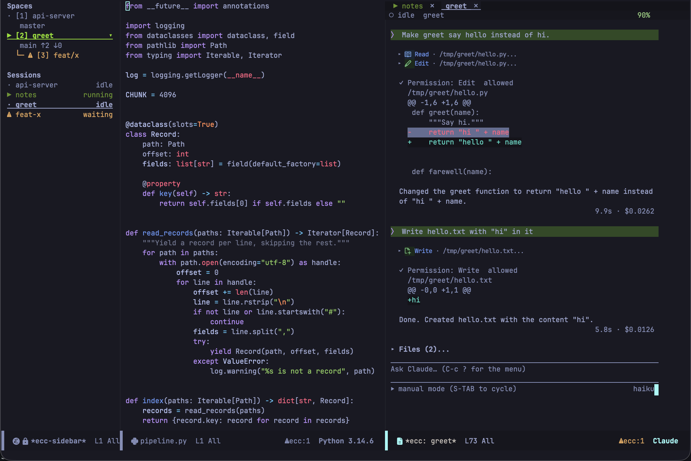
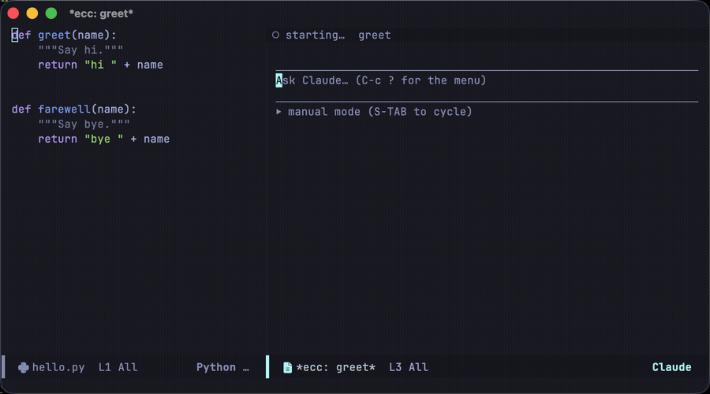

**English** | [日本語](README.ja.md)

---

# Emacs Client for Claude Code

An Emacs client for the Claude Code CLI. Conversations run directly inside ordinary Emacs buffers.






**Documentation:** <https://wakamenod.github.io/emacs-claude-code/>

> **Pre-1.0.** ecc is not stable yet, and breaking changes are likely: commands, key bindings and settings can change or go away from one release to the next. Read [CHANGELOG.md](CHANGELOG.md) before upgrading.

## Overview

ecc runs `claude` in headless mode, communicates over pipes using its stream-json protocol, and renders the session in a standard Emacs buffer.

Because the transcript is standard buffer text, you can use regular Emacs workflows: search, `occur`, narrowing, copying, and exporting to Markdown. Buffer faces are applied on insertion and can be customized with `M-x customize`.

### Scope and Trade-offs

- **No terminal emulation:** ecc does not replicate the CLI's terminal UI. Use `ecc-tui-open` to hand off a live session to a terminal and bring it back when finished.
- **Claude Code only:** ecc speaks the Claude Code protocol directly; it is not a general-purpose LLM frontend.
- **Built-in renderers:** Markdown, tables, and diffs are rendered using ecc's lightweight built-in parsers rather than heavyweight external dependencies.
- **Direct protocol reflection:** Permission requests, usage metrics (`get_usage`), and conversation logs come directly from the CLI without guesswork.

### Key Features

- **[Diff reviews](https://wakamenod.github.io/emacs-claude-code/features/review/):** Inspect all changes made during a session in a single `diff-mode` buffer. Add inline comments to hunks and submit them as a single prompt.
- **[Interactive edits](https://wakamenod.github.io/emacs-claude-code/features/review/#reviewing-a-proposal-before-it-is-applied):** Review and modify proposed file edits before approving them.
- **[Plan mode](https://wakamenod.github.io/emacs-claude-code/features/review/#plan-mode):** Work through proposed execution plans in a writable buffer.
- **[Global access](https://wakamenod.github.io/emacs-claude-code/reference/key-bindings/):** Approve or deny pending tool requests from any buffer.
- **[Session management](https://wakamenod.github.io/emacs-claude-code/features/sessions/):** Manage multiple concurrent sessions from a dashboard.
- **[One project at a time](https://wakamenod.github.io/emacs-claude-code/features/sessions/#focusing-one-project):** `ecc-focus-project` focuses the whole frame on a single project. Window tabs show only that project's sessions.
- **Safe defaults:** Permission prompts default to deny. The built-in loopback MCP server is disabled by default, and evaluating Elisp requires explicit opt-in.

## Requirements

- **Emacs 29.1+** (`transient` is built-in; no required external packages)
- **[Claude Code CLI](https://docs.claude.com/en/docs/claude-code)** on `PATH` or configured via `ecc-executable`

### Optional Dependencies

These packages enhance functionality when available, but ecc falls back gracefully if they are absent:

- [ghostel](https://github.com/dakra/ghostel) — Terminal emulator for sessions handed over by `ecc-tui-open`.
- [posframe](https://github.com/tumashu/posframe) — Floating popups for `/btw` side-queries and usage reports.
- [nerd-icons](https://github.com/rainstormstudio/nerd-icons.el) — Icons for tool calls in the transcript.
- [markdown-mode](https://github.com/jrblevin/markdown-mode) — Major mode for plan and review buffers.

## Installation

ecc is not currently on MELPA; install it directly from this repository.

### Emacs 30+ (`use-package` with `:vc`)

```elisp
(use-package ecc
  :ensure t
  :vc (:url "https://github.com/wakamenod/emacs-claude-code" :rev :newest))
```

*Note: You can pin a specific commit by passing `:rev "<commit-sha>"`.*

### Emacs 29 (`package-vc-install`)

```
M-x package-vc-install RET https://github.com/wakamenod/emacs-claude-code RET
```

Then configure it with a standard `use-package` declaration (without `:vc`).

<details>
<summary>straight.el or Elpaca</summary>

Because the repository name is `emacs-claude-code` while the package name is `ecc`, package managers that infer the package name from the repository URL must declare it explicitly:

```elisp
;; straight.el
(use-package ecc
  :straight (ecc :type git :host github :repo "wakamenod/emacs-claude-code"))

;; Elpaca
(use-package ecc
  :ensure (ecc :host github :repo "wakamenod/emacs-claude-code"))
```
</details>

## Configuration

```elisp
(use-package ecc
  :ensure t
  :vc (:url "https://github.com/wakamenod/emacs-claude-code" :rev :newest)
  :bind-keymap ("C-c c" . ecc-global-map)
  :custom
  (ecc-permission-mode "auto")
  (ecc-notify-level 'pulse)
  (ecc-usage-display 'posframe)
  (ecc-btw-display 'posframe)
  (ecc-prompt-suggestions-enabled t))
```

For all other settings, check the [configuration reference](https://wakamenod.github.io/emacs-claude-code/reference/configuration/).

## Quickstart

1. Run `M-x ecc-start` in a project buffer to start a session.
2. Type your message in the bottom prompt region.
3. Press `C-c C-c` to send (`RET` inserts a newline).
4. When Claude requests tool permissions, press `C-c C-a` to allow or `C-c C-d` to deny.
5. Press `C-c ?` to open the command menu.

## Key Bindings

For prompt and transcript keybindings, see
[Prompt and transcript](https://wakamenod.github.io/emacs-claude-code/features/prompt/).
For global keybindings accessible from any buffer, see the
[keybindings reference](https://wakamenod.github.io/emacs-claude-code/reference/key-bindings/).

## Acknowledgements

ecc builds on ideas from:

- **[claude-code-ide.el](https://github.com/manzaltu/claude-code-ide.el)** — IDE-side CLI integration patterns.
- **[claude-code.el](https://github.com/stevemolitor/claude-code.el)** — Terminal-buffer ergonomics in Emacs.
- **[eca-emacs](https://github.com/editor-code-assistant/eca-emacs)** — Buffer-based chat formatting and inline overlays.
- **[emacs-gravity](https://github.com/gdanov/emacs-gravity)** — Structured tree navigation, plan reviews, and approval workflows.

## Comparison

Comparison of Emacs packages for Claude Code:

| Project | Protocol / Transport | UI Type | Dependencies | Emacs Version | Source |
|---|---|---|---|---|---|
| [claude-code-ide.el](https://github.com/manzaltu/claude-code-ide.el) | CLI TUI + WebSocket MCP server | Terminal emulator | `websocket`, `transient`, `web-server` | 28.1 | MELPA |
| [claude-code.el](https://github.com/stevemolitor/claude-code.el) | CLI TUI | Terminal emulator | `transient`, `inheritenv` | 30 | MELPA |
| [eca-emacs](https://github.com/editor-code-assistant/eca-emacs) | JSON-RPC via standalone `eca` binary | Markdown buffer + overlays | `dash`, `s`, `f`, `markdown-mode`, `compat`, `eca` | 28.1 | MELPA |
| [emacs-gravity](https://github.com/gdanov/emacs-gravity) | Plugin hooks + Node shim + socket | Magit-section tree | `magit-section`, `transient`, Node.js | 27.1 | GitHub |
| **ecc** | Headless `claude` stream-json via pipe | Standard buffer (transcript + prompt) | None | 29.1 | GitHub |

### Architectural Focus

- **claude-code-ide.el:** Preserves the native TUI in a terminal buffer while providing full IDE-side MCP integration.
- **claude-code.el:** Lightweight wrapper running the native CLI TUI directly in an Emacs terminal buffer.
- **eca-emacs:** Provider-agnostic architecture backed by an external server binary.
- **emacs-gravity:** Deep hook-based integration capturing external sessions across Emacs, tmux, and system trays.
- **ecc:** Converts CLI streams into standard editable Emacs text buffers without running a terminal emulator.

## License

GPL-3.0-or-later. See [LICENSE](LICENSE).
