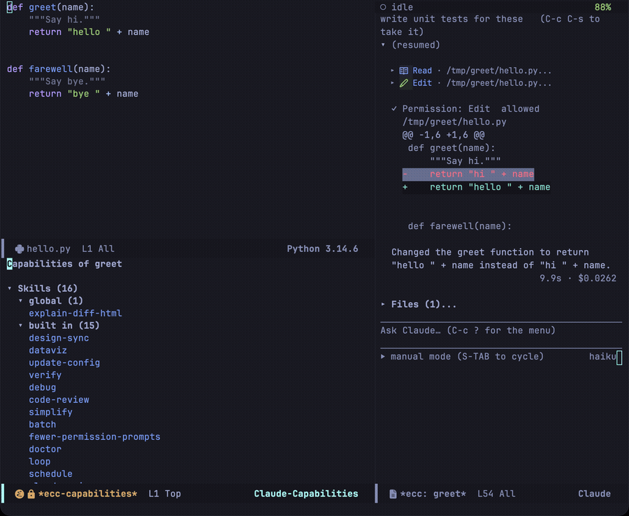
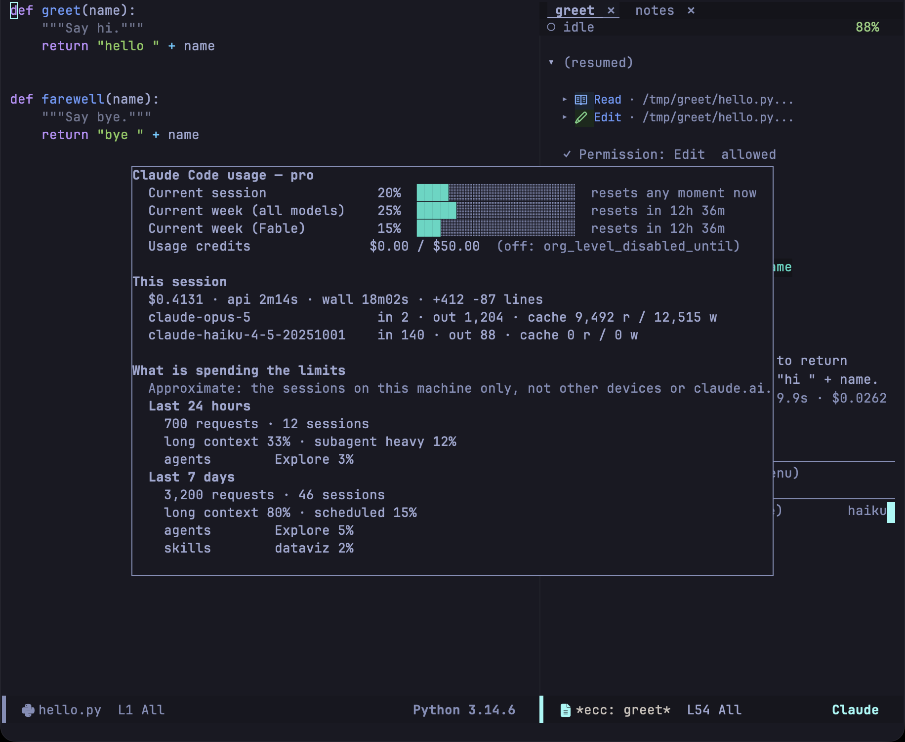

## Capabilities

Press `y` in the transient menu or `C` in the dashboard to inspect active session capabilities reported by the CLI during `system/init`: skills, subagents, slash commands, MCP servers, and plugins. Items are grouped by origin (project, user configuration, plugin, or built-in).

Press `TAB` to expand or collapse groups, `RET` to inspect the item at point, and `g` to refresh. The buffer indicates when no capabilities have been initialized yet prior to the first turn.

## Plugins

Type `/plugins` in the prompt region, press `I` in the transient menu, or run
`M-x ecc-plugin` to browse and manage plugins. `/plugins` is answered by Emacs
itself — it never reaches the model — and anything after it narrows the rows, so
`/plugins mcp` opens on the plugins that mention MCP. The CLI's own `/plugins` is a screen the terminal client draws for
itself — it is not a slash command, so it cannot be sent over stream-json —
and this is ecc's equivalent, built on the `claude plugin` subcommands.

The buffer has four tabs, walked with `TAB` and `S-TAB` or picked with `1`–`4`:

| Tab | What it shows |
|---|---|
| Discover | Every plugin the configured marketplaces offer, with its description and install count |
| Installed | The installed plugins **and skills** in one list, grouped by where they come from, with what is turned off folded away |
| Marketplaces | The configured marketplaces, and a row that adds one |
| Errors | A subcommand that failed, and an installed plugin whose directory is gone |

| Key | Action |
|---|---|
| `s` | Search, filtering the rows as you type (`C-g` puts back what was there) |
| `/` | Jump to a row by completion over the whole tab — the better way through 297 plugins |
| `RET` | Describe the plugin at point, open a skill's `SKILL.md`, or fold the group |
| `i` | Install the plugin at point, asking for the scope (user, project, or local) |
| `SPC` or `e` | Turn the plugin or skill at point on or off |
| `E` | Set the state by name — a skill has four of them |
| `u` | Update the plugin, or the marketplace, at point |
| `d` | Uninstall the plugin, or remove the marketplace, at point |
| `a` | Add a marketplace from a repository, URL, or path |
| `p` | Remove auto-installed plugins nothing needs any more |
| `g` | Read everything again |

Each tab draws a search line at the top and names its keys in the header line, which
scrolling cannot take away.

A skill has four states, not two: `on`, `name-only` (listed without its description),
`user-invocable-only` (hidden from the model, still reachable as `/name`), and `off`.
`SPC` moves between `on` and `off`; `E` sets any of them.

Skills are read from `~/.claude/skills`, the project's `.claude/skills`, and the `skills/`
of each installed plugin. The bundled skills are named nowhere on disk — they come from
the `skills` of `system/init`, so they appear once a session has spoken. Turning a skill
off has no subcommand: ecc writes `skillOverrides` into your settings file. The CLI merges
that key across settings scopes by taking the most restrictive value, so a project that
turns a skill off is not undone in your user settings, and ecc says so when that happens.

A session that is already running keeps the plugins it started with, so a change
offers to send `/reload-plugins` to the running sessions. `ecc-plugin-reload-sessions`
decides whether that is asked (the default), always done, or never done.

The real screen has a fifth tab, Stats: a table of the skills a session loaded with the
tokens attributed to each over a week. It is computed by scanning the local sessions and
nothing exports it, so there is no Stats tab here rather than a tab of something else
wearing its name. What one plugin brings and costs is on `RET`. Nothing reports the plugin
load errors of the real Errors tab either, so that tab holds what Emacs can see for
itself.

`ecc-disabled-plugins` is a different thing: it turns a plugin off for the sessions
ecc starts, without touching the terminal client. A plugin in that list is marked
apart in the Installed tab.

## Usage

Press `U` in the transient menu, `C-c c U`, or run `M-x ecc-usage` to view Claude Code plan usage and rate limit status.

Metrics come directly from the CLI — identical to what appears under Settings → Usage in the web client — without local estimation. If no session is currently active, ecc launches a temporary CLI query and stops it immediately; no prompt is sent, so querying incurs no token cost.

| Key | Action |
|---|---|
| `g` | Refresh usage metrics |
| `b` | Toggle breakdown of rate limit consumption |
| `q` | Dismiss report |

`ecc-usage-display` controls whether the report floats over the frame (using posframe) or appears in an ordinary window. The breakdown scans session activity recorded on **this machine**; activity on other devices or claude.ai is not included.

All configuration options are listed in the [configuration reference](/emacs-claude-code/reference/configuration/).
