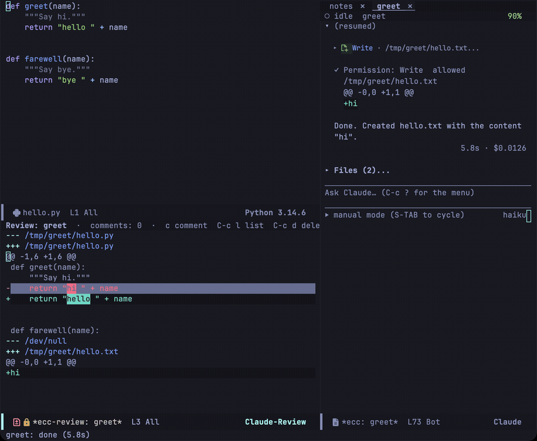
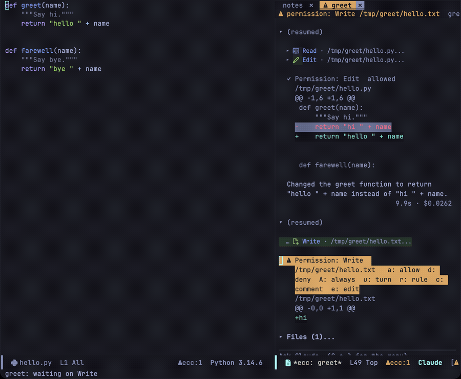
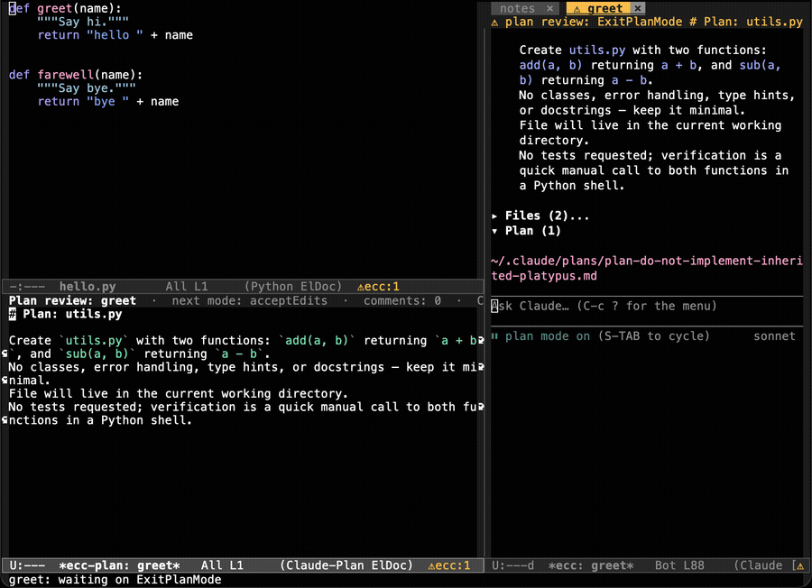
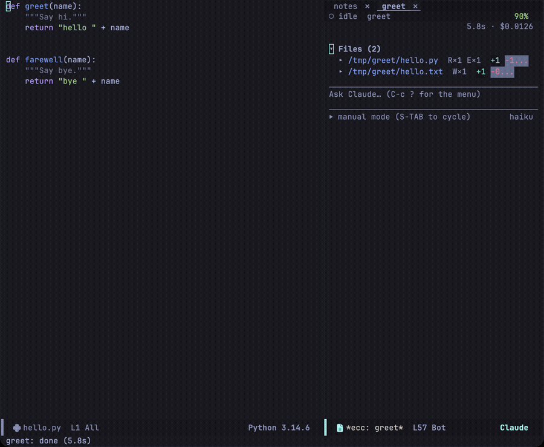

Review changes as a single diff, comment on hunks that need work, and send all comments in a single prompt. The same buffer reviews what a session changed, the working tree it modified, or a single proposal before it is applied.

`C-c c D` opens a menu where you choose what to compare. The two reviews used most often are the same review with a different base:

- `D` in the menu — against **where the session started**, so work committed during the session is still shown.
- `w` in the menu — against **the last commit (`HEAD`)**, so only uncommitted changes are shown.

Neither cares how a file was changed: an edit, a shell command and a script all show alike.

## Choosing what to compare

`C-c c D`, or `D` in the transient menu, opens `ecc-review-menu`. It asks what to compare before anything opens, and each line shows how many files that review would show:

| Key | Compares |
|---|---|
| `D` | Everything since the session started ([below](#reviewing-session-changes)) |
| `w` | Uncommitted changes, staged or not, against `HEAD`, as `M-x ecc-review-range` does |
| `u` | Unstaged changes |
| `s` | Staged changes |
| `b` | This branch against another |
| `p` | A GitHub pull request, shown only when the `gh` CLI is installed |
| `c` | One commit, or a run of commits |
| `r` | A range you type, as `C-u M-x ecc-review-range` takes it |

The git choices (`w` to `r`, and `p`) review the project of the current buffer and send your comments to its session. If the project has no session yet, they offer to start one. `D` reviews that session, or the session you used last when the project has none. The heading names the session and the project. `S` switches the whole menu to another session and its project, with the sessions of the current project listed first, so the menu never compares one project and sends the comments to another. Its first choice, `+ new session`, starts a session in the menu's project and sends the comments there. The new session has the review tools, so `T` works right away. `-f` asks for the files to keep once you have chosen what to compare. `-e` opens this one review in ediff, or as a diff when `ecc-review-style` is `'ediff`, and leaves the setting as it is. Outside a Git repository you can choose only `D`, and the menu says why. The menu marks your last choice with `(last)` and puts the cursor on it, so `RET` opens it again. If a count fails, the line shows `?` and the echo area says why.

`b` first asks for the base, the before side. The default is the branch the current one most likely started from. The candidates are `develop`, `main`, `master` and the branch `origin/HEAD` points to. On one of those branches, its upstream is a candidate too, so on `main` the default is `origin/main`, where your unpushed commits show. The menu skips a candidate that is ahead of `HEAD`, such as `develop` when you are on `main` and `develop` has moved on. A candidate at `HEAD` itself stays: it is the branch you just created yours from. Of these, the one with the fewest commits up to `HEAD` wins. If that is a local branch that is behind its upstream and has no commits of its own, the default is the upstream instead: a local `develop` four commits behind `origin/develop` would put commits you have not pulled into the review. If no candidate remains, `b` asks for the branch with no default. Each branch in the list shows how far it is from its upstream, as in `develop  (4 behind origin/develop)`.

It then asks for the after side, the changes. The default is the current branch with its working tree: the review compares the commit where the two branches part with your files as they are now, so the review includes uncommitted and untracked files. The review buffer takes its name from the base, as in `develop + working tree`, and opening the same choice again reuses that buffer. If Claude opens the same comparison with `review_open`, it opens this buffer too, so its comments land in the review you are reading. Choosing another branch shows `BASE...BRANCH`, the way a pull request shows it.

`c` asks for a commit from the recent history, then for the last commit to include. Press `RET` at the second question to review that commit alone (`X^!`). If you choose a second commit, the review covers both and every commit between them (`X^..Y`), in whichever order you chose them. The first commit of a repository has no parent, so it is compared with the empty tree. The review takes its name from the short commit ID and subject, whether you or Claude opened it, and it stays on those commits when `HEAD` moves.

`p` appears only when the `gh` CLI is on your `PATH`; ecc does not depend on it, and opening the menu runs nothing. Pressing `p` asks gh for the open pull requests of the project's repository and offers them in gh's order, as in `#113  fix(review): …  fix/x → develop  @someone`, with drafts marked. The default is the open pull request of the branch you have checked out.

The first entry, `Search pull requests…`, asks for words and searches every pull request of the repository, open, closed and merged alike. GitHub's search syntax works, as in `is:merged author:someone` or `label:bug`. Words typed at the list are searched for too, when no entry matches them: what is submitted that is neither an entry nor a number is a search. A completion UI that keeps the first candidate selected, such as vertico, submits that candidate on `RET` whenever one matches, and once you type, the search entry is filtered away. There, submit the words as typed with the UI's own key — `M-RET` in vertico (`vertico-exit-input`), `M-j` in icomplete and fido, `C-M-j` in ivy — or choose `Search pull requests…` before typing. The results are offered the same way, closed and merged ones marked `[closed]` and `[merged]`, with the search entry first again to search once more. gh runs only when you press `RET`, not as you type. A number, with or without `#`, opens that pull request directly, merged or closed ones included. If gh fails, for example because you are not logged in or the project has no GitHub remote, the error shows what gh said.

The diff comes from your local git, not from `gh pr diff`, so the review has whole files and works in ediff, with `-f`, `-e`, comments and sending as usual. A pull request of another branch is compared as `BASE...HEAD` by commit ID, the files GitHub shows as changed, and the review is called `PR #N title`. If your repository lacks a commit, ecc fetches only what is missing from the matching remote: the pull request's head (`pull/N/head`, which works for a fork too), then the base branch if the base commit is still missing. A merged pull request whose base branch was deleted still works when its head brings the base commit along. The fetch writes `FETCH_HEAD` and nothing else: no branch or ref is created, and `HEAD` and your files are left alone. An open pull request of the branch you have checked out is reviewed like `b` with the current branch instead: the commit where it parts from the base against your working tree, called `develop + working tree` as `b` calls it, so the two open the same review. That way the review includes what you have not pushed yet, and its lines match the files Claude edits. A closed or merged pull request is always `BASE...HEAD`, even if a branch of its name is checked out.

### When the changes are not on disk

Your comments go to a session whose Claude edits the files on disk. When the right side of a review is a commit rather than your working tree, as with somebody else's pull request, `b` with another branch, `c` of an older commit, or `r` of two commits, those lines are not in your files. The header line then says so (`the right side is a1b2c3d, not checked out here`, or `fix/x (a1b2c3d)` for the head of a pull request, so you know what to check out), and so does the end of the right window's header line in ediff. The prompt your comments go in adds a sentence telling Claude the changes are not in the working tree and to ask before editing anything, without checking anything out itself. A review whose right side is the commit at `HEAD` says nothing, since your files hold that commit.

The count beside `D` needs a snapshot of the working tree. It took 35 ms in a repository of 300 files and 70 ms in one of 20,000 files. The other counts come from a single `git status`. To leave the `D` count out, set `ecc-review-menu-count-session-changes` to `nil`.

## Reviewing session changes

Press `D` in the review menu (`C-c c D D`), or run `M-x ecc-review`. To review only some files, turn on `-f` in the menu, or give `M-x ecc-review` a prefix argument.



When the session starts, ecc records what the working tree held — a Git tree object written through a throwaway index, so nothing is stashed and neither the real index nor your files are touched. The review compares the tree as it stands now against that baseline. Work you had in progress before the session started is therefore left out, and a change is shown whether the CLI made it with an edit tool, a shell command or a script.

Because the base is a moment rather than a commit, changes the session committed along the way are still shown; a review against `HEAD` would have lost them. Resuming a session keeps its baseline.

Two caveats worth knowing. The base is a time, not an author, so another session working in the same directory shows up here too — separate Git worktrees keep them apart. And a file larger than `ecc-review-max-bytes` (200,000 by default) is named rather than printed, which is what usually happens to a lock file a package manager rewrote.

Outside a Git repository there is no tree to compare against, so files are diffed against what the CLI reported them holding before the session's first change — the only place the old behaviour remains.

| Key | Action |
|---|---|
| `c` | Comment on the line at point, or on the whole hunk from its `@@` line (again to edit it) |
| `{` / `}` | Previous / next comment |
| `a` | Show or hide Claude's comments |
| `l` | Jump to a comment |
| `d` | Remove a comment on this line, yours or Claude's (`C-u d` offers every comment) |
| `s` | Show or hide the list of files (see [Listing and filtering the files](#listing-and-filtering-the-files)) |
| `/` | Keep only the files that match a filter |
| `T` / `t` / `M` | Ask Claude for a tour, its next stop, or send a message (see [Talking to Claude from the review](#talking-to-claude-from-the-review)) |
| `e` | Edit the proposed content (reviewing one proposal) |
| `C-c C-c` | Send your comments as a prompt (`C-u C-c C-c` to edit it first) |
| `C-c C-k` | Drop the review and its comments |
| `g` | Read the diff again (see [Following the files](#following-the-files)) |
| `q` | Bury the buffer |
| `?` | List every key of the review |

The buffer uses read-only `diff-mode`: `n` and `p` move between hunks, `N` and `P` between files, and `RET` jumps to the source. All four skip the files a filter hides.

Each comment belongs to the line you made it on. On a removed line (`-`), it is about the old side. On an added line (`+`) or a context line, it is about the new side. On the `@@` line, it is about the whole hunk. The comment appears under its line as `▎ #3 text`, its hunk gets a bold header, and the header line counts the comments. Every comment has a number, and no two comments in a buffer share one.

`g` reads the diff again and keeps every comment and your place in it. A window of the review in another tab starts again from the top. Each comment goes back to the line that still says what its line said, between the same neighbouring lines, even when a change higher up in the file has moved that line. It follows the line for up to `ecc-review-note-max-shift` (100) lines. A comment on a whole hunk follows its hunk: by its `@@` line, or else by the old lines it covers, which stay put when a change adds lines above them. If the line is gone, ecc keeps the comment, marks it `[outdated]`, and shows it above the first hunk of its file. The comment is still sent, with the hunk as it was.

## Following the files

An open review reads the diff again when the files may have changed: when a tool of its session finishes, when a turn ends, and when you save a file of its repository in Emacs. A shell command or a script counts as much as an edit, and so does another session working in the same repository. A tool that only reads, such as Read or Grep, does not count. Your comments and your place are kept, as with `g`.

The review waits half a second, longer while you are typing, and reads several changes in one go. If the diff has not changed, the buffer is left as it is. Only a review on the screen is read. A review out of sight is read when you show it again. The review never takes the focus, never moves a window, and leaves a prompt you are typing alone. When every change has gone, for example because it was committed, the review stays open and says so. `g` on such a review still reports that there is nothing to show. If the diff cannot be read, for example because the directory is gone, the header line says why and the review waits until you press `g`. The review of a single proposal is never read again.

A review in ediff follows the files too, in the same way. It keeps the difference you are on and the line each side shows. If ecc cannot read it, press `!` to try again. See [Opening the review in ediff](#opening-the-review-in-ediff).

To turn this off and read the diff only with `g`:

```elisp
(setq ecc-review-auto-refresh nil)
```

## Listing and filtering the files

`s` shows the files of the review in a list immediately left of the diff, so you can take in a review of many files at a glance: what happened to each file, how much changed, and where the comments are. It works in the diff buffer, and in an ediff review from either window or the control panel.

```
 Files (3 of 5)  /review
▸ M ecc-review.el        +12 −4  2·1
  M ecc-review-ediff.el   +6 −2
  A ecc-review-files.el    +80  0·1!
```

Each line shows what happened to the file: `M` changed, `A` added, `D` deleted, or `R` renamed with its former name. Then come the lines added and removed, and your comments and Claude's as `yours·Claude's`. A `!` marks a file with an outdated comment. `▸` marks the file you are reading, the one point is in or the one of the current ediff difference, and it moves as you move.

In the list, `RET` or a click goes to that file and back to the review, and `o` opens the file itself: in ediff at its first change, in a frame of its own. `n` and `p` show the next or previous file and keep you in the list. `/` filters, `g` writes the list again, and `s` or `q` hides it.

The list is always on the left of the diff. In ediff the review has the frame to itself, so the list is a side window at the left edge, and `|` and `m` leave it in place. When `ecc-review-ediff-full-frame` is `nil`, the list is split off the left side of the review instead. In the diff buffer the list is split off the left of the review's window. When you hide the list, its columns go back to the diff. The list closes when the review leaves its window, for example with `q`. If the window is too narrow for the list, the review opens without it and `/` still works.

The list starts hidden. `s` shows it, and every review you open afterwards shows it too, until you press `s` again or Emacs exits. The width is `ecc-review-files-width` (32 columns):

```elisp
(setq ecc-review-files-width 40)
```

ecc writes the list again whenever it reads the review again and whenever a comment comes or goes.

`/` keeps only the files whose path, former path or one of Claude's comments contains what you type, ignoring case, so you can find a file by what Claude said about it as well as by its name. The list appears and narrows as you type. `RET` hides the other files of the review, and an empty `RET` shows every file again. The filter hides the files without reading the diff again. Their comments are kept and still sent by `C-c C-c`. The header line of the diff buffer says how many files are hidden, as `/review: 2 files hidden by filter`. In ediff, the header line of the window with the keyboard says `/review: 2 hidden`.

Moving skips the hidden files: `n`, `p`, `N` and `P` in the diff buffer, `n`, `p` and `j` in ediff, and `{` and `}` in both. `review_hunks` and `review_open` tell Claude about the filter. Its `next_comment` and `prev_comment` skip the hidden files, and it cannot scroll the review to one of them. The filter stays when the review is read again.

## Sending comments

`C-c C-c` collects your comments into a single prompt and sends it, closing the review. The comments are the prompt, so there is usually nothing to add; `C-u C-c C-c` opens it in a buffer of its own first:

````
## hello.py  L1-L6
```diff
 def greet(name):
     """Say hi."""
-    return "hi " + name
+    return "hello " + name
```
Comment: the docstring still says hi
````

A line comment has its line in the heading, as in `## hello.py  L3 (new)`, and still carries the whole hunk. If the line has gone, the heading ends with `(outdated)`. A reply to Claude starts with `In reply to Claude's #4:` and quotes the comment it answers.

There, `C-c C-c` sends the prompt as it stands, while `C-c C-k` returns to the diff.

## Reviewing against a commit or a range

Where `ecc-review` starts from the moment the session began, `ecc-review-range` starts from the last commit by default. Press `w` in the review menu (`C-c c D w`), or run `M-x ecc-review-range`. There is no key of its own; to bind one:

```elisp
(with-eval-after-load 'ecc-answer
  (define-key ecc-global-map "G" #'ecc-review-range))
```

This diffs the project's entire repository against `HEAD` — every uncommitted change, staged or unstaged, plus the untracked files (those `.gitignore` excludes are left out; a binary file, or one larger than `ecc-review-max-bytes`, is named rather than printed). A repository with no commits yet is compared against the empty tree, so the first code written in a project can be reviewed before it is committed.

`C-u M-x ecc-review-range` prompts for what to diff against, then for the files to include:

- A revision such as `HEAD~1` compares it with the working tree, untracked files included.
- A range such as `main...HEAD`, `HEAD~1..HEAD` or `HEAD^!` compares commits, without untracked files.
- Nothing compares the index with the working tree: the unstaged changes.
- `--staged` (or `--cached`) compares `HEAD` with the index: the staged changes alone. The buffer name says `staged changes`.

For the files, choose any number with completion; leave it empty for all of them. `g` and [following the files](#following-the-files) keep the choice. Whether a range involves the working tree is decided by `git rev-parse`, not by reading the text. A range that starts with `-` is refused, so no git option gets in.

The project is determined by the current buffer, and comments go to that project's session. If none exists, ecc offers to start one, which is the usual entry point. Commenting and sending work as described above, and the two reviews use separate buffers.

Hunks are as small as the change itself, since a comment includes the entire hunk it annotates. Setting `(setq ecc-review-context-lines 3)` widens them: the value is passed to git as `-U` when ecc runs it, so no `git config` is read or written. Proposals retain three lines of context either way via `ecc-review-proposal-context-lines`.

## Comments from Claude

With the [Emacs MCP server](/emacs-claude-code/start/installation/) on (`ecc-mcp-enabled`), the review works both ways. Claude can open the review, comment on its lines, and scroll it to the place it is talking about. Ask in plain words, for example "walk me through these changes in the review" or "review the diff and leave comments."

Claude's comments appear as `▎ #4 Claude: text`, in a face of their own, `ecc-review-agent-comment-face`. Press `c` on a line that has only a comment from Claude to reply to it. Your reply appears indented under it. `a` hides Claude's comments and shows them again, and the header line keeps counting them while they are hidden. `C-c C-c` sends only your comments, since Claude already knows what it wrote.

| Tool | What Claude does with it |
|---|---|
| `review_open` | Opens the session's changes, the working tree against a range, or the staged changes (`staged`), optionally for some files only (`paths`), or reads the review again |
| `review_hunks` | Lists the files and the numbered hunks, optionally with their text |
| `review_comment` | Puts a comment on a line (`side` `new` or `old`), on a hunk, or under another comment (`reply_to`) |
| `review_comment_apply` | Puts several comments at once, and puts none when one of them is wrong |
| `review_navigate` | Scrolls the review to a line, a hunk, a comment, or the next or previous comment |
| `review_list_comments` | Reads the comments, the user's with the hunk they are on |
| `review_remove_comment` | Removes one comment, including one of yours it has dealt with |
| `review_clear_comments` | Removes Claude's comments, yours too only when asked |

`review_open` takes the same comparisons as the [review menu](#choosing-what-to-compare). If you ask Claude for "the staged changes", "this whole branch" or "just this commit", it opens what `s`, `b RET RET` or `c` opens.

Claude cannot write or change your comments, but it can remove them. Each tool works on the review of the session that calls it, so two sessions never touch each other's reviews.

The tools never take the keyboard. A review that Claude opens or moves appears beside the session without being selected. No session window is hidden, so a prompt you are typing stays where it is. The review never takes the window you are in, and never switches to another tab or Space. It goes into the window of another review of the same session first, then into a free window, and last into half of the session's window. `q` deletes a window made for it. If you wrote a `display-buffer-alist` rule for review buffers, the review follows it, as long as the rule leaves your window and tab alone. If the session is not on the screen, or no other window is free, nothing comes forward. The review waits in its buffer, already at the place Claude chose.

These tools only put text into a buffer and move a window. They write no files, so Emacs allows them without asking, and the transcript records each call as `auto-allowed`. To be asked as with any other tool, set `ecc-review-agent-auto-allow` to `nil`.

The tools also work on a review you have open in ediff. There a hunk is one ediff difference, and `review_hunks` gives its number and the lines it covers on each side. Claude never starts ediff, because ediff takes the frame and the keyboard. If you have an ediff review open, `review_open` reads that one again. Otherwise it opens the diff buffer, even when `ecc-review-style` is `'ediff`.

## Talking to Claude from the review

An ediff review takes the whole frame, so the session and its prompt are out of sight while you read. Rather than leave the review to ask Claude about it, you talk to Claude from the review itself. These keys work in the diff buffer and anywhere in an ediff review, and they always go to the session of the review:

| Key | Action |
|---|---|
| `T` | Ask Claude for a tour of the changes, the most important first. Claude shows each stop with `review_navigate`, explains it, comments on the lines that need attention, and waits |
| `t` | Ask for the next stop of the tour |
| `M` | Type a message in the minibuffer and send it as a prompt. Claude can use any tool, as with a prompt typed in the session |

They are sent like a prompt typed in the minibuffer: while the session is busy, the prompt waits in its queue. `T` and `t` need the MCP server (`ecc-mcp-enabled`), because a tour is made of the review tools.

In an ediff review, a pane beside the diff shows the session's latest reply as it streams, with each tool call on a line of its own. The pane is on the right while the two sides are stacked and at the bottom while they are side by side:

```
› Next stop.
The cache is now keyed by path, so a renamed file is read again.
  review_navigate → ecc-review-ediff.el:248
  review_comment → ecc-review-ediff.el:252: This drops the old entry
```

Each turn replaces the last one. The whole conversation stays in the transcript. When Claude asks for permission, asks a question, or has a plan to approve, the pane shows the request in full, and `y` in the review answers it: allow or deny, or pick an answer in the minibuffer. The pane is never selected, so the keyboard stays where you are reading. It moves with the layout when `|` changes it, and it closes with the review. On the right the pane is `ecc-review-talk-reply-width` (75) columns wide, and at the bottom `ecc-review-talk-reply-height` (12) lines high. When the frame is too narrow to leave the diff 80 columns beside the pane, the pane goes to the bottom. A height of `nil` turns the pane off:

```elisp
(setq ecc-review-talk-reply-width 90
      ecc-review-talk-reply-height 16)
```

In an ediff review, `u` scrolls the pane back to what Claude said earlier, and `d` scrolls it on. You do not have to select the pane for this. Inside the pane, `u`, `d`, `DEL` and `SPC` do the same. While the end of the reply is in view, the pane follows it as Claude goes on. Once you scroll back, with these keys or with the mouse wheel, the pane keeps the same lines in view. When the end is in view again, or a new turn starts, it follows the end again. A pane that `|` moves keeps its place.

To keep the whole frame for the diff, put the pane in a frame of its own. Each review has a frame of its own, which closes with that review. The frame never takes the focus, so the keyboard stays in the review, and `y` is pressed there:

```elisp
(setq ecc-review-talk-reply-place 'frame)
```

The diff buffer has the session beside it, so it has no pane.

## Opening the review in ediff

`ecc-review-style` controls how the reviews of the review menu and `ecc-review-range` show changes. `-e` in the menu changes it for one review. The default, `'diff`, uses the single `diff-mode` buffer described above. Setting it to `'ediff` shows the files side by side instead:

```elisp
(setq ecc-review-style 'ediff)
```

All files in the review open in a single ediff session instead of one session per file. The original contents are concatenated into the left buffer, and the new contents into the right buffer. A separator line like `═══ path ═══` marks each file, preceded by a blank line so files do not run together. Because all changes are in one session, `n` and `p` move through every difference across the entire review, crossing directly from one file into the next. Each file is still compared on its own, so a difference never runs from one file into the next. Any file that git considers binary, or that is larger than `ecc-review-max-bytes`, appears only as a separator line, such as `═══ photo.png (binary, not shown) ═══`, and contains no differences.

The review opens with the old side above the new one, each as wide as the frame, and Claude's reply pane on the right. `|` puts the two sides side by side, with the pane under them, and `|` again stacks them. `ecc-review-ediff-layout` chooses the layout a review opens in:

```elisp
(setq ecc-review-ediff-layout 'side-by-side)   ; the default is 'stacked
```

`ecc` sets `ediff-split-window-function` only in the review control buffer, so all other ediff sessions keep your configured window layout. Each window has a header line with keys. Every key works in either window, so the two lines split one list between them:

```
 n/p diff  j jump  { } comments  c comment  x delete  l list  a Claude's  s files  / filter
 RET open  T tour  t next  M message  C-c C-c send  q quit  u/d reply  v/V scroll  ! reread  ? all keys
```

The left line has the keys for reading and for your comments, and the right line has the keys for Claude, opening, sending and closing. The most used keys come first, so a narrow window loses the least used ones. The right line always keeps `? all keys` at its end: a narrow window drops the keys before it. Side by side, the left line is aligned to the right edge of its window, so the two lines meet in the middle. The header line of the window with the keyboard, the lower one or the right one, ends with where you are, such as `3/12`, and what a filter hides. When the window is too narrow even for `? all keys` and where you are, where you are comes first.

The ediff control panel is not shown. `?` opens it with every key, and `?` again closes it. A review shows the panel in the review's frame, whatever `ediff-window-setup-function` says, so no control frame appears.

Each file is coloured by its own major mode. The review does not wait for that: it colours what is on the screen first and the rest in the background, pausing while you type. A file with very long lines, such as a minified script, stays uncoloured. In the current difference and in every other difference on the screen, the words that changed are shown in bold. Their shade stays clearly apart from the highlight of the current difference, whatever your theme.

Both buffers are read-only, so ediff's `b` copy command does nothing here, and `a` shows or hides Claude's comments instead. You read the changes, add comments, and send them. Claude then updates the files on disk using the prompt generated from your comments.

### Reading in the two windows

The review opens with the keyboard in the new side, the lower window or the right one. Every key of the control panel works in both windows, and the keyboard stays where you typed it, even when ediff lays out its windows again. Digits give a count, as in the panel: `3j` jumps to the third difference. `SPC` and `DEL` work like `n` and `p`.

Moving point drives the review. When point enters a difference, that difference becomes the current one: it gets the stronger colour, the bar in the fringe and its number in the header line. The window you are reading does not scroll. The other window moves so that the matching line is on the same row of the screen, even when a comment or a wrapped line takes extra rows on one side. A removed line matches the place the change took it from. Between differences, the other window shows the same line of the file, and the current difference stays the one you read last. `n` and `p` then go to the next difference below point or the previous one above it. This works for any command that moves point, such as `C-n`, `M-<` or a click. During an isearch the other window follows only when `C-s` stops on a match and when the search ends, not as you type. Scrolling one window with `C-v`, `M-v` or the mouse wheel does not move the other yet. `v` and `V` scroll both, and `C-l` lines them up again.

`RET` opens the file at the line point is on, as the file is now. If the review is of commits, or the files changed after the review read them, ecc moves the line through those later changes. A line of the left side opens where it is now, and a removed line opens where it was. The file opens in a frame of its own, the same frame each time while it is open. The review keeps its frame, its windows and the keyboard.

### Comments in ediff

In a window, `c` comments on the line at point: on the left for a line the change removed, on the right for a line it added, as `c` on a line of the diff buffer. On a line both sides share, there is nothing to comment on, and `c` says so. When `?` shows the control panel, `c` there comments on the whole current difference and the comment appears under it on the right. If the most recent comment in that difference is Claude's and you have not answered it, the panel's `c` replies to it. Whenever there is a comment to answer or edit, it asks what to do, with the most likely choice as the default, so `RET` replies to Claude. You can also choose a new comment. Claude's comments appear under their lines, on the left for a removed line and on the right for an added one, as `▎ #4 Claude: text`. `review_navigate` moves to the difference and the line without selecting a window. The review follows the files like the diff buffer and keeps the current difference, the place of each side, and the comments.

| Key | Action |
|---|---|
| `c` | In a window, comment on the line at point. In the panel that `?` shows, comment on the current difference, or reply to Claude's most recent comment there. Press again to edit your comment |
| `{` / `}` | Previous / next comment |
| `a` | Show or hide Claude's comments |
| `l` | Jump to a comment |
| `x` | Remove a comment on the line at point, else on the current difference (`C-u x`, or off every difference: any comment). It is `d` in the diff buffer |
| `u` / `d` | Scroll the reply pane back / on |
| `RET` | Open the file in a frame of its own: in a window at the line at point, in the panel that `?` shows at the current difference |
| `v` / `V` | Scroll both windows |
| `n` / `p` / `j` | Next or previous difference (from point, in a window), or the numbered one, skipping the files a filter hides |
| `s` | Show or hide the list of files (see [Listing and filtering the files](#listing-and-filtering-the-files)) |
| `/` | Keep only the files that match a filter |
| `T` / `t` / `M` | Ask Claude for a tour, its next stop, or send a message (see [Talking to Claude from the review](#talking-to-claude-from-the-review)) |
| `y` | Answer what Claude is waiting for, shown in the reply pane |
| `\|` | Stack the two sides, or put them side by side; the reply pane moves with them |
| `!` | Read the files again |
| `C-c C-c` | Send the comments as a prompt (`C-u C-c C-c` to edit it first) |
| `C-c C-k` | Drop the review and its comments |
| `q` | Quit the review |
| `?` | Show the control panel with every key (press again to hide it) |

Comments work as they do in the diff buffer, on a line or on a whole difference. They include the file name and line numbers, and the prompt sent to the session has the same form. Sending comments, pressing `C-c C-k`, or pressing `q` restores the window configuration you had before opening the review. There is no `g` command here. `!` reads the review again.

## Reviewing proposals before approval



While a tool permission request is pending in the transcript, pressing `c` on the request node reviews that change, and `e` opens its proposed content (see [Prompt and transcript](/emacs-claude-code/features/prompt/#on-a-pending-request-node)).

Comments here are sent as the **reason for the denial**, allowing Claude to propose again rather than being corrected after the write.

`e` opens the proposal in the target file's major mode. `C-c C-c` allows the change using your text instead of Claude's and sends a diff of what you altered; `C-c C-k` leaves the request pending.

## Plan mode

Exiting plan mode sends the plan as a request. ecc opens it in an editable buffer beside the session.



Feedback can take three forms: a line comment (`C-c C-a`, removed with `C-c C-r`), an inline `@claude: …` marker, or an edit to the plan itself (`C-c C-d` diffs it).

With any feedback present, `C-c C-c` returns the plan with that feedback and requests a revision. Without feedback, it approves and prompts for a permission mode: `C-c C-p` chooses one; otherwise, `ecc-plan-default-mode` (`"acceptEdits"`) is used.

| Key | Action |
|---|---|
| `C-c C-c` | Approve, or send any feedback |
| `C-c C-k` | Reject with a reason, feedback included |
| `C-c C-a` / `C-c C-r` | Add or remove a comment on this line |
| `C-c C-d` | Diff your edits against the plan as proposed |
| `C-c C-p` | Choose the permission mode to approve with |
| `C-c C-n` | Next line changed since the previous plan |

A new plan marks changed lines in the margin and shows `+N −N` in the header line.

## The Files section



The bottom of the transcript lists the files touched during the session: the path, operations performed (`R×n` reads, `E×n` edits, `W×n` writes), and lines changed (`+n −n`). `TAB` expands a file's cumulative diff, `RET` visits it, and `d` reviews it on its own.

Pressing `f` in the transcript (or `F` in the menu) jumps there. Setting `ecc-render-summary-position` to `'top` places the section at the top instead.

## The Timeline

`T` in the transcript lists turns by their prompts and jumps to the selected one. `C-c C-n` and `C-c C-p` step through them.


## Window placement for reviews

Reviews require screen space, which two variables control:

| Variable | Description |
|---|---|
| `ecc-window-hide-on-review` | `'project` hides the sessions of this project, `'all` every session, `nil` none |
| `ecc-window-review-focus` | `'review` focuses the review, `'session` keeps point in the transcript, `nil` leaves focus alone |

Hidden windows are not saved. `C-c c V` (`ecc-space-reset-windows`) lays the whole tab out again, and `C-c c v` brings back one session at a time. The remaining options are in the [configuration reference](/emacs-claude-code/reference/configuration/).
