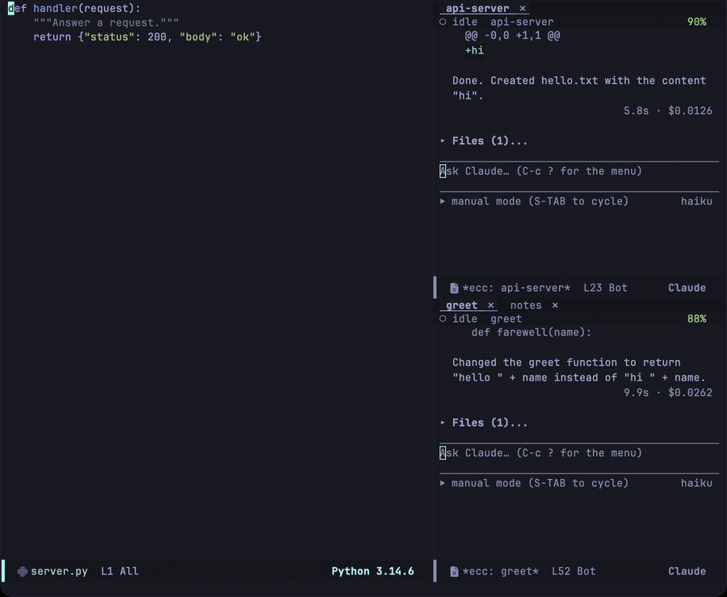

A session consists of a running `claude` process, its transcript buffer, and its session name. The initial session in a project is automatically named after the project directory; subsequent sessions prompt for a name. Killing a session buffer terminates the CLI process, but the conversation history remains saved on disk.

## Where a session starts

`C-c c c` (`ecc-start`) starts a session in the project of your current buffer. It uses the buffer's file or directory, or falls back to the last buffer that visited one. Starting from a transcript, the dashboard, a help window, or the scratch buffer uses that same fallback. A prefix argument (`C-u C-c c c`) prompts for a directory, offering that project as the default.

Check where your session starts: **a session's directory is fixed when the CLI starts** and cannot be changed afterwards. If you start in the wrong project, you must kill the session and start over. The echo area reports the starting directory, and the header line displays the project name for the life of the session.

## Resuming conversations

Press `r` in the [transient menu](/emacs-claude-code/features/menu/#r--resume) or run `M-x ecc-resume-menu`. The picker lists active sessions in this Emacs instance first, followed by recorded conversations in this project, sorted by most recent activity.


| Icon | State |
|---|---|
| ▶ | Active session running in this Emacs instance |
| ● | Terminated session buffer in this Emacs instance |
| ◉ | Active conversation running in another process |
| ↺ | Recorded conversation on disk |

Each entry displays its name, last modified time, and directory (or the initial prompt for historical recordings). Use `-f` to branch a new conversation from the selection instead of resuming it directly.

:::caution[Resuming an active conversation branches history]
If two processes write to the same session ID simultaneously, the recording can become corrupted since the CLI does not use file locking. This state is indicated by ◉; ecc asks for confirmation before resuming.
:::

Session recordings are stored by Claude Code under `~/.claude/projects`, meaning conversations started in the terminal CLI are listed here as well. Each recording forms a conversation tree: editing, interrupting, and resuming create new branches.

`h` inspects a recording without launching a process, and `r` from within that buffer resumes it. If a CLI process terminates unexpectedly, ecc prompts to resume it.

## Searching past conversations

If you remember what was discussed rather than the session name, you can search past conversations by their message text. Press `/` in the transient menu, `C-c c /`, or run `M-x ecc-search`. Matching conversations in the current project are displayed newest first, showing matching lines and context; press `RET` or `o` to open the conversation at point. Providing a prefix argument (`C-u`) searches across all projects instead of just the current one.

```
3 sessions said permission prompt in ~/Projects/emacs-claude-code/

Permission prompt rendering  2026-09-08 14:07  2d4f54c9  2 hits
    › how does the permission prompt decide which diff to show?
    ‹ …the block is drawn by `ecc-perm.el`, and a permission prompt keeps the tool input…

Dashboard columns  2026-09-06 10:22  f6743727  1 hit
    ‹ …an idle row is dimmed, and a permission prompt puts `!` in the gutter…
```

`›` marks user prompts, and `‹` marks Claude's responses. Each block's header displays the conversation title, last modified date and time, the abbreviated session ID, and the total match count.

| Key | Action |
|---|---|
| `RET` / `o` | Open the recorded conversation at point |
| `n` / `p` | Move to the next or previous session |
| `g` | Re-run search |

Search queries match against conversation text—specifically user prompts and assistant responses. Tool results, raw tool-call JSON, and file contents read by the model are excluded so searches do not match every session that happened to inspect a given file. Searches are case-insensitive literal string matches, not regular expressions.

To keep searches fast across session recordings that may contain tens of thousands of messages, ecc first uses `rg` or `grep` to identify candidate recording files, then parses only the matching lines within those files. Even across projects with a hundred session recordings totaling over 100 MB, queries complete in well under a second. If neither search tool is available on `PATH`, ecc falls back to reading each recording directly, which produces identical results at a slower speed.

:::note[Abandoned conversation branches are also searched]
Determining which messages belong to the active line of conversation requires parsing the entire recording, which would defeat fast search pre-filtering. As a result, matches in conversation branches that were rewound or abandoned will still appear in results and open the corresponding session.
:::

## The dashboard

Open the dashboard with `b` in the transient menu, `C-c c b`, or `M-x ecc-dashboard`.


The dashboard lists all sessions managed by this Emacs instance. It reads directly from internal state without polling. Conversations in other processes or saved on disk can be accessed via `r` or `h`.

| Column | Description |
|---|---|
| Name | Session name (as shown in tabs and the mode line) |
| State | Current activity and whether user input is pending |
| Project | Directory basename (full path is shown in tooltip) |
| Model | Active model reported by the CLI |
| Last prompt | Prompt submitted in the most recent turn |
| Updated | Timestamp of the most recent response |
| Cost | Cumulative session cost |

Waiting sessions appear at the top, followed by remaining sessions sorted by recent activity. The gutter marks `!` for sessions awaiting user response and `▶` for the currently visible session; idle rows are dimmed. The header line displays aggregate state counts, total cost, and current rate limit headroom based on data received from the CLI.

| Key | Action |
|---|---|
| `RET` | Switch to session |
| `+` | Start new session |
| `k` | Kill session process |
| `D` | Delete session recording from disk |
| `r` | Rename session |
| `R` | Resume session |
| `a` / `d` | Allow or deny oldest pending request |
| `C` | View session capabilities |
| `U` | View usage and rate limits |
| `g` | Refresh dashboard |

`k` stops the process while keeping the recording on disk so it can still be resumed via `r`. `D` permanently deletes the recording file. See [Prompt and transcript](/emacs-claude-code/features/prompt/) for details on what `a` and `d` send.

## The tab line

Each session appears as a tab in the tab line of its project's session windows.


| Mark | State | Color |
|---|---|---|
| `⚠` | Awaiting user input | Flashing warning highlight |
| `▶` | Busy / working | Green |
| `✗` | Process terminated | Red |
| (none) | Idle | Dimmed |

The tab for the active session window is bold and underlined; active background sessions use a muted green. Set `ecc-tab-blink` to `nil` to disable blinking.

Tabs remain in creation order so their positions remain stable. Clicking a tab with `mouse-1` (or pressing `S`) switches the window to that session. Clicking the `x` button prompts to stop the session.

To show session state in the global Emacs tab bar, set `ecc-tab-bar-state` and use `tab-bar-tab-name-function #'ecc-tab-bar-tab-name`.

A window's tabs list only that window's own project's sessions. Two session windows side by side in different projects show separate rows, and neither lists the other's sessions. Set `ecc-tab-line-scope` to `'all` to list every session in a single row.

You can still reach a session outside the scope with `S` (`ecc-switch-session`), the dashboard (`C-c c b`), and `C-c c n` (`ecc-next-attention`). But because its tab is not on screen, it cannot blink when waiting for an answer. The mode line `⚠ecc:N` count and notifications still report it.

Under the tab line, the header line displays the session's current status on the left, the project name beside it, and the remaining context window capacity on the right (turning amber and red as capacity diminishes).

## Focusing one project

`C-c c j` (`ecc-focus-project`) resets the frame to show only one project:



- Session windows from every other project leave the screen. `ecc-focus-project` kills nothing and stops no processes. `C-c c w` (`ecc-toggle`) brings back one project, and `C-u C-c c w` (`ecc-toggle-all`) brings back all of them.
- Sessions of the chosen project fill the window roles in order of recent use, placing the session you worked in last into the main window.
- The main window switches to that project's source. It chooses a visible project buffer first, then the last buffer you edited there, then the most recently used buffer in the project, or Dired on the project root. A prefix argument (`C-u C-c c j`) prompts for a buffer instead.

A project is matched as a project, not as a path, so a subdirectory session groups with the tree.

## Pending request indicators

- `⚠ecc:N` in the mode line: `N` indicates total pending requests across all sessions. Clicking it opens the dashboard.
- Notifications: Configurable via `ecc-notify-level` (`'message`, `'pulse`, `'desktop`, or `nil`) and `ecc-notify-events` (turn completion, pending requests, or process termination).
- Visual tab indicators: The tab marks described above.

`n` and `N` jump to the next waiting request, either globally or within the current project. Both work from any buffer via `ecc-global-map`, as do `a`, `d`, and `1`–`4`.

All three indicators are active by default so waiting sessions never go unnoticed.

All configuration options mentioned here are detailed in the [configuration reference](/emacs-claude-code/reference/configuration/).
