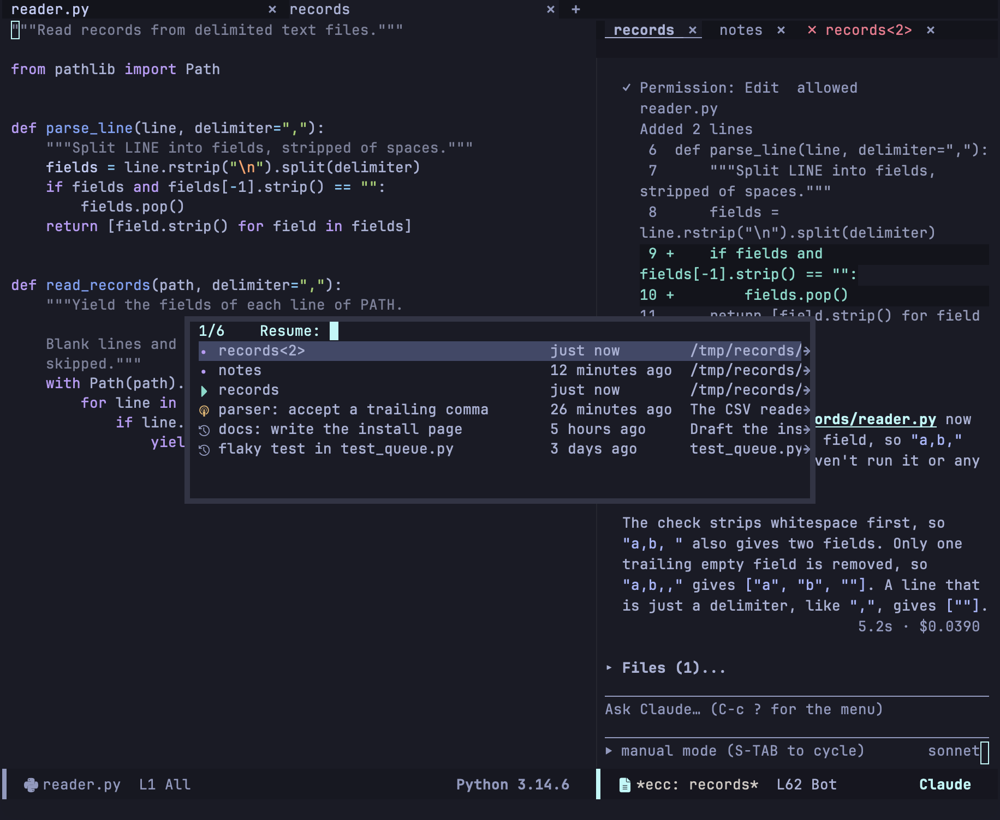
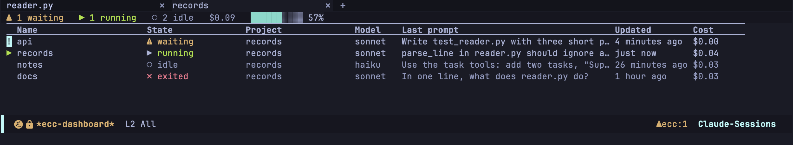
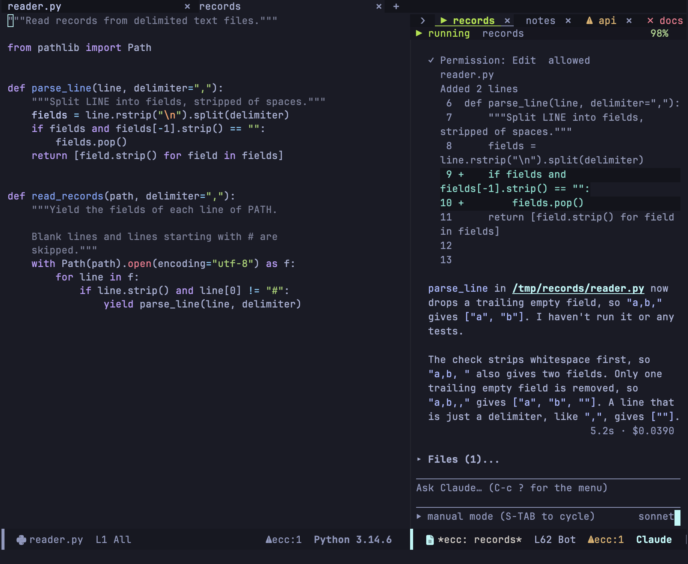

import Video from '../../../components/Video.astro';

A session is a running `claude` process, its buffer and its name. The first session in a project is named after the project directory; later ones ask for a name. Killing a session stops the process; the conversation stays on disk.

| Key | Command | Action |
|---|---|---|
| `C-c c c` | `ecc-start` | Start a session in the current buffer's project (`C-u`: choose the directory) |
| `C-c c r` | `ecc-resume` | Resume a conversation (`C-u`: fork it) |
| `C-c c R` | `ecc-rename-session` | Rename the session |
| `C-c c v` | `ecc-show-session` | Show the session's window and move point to the prompt |
| `C-c c i` | `ecc-interrupt` | Interrupt the turn, keeping the work done so far |
| `C-c c ?` then `k` | `ecc-kill` | Stop the process and kill the session's buffers |
| `C-c c t` | `ecc-tui-open` | [Hand over to the terminal](#handing-over-to-the-terminal) |

## Where a session starts

`C-c c c` starts in the project of the current buffer's file or directory. From a buffer without one (a transcript, the dashboard, `*scratch*`) it uses the last buffer that had one. `C-u C-c c c` asks for the directory.

:::caution[The directory is fixed when the CLI starts]
A session cannot move to another directory. If it started in the wrong project, kill it and start again there. The echo area names the directory, and the header line names the project.
:::

## Resuming conversations

`C-c c r`, or `r` in the menu, lists the sessions of this Emacs first, then the recorded conversations of this project, most recent first.



| Icon | State |
|---|---|
| ▶ | Running in this Emacs |
| ● | Stopped, with its buffer still in this Emacs |
| ◉ | Running in another process |
| ↺ | Recorded on disk |

Each entry shows its name, when it was last active, and its directory or first prompt. `-f` in the menu, or `C-u C-c c r`, forks a new conversation from the one you pick instead of continuing it.

:::caution[Resuming a running conversation forks it]
Two processes writing to one session ID branch its recording, and the CLI does not lock the file. ◉ marks such a conversation, and ecc asks before resuming it.
:::

Recordings live under `~/.claude/projects`, so conversations from the terminal client are listed too. `C-c c h` opens a recording to read without starting a process; `r` in it resumes it. When a CLI process dies, ecc offers to resume it.

## Handing over to the terminal

`C-c c t` hands the conversation to [ghostel](https://github.com/dakra/ghostel), which shows the CLI's own interface in an Emacs buffer. ecc interrupts the turn and stops its own process first, so the conversation does not fork, and the transcript keeps following the terminal.

<Video name="handover" label="A session handed over: the CLI's own interface takes the window, with the conversation resumed" />

`u` in the menu (`ecc-tui-return`) reads what the terminal added and resumes the session in Emacs. If the terminal is still running, the session comes back when it exits.

## Bringing sessions back after a restart

ecc saves the open Spaces and sessions to `ecc-state.eld` in `user-emacs-directory` whenever a session or a tab opens or closes. `M-x ecc-restore` brings them back:

- The Spaces open in their old order, with their sessions. With `ecc-use-spaces` off, only the sessions come back.
- Each session comes back stopped. Its CLI starts when you send a prompt or press `R`.
- A session that is already open, or whose directory is gone, is skipped. Running the command twice does no harm.

A session you kill yourself is not saved. Sessions an earlier Emacs saved stay in the file until you restore them. To restore on every start, call `(ecc-restore)` from your init file.

## Searching past conversations

`C-c c /` (`ecc-search`) searches the prompts and replies of this project's recorded conversations; `C-u` searches every project. The match is literal and ignores case. Tool results and file contents are not searched.

```
3 sessions said permission prompt in ~/Projects/emacs-claude-code/

Permission prompt rendering  2026-09-08 14:07  2d4f54c9  2 hits
    › how does the permission prompt decide which diff to show?
    ‹ …the block is drawn by `ecc-perm.el`, and a permission prompt keeps the tool input…

Dashboard columns  2026-09-06 10:22  f6743727  1 hit
    ‹ …an idle row is dimmed, and a permission prompt puts `!` in the gutter…
```

`›` marks your prompts and `‹` Claude's replies. `RET` or `o` opens the conversation, `n` and `p` move between conversations, and `g` searches again. Abandoned branches are searched too.

## The dashboard

`C-c c B` (`ecc-dashboard`) lists the sessions of this Emacs.



Each row shows the name, state, project, model, last prompt, last answer time and cost. Sessions waiting for you come first, marked `!`. The header line totals the states and the cost, and shows the rate limits.

| Key | Action |
|---|---|
| `RET` | Switch to the session |
| `+` | Start a session |
| `k` | Stop the session (asks first); the recording stays |
| `D` | Delete the session's recording from disk |
| `r` / `R` | Rename / resume the session |
| `a` / `d` | Allow or deny its oldest request ([details](/emacs-claude-code/features/permissions/#answering-a-request)) |
| `C` / `S` | Show its [capabilities](/emacs-claude-code/features/other/#capabilities) / skills |
| `U` | Show [usage](/emacs-claude-code/features/other/#usage) |
| `g` | Refresh |

## The tab line

Each session window has a tab for each session of its project.



| Mark | State | Colour |
|---|---|---|
| `⚠` | Waiting for you | Blinking warning |
| `▶` | Working | Green |
| `✗` | Process ended | Red |
| `○` | Restored, not started yet | Dimmed |
| (none) | Idle | Dimmed |

The tab of the session in the window is bold and underlined. `(setq ecc-tab-blink nil)` stops the blinking.

Clicking a tab switches the window to that session. `C-c C-t` in a session buffer chooses from the window's tabs, and `C-u C-c C-t` from every session; with Spaces on, a session of another project opens in that project's Space. The `x` on a tab stops the session, and the window moves to the next tab.

<Video name="switch" label="The session window changing from one session to another: the selected tab moves from greet to notes and the transcript is replaced" />

`(setq ecc-tab-line-scope 'all)` lists every session in each tab line. To mark session state in the Emacs tab bar too, set `ecc-tab-bar-state` to `t` and `tab-bar-tab-name-function` to `#'ecc-tab-bar-tab-name`.

The header line under the tabs shows the session's status, the project, and the context window left, which turns amber and then red.

## Waiting sessions

A session waiting for an answer shows in three places:

- `⚠ecc:N` in every mode line counts the waiting requests of all sessions; clicking it opens the dashboard.
- Its tab blinks.
- A notification, set by `ecc-notify-level` (`'message`, `'pulse`, `'desktop` or `nil`) and `ecc-notify-events`.

`C-c c n` jumps to the next waiting request, and `C-c c N` to the next one in this project.
