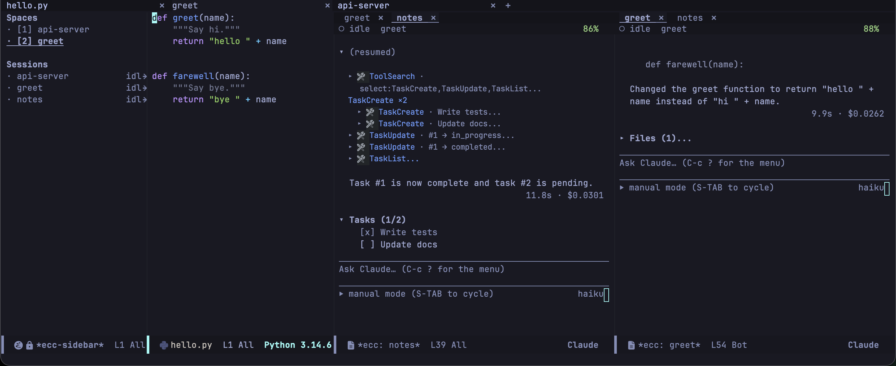
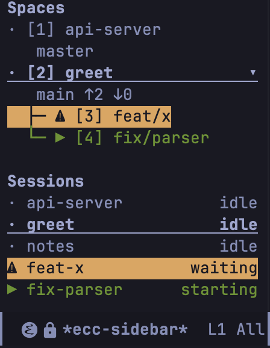

A **Space** is a project with an Emacs tab of its own. A tab is a named window arrangement of the frame; whether the strip at the top of the frame is drawn is [`tab-bar-show`'s business](#the-bar-itself-is-yours). A git worktree is its own Space, shown under the repository it came from.

[`ecc-use-spaces`](/emacs-claude-code/reference/configuration/#ecc-use-spaces) is on by default. Turn it off for the older layout: transcripts in side windows, with no tabs, no sidebar, and no worktree commands.

```elisp
(setq ecc-use-spaces nil)
```

## How a Space works



```
┌ *ecc-sidebar* ─────┬ tab bar: [ecc] [herdr] [feat-x] ────────────────────┐
│ Spaces             │ ┌ source ─────────┬ session-A ────┬ session-B ────┐ │
│ ⚠ [1] ecc        ▾ │ │                 │ (tab line)    │ (tab line)    │ │
│    main ↑2 ↓0      │ │                 │               │               │ │
│   └─ ▶ [2] feat-x  │ │                 │               │               │ │
│ · [3] herdr        │ └─────────────────┴───────────────┴───────────────┘ │
│    master          │                                                     │
│                    │   one Space = one tab = one window arrangement      │
│                    │                                                     │
│ Sessions           │                                                     │
│ ⚠ ecc   waiting    │                                                     │
│ ▶ ecc-2 running    │                                                     │
│ · herdr    idle    │                                                     │
└────────────────────┴─────────────────────────────────────────────────────┘
```

Transcripts sit side by side: the first opens to the right of the source, each one after it splits the rightmost window, and nothing is ever stacked. From there they are ordinary windows, yours to split, move, enlarge, and close. A tab **is** a window configuration, so leaving a Space and coming back restores it. The tab line inside a transcript still switches between that project's sessions.

No transcript is made narrower than `ecc-space-session-min-width`. When the row is full, the session worked in longest ago gives up its window and keeps running without one; the sidebar or `C-c c V` brings it back.

**Going to a Space with nothing running starts a session there** — [`ecc-space-always-session`](/emacs-claude-code/reference/configuration/#ecc-space-always-session), on by default, which also closes a Space when its last session is killed. Type `/resume` in the session that opens to carry on an earlier conversation. Turn it off and a Space opens on the source alone and stays until you kill the project's last buffer.

| Key | Command | What it does |
|---|---|---|
| `C-c c j` | `ecc-space-goto` | Go to a Space by name, including a project that only has recordings |
| `C-c c z` | `ecc-space-zoom` | Fill the tab with this window; press the same key to restore the windows |
| `C-c c V` | `ecc-space-reset-windows` | Reset this Space to the layout of a new tab: the source on the left, transcripts beside it |
| `C-c c ?` then `X` | `ecc-space-close` | Close this Space and stop everything running in it — including its worktrees, if it is a repository — then offer to remove the closed worktrees |
| — | `ecc-space-jump` | Go to the Nth Space, as numbered in the sidebar |

### The bar itself is yours

`tab-bar-mode` only draws the strip above the tab, and nothing here turns that mode on: `tab-bar-new-tab` does where `tab-bar-show` is `t`, its default, and leaves it off where you set that to `nil`.

```elisp
(setq tab-bar-show nil)   ; Spaces with no strip at the top of the frame
```

With the bar hidden the tabs are made, named, switched and closed exactly as before, and the sidebar is the list of them.

## The sidebar



`C-c c b` (`ecc-sidebar-focus`) opens the sidebar and puts point in it; the same key puts point back.

The top half lists the Spaces: a mark for what the Space is doing, the number the `1`-`9` keys take, and the name. Under a repository come its branch and how far it is from its upstream, and its worktrees hang on a tree line below it, each named by its branch; `TAB` folds them away.

The bottom half lists the sessions, each with its mark, its name and what it is waiting for. The marks, the colours and the blink are the tab line's, so a session says the same thing wherever it is drawn.

| Key | What it does |
|---|---|
| `RET` | Go to the Space or session on this line |
| `n`, `p` | Next, previous row |
| `TAB` | Fold or unfold a repository's worktrees |
| `1`–`9` | Go to the Space with that number |
| `c` | Start a session in this Space |
| `W` | Create a worktree from this Space and start a session there |
| `k` | Stop this session |
| `K` | Remove this worktree's directory |
| `X` | Close this Space |
| `a`, `d` | Allow or deny what this session is waiting on (asks first; not for `Bash`) |
| `g` | Refresh git status and redraw |
| `q` | Hide the sidebar |

`a` and `d` behave exactly as the dashboard's do: see [Sessions](/emacs-claude-code/features/sessions/). `ecc-sidebar-width` is the width in columns, 28 by default. `ecc-sidebar-sessions-sort` orders the bottom half: `spaces` (the default) keeps sessions under their Space, `priority` puts what wants an answer first.

### What an idle session meant

The CLI reports a session that has stopped as idle, whether it finished the job, stopped to ask you something, or gave up. With several sessions running, the one thing worth knowing is which of the idle ones is waiting on **you**, and that never comes from the CLI.

[jev.el](https://github.com/wakamenod/jev.el) can answer it. It is a client for TypeSafe AI's System One model, which takes unstructured state plus typed questions and answers each with a typed value and a confidence, in one round trip. Put it on your `load-path`, then:

```elisp
(setq ecc-jev-enabled t)   ; or M-x customize-variable ecc-jev-enabled
```

The last assistant message of each finished turn then goes out with two questions — what became of the turn, and whether it ends by asking the user something — and the answer becomes the mark that opens the session's row.

| Mark | What the turn meant |
|---|---|
| `?` | It is waiting on a decision: it asked you something, or wants you to choose |
| `!` | It is blocked: something failed, was missing, or was refused |
| `…` | It did some of the work and stopped short of the rest |
| `·` | The ordinary mark: the turn simply finished, or nothing is sure enough to say |

:::caution[It is off by default, and it talks to another service]
`ecc-jev-enabled` is the one setting in ecc that sends anything anywhere but Claude. Turning it on sends the last assistant message of every finished turn to TypeSafe AI (`api.typesafe.ai`, or the Vercel AI gateway, whichever jev.el is pointed at), and every turn is a request that is charged for.
:::

#### The API key

jev.el finds the key itself and ecc has no setting of its own for it. Pick a provider, and give it a key in one of three ways:

| Provider | Endpoint | Environment variable |
|---|---|---|
| `typesafe` (the default) | `api.typesafe.ai` | `TYPESAFE_API_KEY` |
| `vercel` | `ai-gateway.vercel.sh` | `AI_GATEWAY_API_KEY` |

```elisp
;; auth-source, so that nothing secret is in the init file:
;;   # ~/.authinfo.gpg
;;   machine api.typesafe.ai login jev password sk-...
(setq jev-auth-source-user "jev")

;; macOS Keychain instead of a file:
;;   security add-internet-password -a jev -s api.typesafe.ai -r htps \
;;     -l "Jev" -T /usr/bin/security -U -w
(add-to-list 'auth-sources 'macos-keychain-internet)

;; Or plainly, in the init file:
(setq jev-api-key "sk-...")

;; The Vercel AI gateway rather than TypeSafe:
(setq jev-provider 'vercel)
```

`jev-api-key` is consulted first, then the provider's environment variable, then auth-source by the endpoint's host. `jev-api-key` also takes a function of the provider symbol, or an alist keyed by provider, when both providers are in use.

With no key, every turn fails with ``No Jev API key for `typesafe'``. That is said once in the echo area, because a setting switched on and answering with silence is worse than the setting being off; so are the other two failures nobody can fix from here and nothing fixes by itself, a key that is refused and an account out of credit (`ecc-jev-loud-errors`). Everything else — a rate limit, a timeout, a provider having a bad minute — is left to that session's log (`C-c c ? L`, `ecc-show-log`), where every failure is written whether or not it was said out loud. The next answer that arrives lets it speak again, so a key put right is not a warning that cannot come back.

jev.el is not a dependency of this package: ecc loads and works without it, and the setting is in Customize either way. Switched on with jev.el absent, it says so once and does nothing more. Jev decides nothing either — it never approves, refuses or answers anything, and it annotates one column of one row. A Jev that is down, rate-limited or out of credit leaves the sidebar exactly as it looks without it, with the failure in the session log (`ecc-show-log`). An answer arrives a few hundred milliseconds later, and is dropped unless the session is still there, still idle, and still on the same turn.

A slash command the CLI answers itself, such as `/cost`, is not what the model said: it is left where it is, neither sent nor charged for. `ecc-jev-confidence-threshold` (0.6) is how sure Jev must be before a mark is drawn; below it the row keeps its ordinary one. The number is a starting guess rather than a calibrated one. `ecc-jev-marks` is the character each verdict draws, and `ecc-jev-text-limit` how much of the message is sent (the tail, 4000 characters). All three are plain variables, set with `setq`.

## Worktrees

A git worktree is a second working tree for a repository, on a branch of its own: two sessions work on the same project without seeing each other's edits. These commands work with `ecc-use-spaces` on or off.

| Key | Command | What it does |
|---|---|---|
| `C-c c ?` then `W c` | `ecc-start-worktree` | Check out a branch beside the repository and start a session there |
| `C-c c ?` then `W o` | `ecc-start-in-worktree` | Start a session in an existing worktree |
| `C-c c ?` then `W k` | `ecc-remove-worktree` | Stop the sessions running in a worktree and remove it |

`ecc-start-worktree` asks for a branch, offering the ones that exist. An existing branch is checked out as it is; one that does not exist is created from `HEAD`. A branch that another worktree already holds is not refused: ecc asks, then starts the session in that worktree. It finds the worktree by its branch, so the directory can be named anything.

Worktrees are placed in `ecc-worktree-directory`, `.claude/worktrees` by default. A relative path hangs off the repository, so a worktree for `feat/x` lands at `<repo>/.claude/worktrees/feat-x`; an absolute one is shared by every repository, and a worktree lands at `<directory>/<repository>/<branch-slug>`.

When the **last** session working in a worktree ends, however it ended, ecc offers to remove the worktree. **No branch is ever deleted**: `ecc-remove-worktree` removes a directory, so nothing committed can be lost. If git refuses to remove a worktree because it holds uncommitted changes or untracked files, ecc names the directory and asks again; only then is the removal forced.

## Handing work to a session in a worktree

Ask inside a session for something to be done in a worktree and the CLI, left to itself, runs `git worktree add` and carries on in the same conversation: one session, two worktrees.

With the [Emacs MCP server](/emacs-claude-code/start/installation/) on (`ecc-mcp-enabled`), the model is offered `start_worktree_session` instead. It names the branch and writes a brief; Emacs makes the worktree, opens it as a Space, starts a session there and sends it that brief. Emacs adds what it watched the conversation do: the files it touched, the plans it wrote, the path of the recording, and the changes that are still uncommitted. The worktree is made from `HEAD`, so commit that work first or say so in the brief. If the model tries to make a worktree itself instead of calling the tool, Emacs refuses the request and tells it to use the tool. You see no permission prompt for it.

A draft of yours that mentions a worktree is sent with one extra line reminding the model of the tool. You did not write that line, so the transcript keeps it out of your prompt and shows it folded underneath as "1 line Emacs added".

If the branch the model names is already checked out in another worktree, the tool refuses and asks it for a different branch: two sessions in one worktree is not what handing work over means. From Lisp the command is `ecc-worktree-delegate`; there is no `M-x` for it.

A session started in a worktree opens a Space of its own, under the repository it came from.
