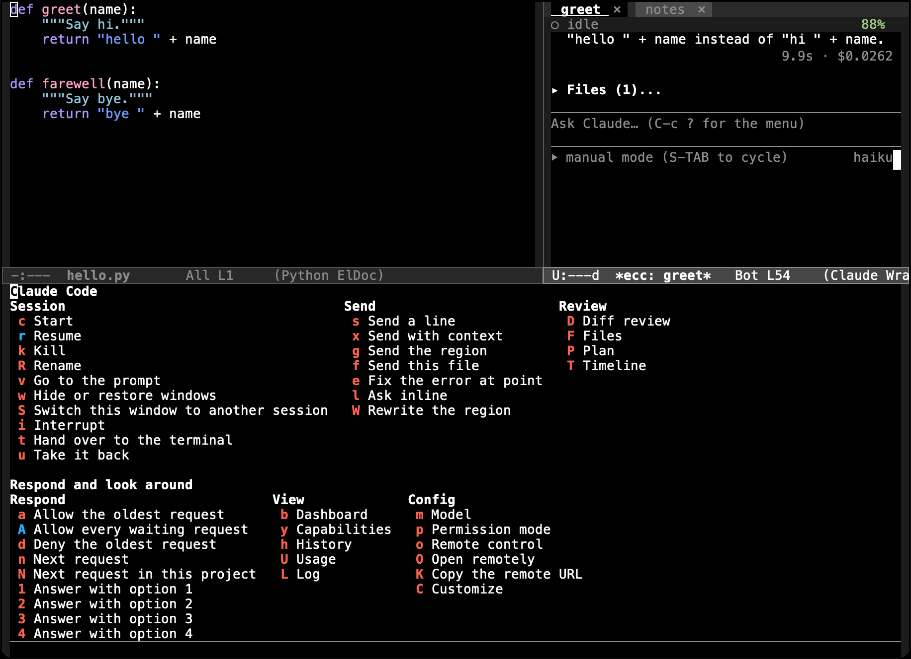
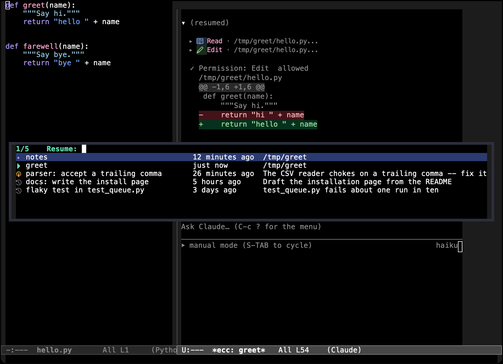
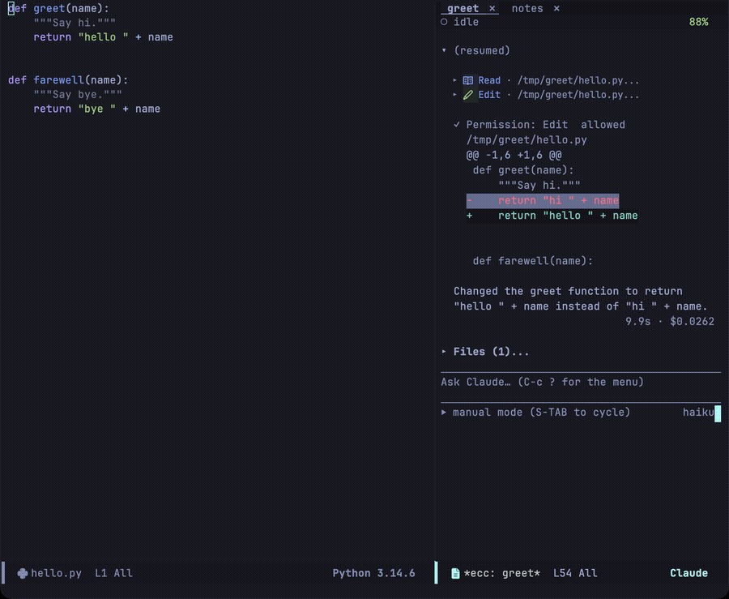
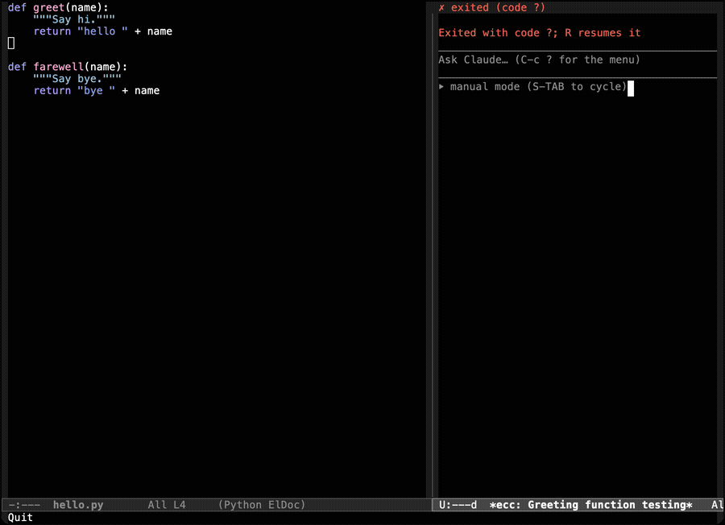
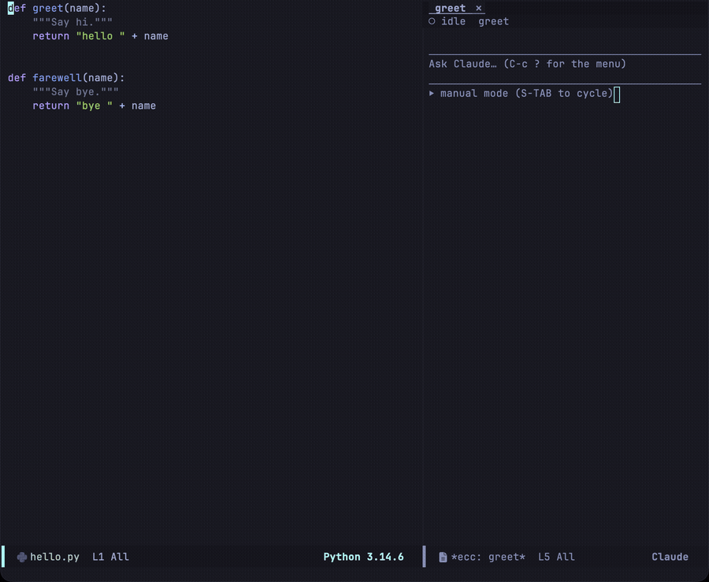
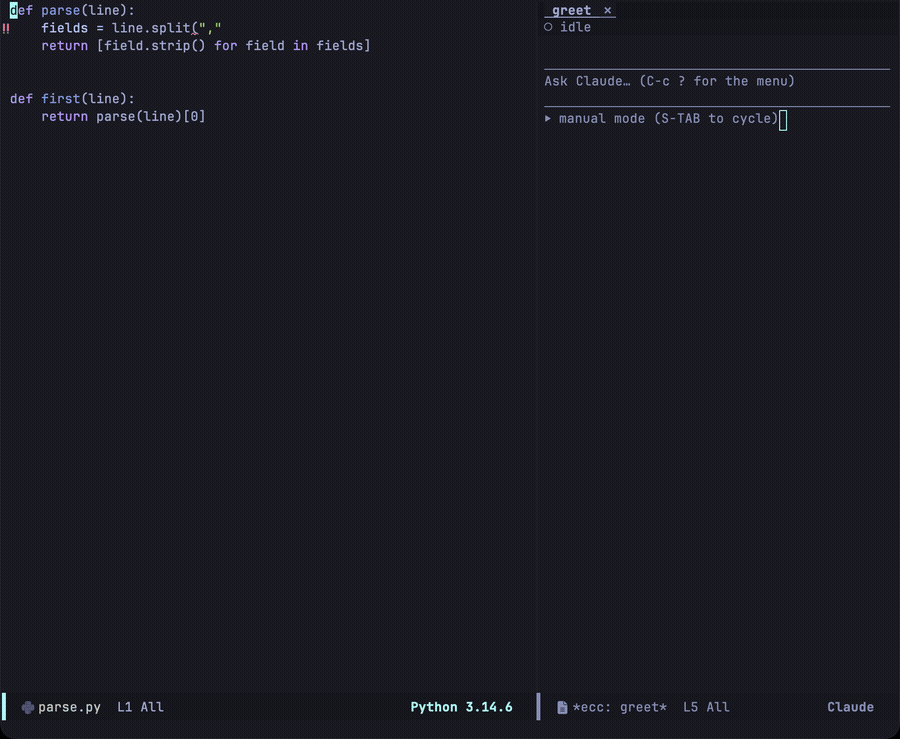
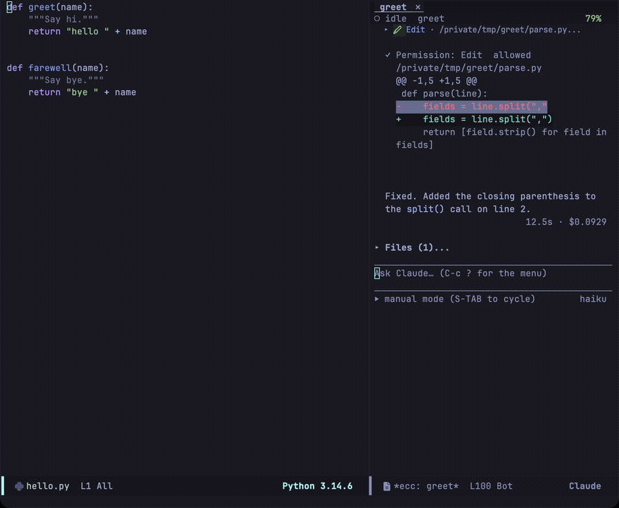
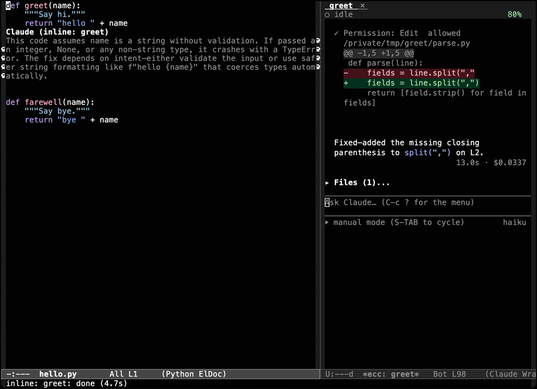

`C-c ?` を押すと、Transient メニューが開きます（Magit でおなじみの [transient](https://magit.vc/manual/transient/) ライブラリで構築されています）。ecc の全コマンドが機能ごとにグループ化されており、キーを一覧しながら直感的に実行できます。



各行にはキーと対応するコマンドが表示されており、`C-g` でメニューを閉じます。`-` で始まる項目はスイッチ（トグル設定）で、その後に実行するコマンドにオプションを適用します。

セッションバッファの外からは、`M-x ecc-menu` を実行するか、グローバルプレフィクスキーマップ `ecc-global-map` で `?` を押すとメニューを開けます（詳細は [グローバルキーバインド](/emacs-claude-code/ja/reference/key-bindings/) を参照）。どちらのメニューでも共通のキー操作が使えます。

:::note[操作対象となるセッションの自動決定]
メニューは、現在のバッファに紐付けられているセッションを優先して対象とします。該当するものがない場合は、カレントプロジェクトの唯一のセッション、画面上に表示されている唯一のセッション、または直近に使用したセッションが自動選択されます。判断がつかない場合にのみプロンプトで確認を求め、その結果をカレントバッファに記憶します。
:::

## Session グループ

### `c` — セッションの開始 (Start)

現在のバッファが属するプロジェクト内で新しいセッションを開始します。セッション名にはデフォルトでそのディレクトリ名が付けられます。同一プロジェクト内で 2 つめ以降のセッションを開始する場合は名前の入力を求められます。`C-u c` を押すと、対象ディレクトリと名前の両方を手動で指定できます。

### `r` — セッションの再開 (Resume)

再開可能な過去の会話一覧を表示します。



| アイコン | 状態 |
|---|---|
| ▶ | この Emacs インスタンスで実行中のアクティブセッション |
| ● | この Emacs 内にあるが、CLI プロセスが停止しているセッション |
| ◉ | 別のプロセスで実行されている会話 |
| ↺ | ディスク上に保存されている過去の記録 |

各項目にはセッション名、最終更新時刻、ディレクトリ（過去の記録の場合は最初のプロンプト）が表示されます。`-f` スイッチを付けると、選択した会話を直接引き継ぐのではなく、新しい会話として分岐（フォーク）して開始できます。

:::caution[実行中のセッションを再開すると履歴が分岐します]
同一のセッション ID に対して 2 つのプロセスが同時に書き込みを行うと、ファイルロック機構がないため記録ファイルが破損する恐れがあります。この状態は ◉ アイコンで示され、ecc は再開前に確認ダイアログを表示します。
:::

### `k` — セッションの終了 (Kill)

プロセスを停止し、セッションのバッファを閉じます。会話の記録はディスク上に保持されるため、後から `r` で再開可能です。

### `R` — セッション名の変更 (Rename)

セッションおよび関連バッファの名前を変更します。新しい名前はタブ、モードライン、および各種選択メニューに即座に反映されます。

### `v` — プロンプトへフォーカス (Focus prompt)

セッションウィンドウを表示し、ポイントをプロンプト入力領域へ移動します。

### `j` — 1 つのプロジェクトに絞る (Focus one project)

フレーム全体を 1 つのプロジェクトに絞り込みます。セッションを持つプロジェクトを選ぶと、他のプロジェクトのセッションウィンドウが画面から消え、このプロジェクトのセッションがウィンドウの役割へ割り当てられ、メインウィンドウがそのソースに切り替わります。`C-u j` でメインウィンドウに表示するバッファを選べます。kill はしません。`w` と `C-u w` で隠れたセッションを戻せます。[1 つのプロジェクトに絞る](/emacs-claude-code/ja/features/sessions/#1-つのプロジェクトに絞る)を参照してください。

### `w` — ウィンドウの表示/非表示切り替え (Toggle windows)

カレントプロジェクトのセッションウィンドウを非表示または再表示します。他のプロジェクトはそのまま残ります。`C-u w` は全プロジェクトのセッションウィンドウを対象にし、絞り込みを解除します。バックグラウンドのセッションは非表示の間も動作し続けます。

### `S` — ウィンドウ内のセッション切り替え (Switch session in window)

セッションウィンドウには、アクティブなセッションごとにタブが並びます。`S` を押すと、現在のウィンドウに表示するセッションをその場で切り替えます。



セッションバッファ内からは、`C-c C-t` でも同じ操作が行えます。

### `i` — 実行中断 (Interrupt)

実行中のターンを直ちに中断します。それまでに完了した変更や出力内容はそのまま保持されます。

### `t` — ターミナルへ引き渡し (Hand over to terminal)

セッションを [ghostel](https://github.com/dakra/ghostel) へ引き渡し、CLI ネイティブの TUI インターフェースを Emacs バッファ内で操作できるようにします。



履歴の競合分岐を防ぐため、ターミナルで再開する前に実行中のターンは中断され、Emacs 側のバックグラウンドプロセスは一旦停止します。ターミナルで操作中も、Emacs のトランスクリプト側はリアルタイムに進行を追従します。

### `u` — セッションの回収 (Reclaim session)

ターミナル側で追加されたやりとりを取り込み、Emacs 内でヘッドレスプロセスとしてセッションを再開します。ターミナルがまだ動作している間はセッションはターミナル側に留まり、ターミナルが終了した時点で自動的に Emacs 側へ復帰します。

## Send グループ

これらのコマンドは、トランスクリプト内ではなくソースコードを編集中のバッファから実行することを想定しています。対象セッションへコンテキストを直接送信でき、ターン実行中の場合はプロンプトが自動的にキューへ追加されます。

### `s` `x` `g` `f` — バッファからの送信

| キー | 送信内容 |
|---|---|
| `s` | ミニバッファで入力した 1 行の指示のみ |
| `x` | 入力した指示に加え、現在のファイル名と行番号 |
| `g` | 選択中のリージョン（未選択時はバッファ全体）を引用ブロックとして添付 |
| `f` | ファイル全体を CLI が読み取れる `@path` 参照として送信 |



`x` や `g` によって付加されるコンテキストは、以下のような読みやすいブロック形式で送信されます:

````
---
Current context: hello.py L1-L3
```python
def greet(name):
    return "hello " + name
```
````

プレフィクス引数を渡すと、コードの前に添える追加指示を入力したり（`C-u g`）、送信先セッションを選択したりできます（`C-u s`）。`f` は CLI がディスクからファイルを直接読み込むため、送信前にバッファの保存を促します。

### `e` — ポイント位置のエラーを修正 (Fix error at point)

カーソル行の診断情報（エラーや警告）を周囲の数行のコードとともに送信します。Flymake、Flycheck、ポイント位置のオーバーレイヘルプテキストの順に診断情報を検索して取得します。



### `l` — インラインで質問 (Ask inline)

リージョンやファイルに関する質問をミニバッファから送信し、トランスクリプトではなくコードの直上にオーバーレイとして回答を表示します。`n` / `p` でスクロール、`r` で追加質問、`q` でオーバーレイを消去できます。



この質問は専用のセッション（プロジェクトのセッションのフォーク、または軽量な独立セッション）で処理されます（バッファごとに初回選択した方式を記憶）。

### `W` — リージョンの書き換え (Rewrite region)

指定した指示に従って選択範囲のコードを直接書き換えます。修正案がその場にプレビュー表示され、`RET` で受け入れるまでバッファの内容は変更されません。



この機能はツール呼び出しを行わない単発のコード生成として動作し、Emacs 側が直接バッファを書き換えます。

## Review グループ

`D` を押すとセッション内の全変更を 1 つの統合 diff として表示します。`F` と `P` はトランスクリプト内の変更ファイル一覧およびプランセクションへジャンプし、`T` は指定したターンへ移動します。

詳細は [レビューとプランモード](/emacs-claude-code/ja/features/review/) をご覧ください。

## Respond グループ

`a` と `d` で最古の待機中リクエストを許可/拒否、`A` で全リクエストを一括許可、`n` と `N` で次の待機中セッションへジャンプ、`1`–`4` で質問の選択肢に素早く回答します。

詳細は [プロンプトとトランスクリプト](/emacs-claude-code/ja/features/prompt/) をご覧ください。

## View グループ

### `b` — ダッシュボード (Dashboard)

この Emacs で管理されている全セッションを一覧表示します。
詳細は [セッション管理](/emacs-claude-code/ja/features/sessions/) をご覧ください。

### `y` — ケイパビリティ (Capabilities)

セッションで利用可能なスキル、サブエージェント、スラッシュコマンド、MCP サーバー、プラグインの一覧を確認できます。
詳細は [その他の機能](/emacs-claude-code/ja/features/other/#ケイパビリティ-能力一覧) をご覧ください。

### `I` — プラグイン (Plugins)

プラグインの一覧・導入・管理を行います。マーケットプレイスが提供するプラグインの
検索、導入、有効化・無効化、更新、削除、およびマーケットプレイス自体の管理ができます。
詳細は [その他の機能](/emacs-claude-code/ja/features/other/#プラグイン-plugins) を参照してください。

### `h` — 履歴 (History)

過去に `~/.claude/projects` に記録された会話を標準のセッションバッファで開きます。過去の会話は閲覧専用として確認できるほか、`r` を押してその場で再開することも可能です。

### `/` — 検索 (Search)

現在のプロジェクトにおける過去の会話を発言内容（プロンプトや回答）から検索し、該当するセッションを開きます。
詳細は [セッション管理](/emacs-claude-code/ja/features/sessions/#過去の会話を検索する) をご覧ください。

### `U` — 使用量 (Usage)

プランの使用量とレート制限の利用状況を確認します。
詳細は [その他の機能](/emacs-claude-code/ja/features/other/#使用量レポート) をご覧ください。

### `L` — ログ (Log)

セッションの生の JSON プロトコルログをタイムスタンプ付きで確認します（受信メッセージは `<<`、送信メッセージは `>>`）。動作不良時のトラブルシューティングやバグ報告の際に最も重要な情報源となります。

## Config グループ

### `m` — モデル変更 (Model)

セッションを再起動することなく、実行中のセッションの使用モデルを切り替えます。

### `p` — 権限モード (Permission mode)

実行中セッションの権限モードを切り替えます（セッションバッファ内では `S-TAB` でも直接切り替え可能です）。

### `o` `O` `K` — リモートコントロール (Remote Control)

`o` でこのセッションのリモートコントロール（Remote Control）の有効/無効を切り替えます。有効にすると Claude の Web アプリやデスクトップアプリからこのセッションを遠隔操作できるようになります。`O` はブラウザでそのセッションの Web UI（claude.ai/code）を開き、`K` はその URL をキルリングにコピーします。

すべての設定オプションは `M-x customize-group RET ecc` でカスタマイズできるほか、[設定リファレンス](/emacs-claude-code/ja/reference/configuration/) でもご確認いただけます。
