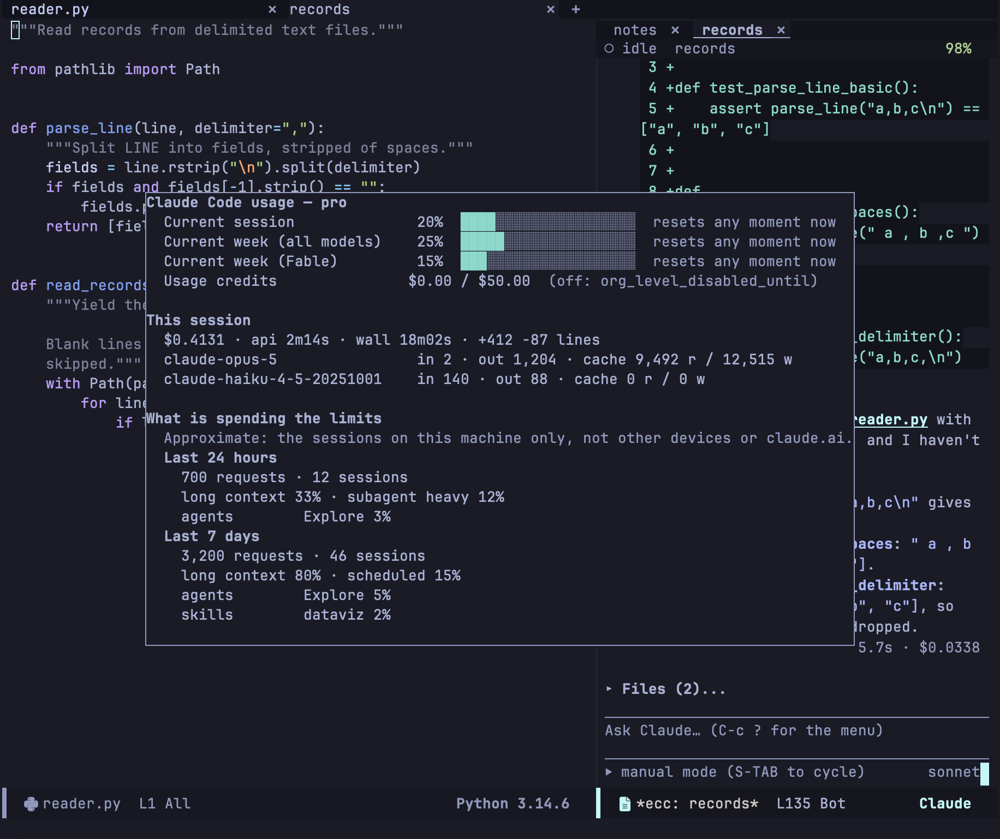

import Video from '../../../../components/Video.astro';

## ケイパビリティ (能力一覧)

Transient メニューかダッシュボードで `C` を押すと、そのセッションで使える機能を確認できます。CLI が `system/init` で報告したスキル、サブエージェント、スラッシュコマンド、MCP サーバー、プラグインです。項目は提供元（プロジェクト、ユーザー設定、プラグイン、組み込み）ごとにまとめて表示されます。

<Video name="capabilities" label="ケイパビリティバッファ: 各グループが開閉されている様子" />

`TAB` でグループを開閉し、`RET` でポイント位置の項目を詳しく表示し、`g` で再取得します。最初のターンの前で、まだ何も報告されていないときは、バッファにそのことが表示されます。

## 使用量レポート

Transient メニューで `U` を押すか、`C-c c U`、または `M-x ecc-usage` を実行すると、Claude Code プランの使用量とレート制限の状況を確認できます。

数値は CLI から直接取得したもので、Web クライアントの「Settings → Usage」と同じです。Emacs 側で推計はしていません。動いているセッションがないときは、ecc が一時的に CLI を起動して問い合わせ、すぐに止めます。プロンプトは送らないので、トークンは消費しません。

| キー | 動作 |
|---|---|
| `g` | 使用量メトリクスを再取得 |
| `b` | レート制限の消費内訳の表示を切り替え |
| `q` | レポートを閉じる |

`ecc-usage-display` で、レポートをフレームの上に浮かべる（posframe）か、通常のウィンドウに表示するかを選べます。内訳は **このマシン** に記録されたセッションの活動から集計するので、ほかの端末や claude.ai での消費は含まれません。

すべての設定は[設定リファレンス](/emacs-claude-code/ja/reference/configuration/)にあります。
