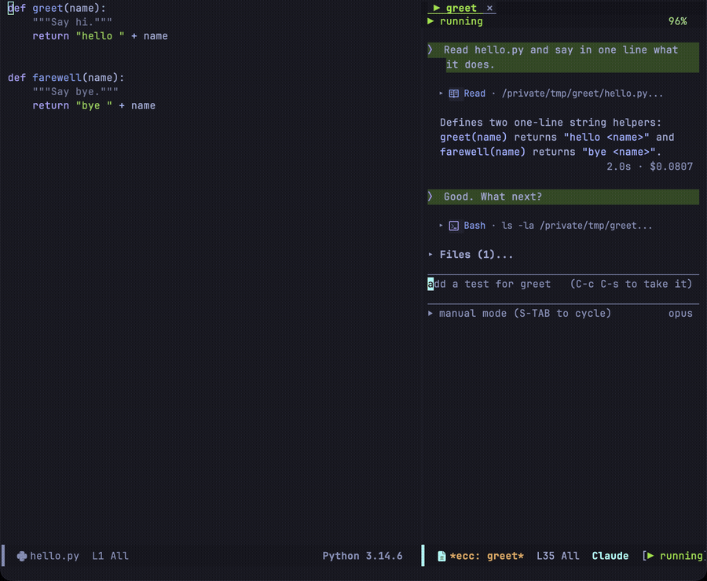
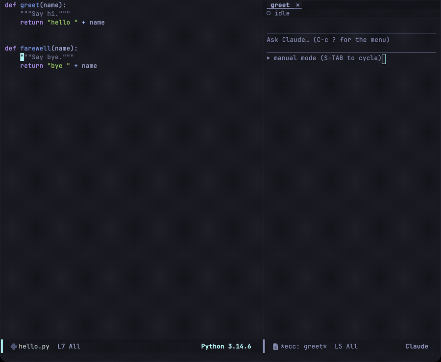
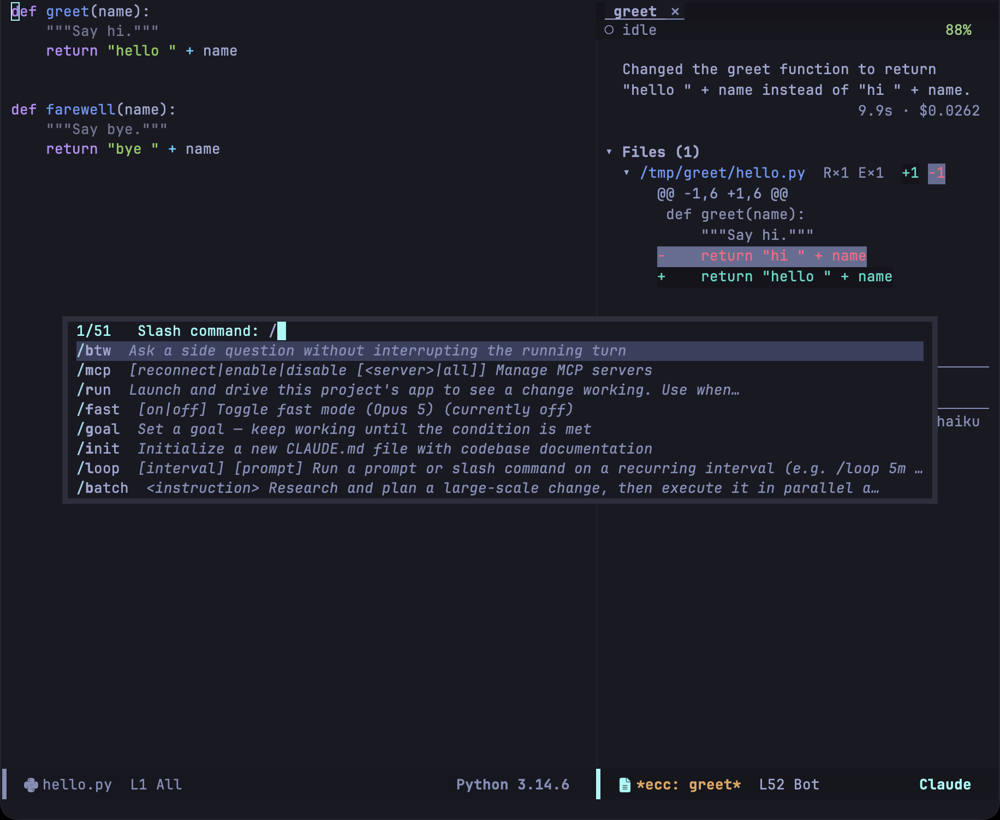
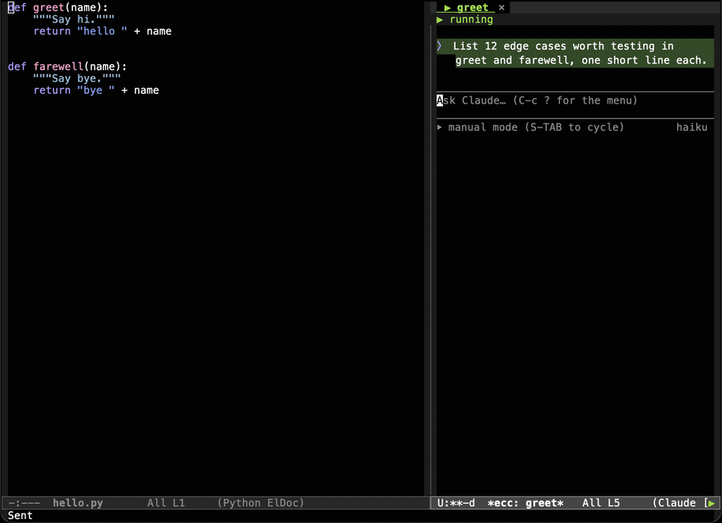
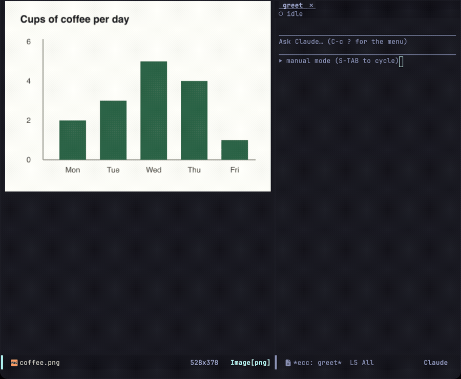
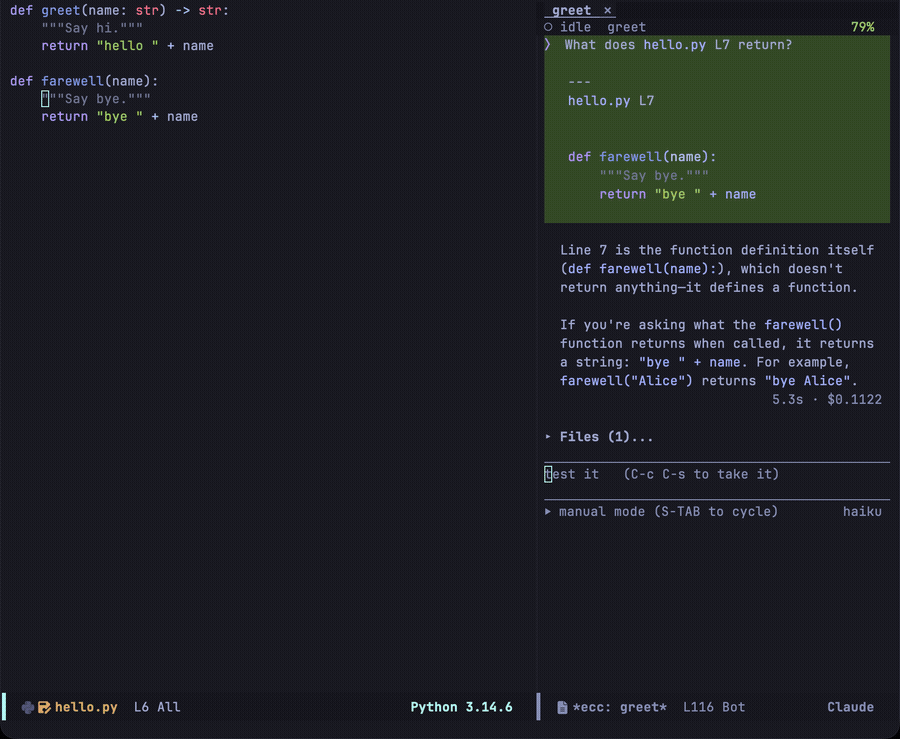
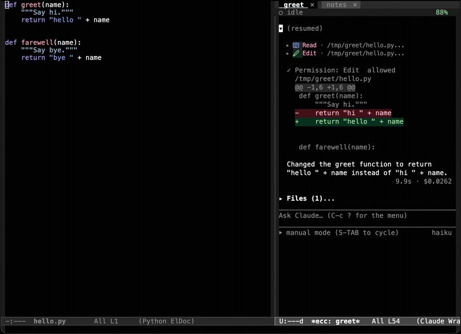
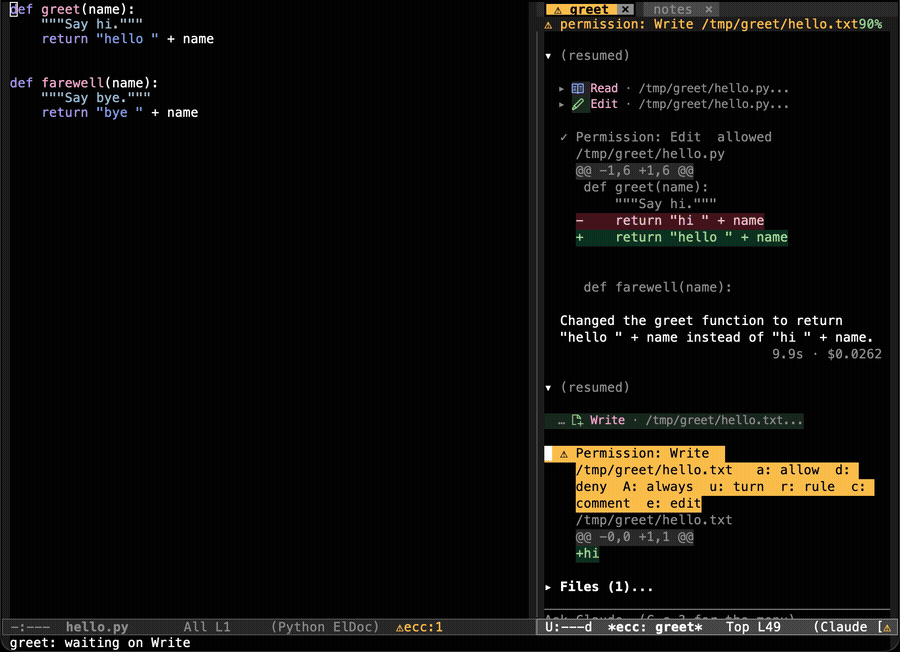
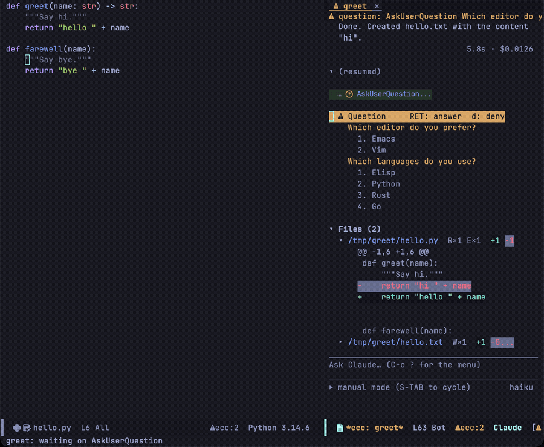

セッションバッファは、上部にトランスクリプト、区切り線を挟んだ下部にプロンプト入力領域、最下部にフッターを表示します。トランスクリプトはテキストプロパティにより独自のローカルキーマップを持つ読み取り専用テキストで、単一キーによるコマンド実行が可能です。一方、プロンプト領域にはプロパティがなく、メジャーモードマップ（`RET`、`TAB`、移動キー、`C-c C-` プレフィクスのみバインド）に従うため、通常の文字入力が保持されます。

## プロンプト入力領域

### 入力と送信

| キー | 動作 |
|---|---|
| `RET` | 改行を挿入（`ecc-chat-return-sends` が有効な場合は送信） |
| `S-RET`, `C-j` | 改行を挿入 |
| `C-c C-c` | プロンプトを送信 |
| `C-c C-k` | プロンプト領域をクリア |
| `C-k` | 物理行（ビジュアルライン）を末尾までキル（プロンプト領域内で停止） |
| `C-a` / `C-e` | 物理行の先頭 / 末尾へ移動 |
| `TAB` | スラッシュコマンドまたは `@` 参照の補完 |
| `/` | スラッシュを挿入（空のプロンプトで押した場合はコマンド候補を表示） |

### 履歴と提案プロンプト

| キー | 動作 |
|---|---|
| `M-p` / `M-n`, `C-<up>` / `C-<down>` | 履歴から前 / 次のプロンプトを呼び出し |
| `C-c C-r` | 直前のプロンプトを再送信 |
| `C-c C-s` | CLI からの提案プロンプトを採用 |

プロンプトの履歴は全セッションで共有されるため、あるセッションで入力したプロンプトを別のセッションでもすぐに再利用できます。

1〜2 ターンのやりとりの後、CLI が次のプロンプトを提案してくることがあります。提案は空のプロンプト領域にゴーストテキストとして表示され、`C-c C-s` を押すと下書きとして確定して編集可能になります。

提案機能は `ecc-prompt-suggestions-enabled` が有効な場合（CLI に `--prompt-suggestions` を渡す）にのみ利用できます。なお、モデルによっては提案をサポートしていない場合があります。

### プレフィクスキーバインド (C-c C-)

| キー | 動作 |
|---|---|
| `C-c C-q` | キューに入っているプロンプトを表示 |
| `C-c C-g` | 実行中のターンを中断 |
| `C-c C-x` | エディタコンテキストの自動添付を切り替え |
| `C-c C-i` | 画像を挿入 |
| `C-c C-a` / `C-c C-d` | 待機中リクエストを許可 / 拒否 |
| `C-c C-n` / `C-c C-p` | 次 / 前のターンへ移動 |
| `C-c C-b` | `/btw` サイドクエリを表示 |
| `C-c C-t` | このウィンドウで別のセッションを表示 |
| `C-c C-e` | 会話を Markdown としてエクスポート |
| `S-TAB` | 権限モードを切り替え |
| `C-c ?` | Transient メニューを開く |

`C-c C-a` と `C-c C-d` はプロンプト領域から離れることなく応答できます。ポイント位置にリクエストがあればそのリクエストに応答し、なければこのセッション内で最も古い待機中リクエスト、さらに他セッションも含めて最も古いリクエストの順に応答します。

### `@` 参照によるコンテキスト挿入

プロンプト内で `@` を入力すると、Claude に読み込ませたいコンテキストを指定できます。`TAB` で補完でき、以下の特殊参照のほかプロジェクト内のファイル名も指定可能です。

| 参照 | 説明 |
|---|---|
| `@region` | 選択中のアクティブリージョン（引用コードブロックとして添付） |
| `@cursor` | カーソルがある現在行と前後の文脈行 |
| `@diagnostics` | カレントバッファの診断情報（Flymake / Flycheck） |
| `@path:10-40` | 指定ファイルの名前と行範囲（例: 10〜40行目） |
| `@path` | CLI が直接解決するファイルパス参照 |

上位4つの参照は Emacs 側で送信前に展開されます。プロンプト内の参照表記は短いラベルに置き換えられ、参照先の実際の内容はプロンプト末尾に区切り線を挟んで引用ブロックとして追加されます（同一の対象を複数回参照しても引用ブロックは1つにまとめられます）。添付された内容はエコーエリアに表示され、リージョン非選択時に `@region` を指定した場合は警告が出ます。

リージョン、カーソル位置、診断情報は、セッションバッファに切り替える直前にアクティブだった編集バッファから取得されます。

### スラッシュコマンド

プロンプトの先頭で `/` を入力するとコマンド候補が一覧表示され、途中で入力した場合も `TAB` で補完できます。各コマンドの説明は CLI から取得されたものです。

`/model`、`/effort`、`/permissions`、`/config`、`/btw` は引数を必要とするため、選択時にまず引数の入力を求められます（CLI が引数なしの呼び出しに対して使い方メッセージを返す仕様のためです）。ターミナル環境専用のコマンドは補完候補から除外されていますが、直接フルスペルを入力すれば送信可能です。

CLI が一覧に含めないコマンドのうちいくつかは Emacs 側が処理し、モデルには送信されません: `/btw`、`/plugins`（[プラグイン](/emacs-claude-code/ja/features/other/#プラグイン-plugins) を参照）、および `/login`、`/logout`、`/auth-status` です。

### `/btw` によるサイドクエリ

`/btw <質問内容>` を送信すると、メインの会話履歴を汚さずにその場で質問できます。Emacs がコマンドをインターセプトし、ここまでの文脈を共有しつつツール実行権限を持たない軽量な別プロセスで回答を生成します。質問と回答はトランスクリプトやセッション記録には残りません。

進行中のターンは中断されません。トランスクリプトのストリーミングが続いている間でも、サイドクエリの回答は別ビューに非同期で届きます。`C-c C-b` を押すとセッション内のサイドクエリ一覧が表示され、`a` で追加の質問、`c` で回答のコピー、`k` で実行中クエリのキャンセル、`x` で履歴の消去、`q` でバッファの非表示が行えます。表示形式は `ecc-btw-display` によりフローティングポップアップ（posframe）または通常ウィンドウから選択できます。

`/btw` は単発の問い合わせ用です。直前の文脈を引き継ぎたい場合でも、保持されるのは直近数往復の履歴のみです（`ecc-btw-history-limit`）。

### ターン実行中のプロンプト送信

Claude が処理を行っている最中にプロンプトを送信すると、処理を中断することなくキューに追加され、エコーエリアにキューの位置が表示されます。キューの内容は `C-c C-q` で確認できます。リモートコントロール（Remote Control）経由で外部から開始されたターンも同様にキューに入り、通知で通知されます。

### 画像とエディタコンテキスト

バッファに貼り付け（ペースト）やドラッグ＆ドロップ、または `C-c C-i` で挿入した画像は `ecc-image-dir` 配下に保存され、ファイルパスとして CLI に渡されます。セッション終了時に画像を削除するかどうかは `ecc-image-cleanup` で設定できます。

`C-c C-x` を押すと、カレントバッファのエディタコンテキスト自動付与を切り替えられます。有効にすると、現在開いているファイル名と行番号がプロンプト送信時に自動的に付加されます。

### フッター表示

プロンプト入力領域の下には区切り線が引かれ、左側に現在の権限モード、右側に使用中のモデル名が表示されます。`S-TAB` を押すと `default`、`acceptEdits`、`plan`、`auto` の間でモードが順繰りに切り替わります（誤操作防止のため `bypassPermissions` はスキップされます。明示的に設定したい場合は `ecc-set-permission-mode` を使用してください）。プロンプトが空のときは、オーバーレイによるプレースホルダー案内が表示されます。

## トランスクリプト

トランスクリプトは通常の読み取り専用バッファテキストであるため、`isearch`、`occur`、narrowing、`M-w` などの Emacs 共通の操作がそのまま動作します。

### 折りたたみ (Folding)

| キー | 動作 |
|---|---|
| `TAB` | ポイント位置のノードを開閉 |
| `1`–`4` | 指定した深さまでツリーを展開 |
| `+` / `-` | すべてのノードを展開 / 折りたたむ |

### ナビゲーション

| キー | 動作 |
|---|---|
| `n` / `p` | 次 / 前の見出しへ移動 |
| `M-n` / `M-p` | 同じ深さの次 / 前のノードへ移動 |
| `^` | 親の見出しへ移動 |
| `]` / `[` | 次 / 前のブロックへ移動 |
| `T` | プロンプト一覧からターンを選んでジャンプ |
| `f` / `P` | 変更ファイル一覧セクション / プランセクションへ移動 |
| `SPC` / `DEL` | 下 / 上へスクロール |
| `i` | プロンプト入力領域へ移動 |

### ポイント位置の項目に対する操作

| キー | 動作 |
|---|---|
| `RET` | 項目を開く（リンク、ファイル、サブエージェント履歴、またはツール実行全文） |
| `mouse-1` / `mouse-2` | クリックしたリンクを開く |
| `w` | コードブロック（または回答全文）をコピー |
| `a` | 待機中リクエストを許可 |
| `d` | リクエストを拒否（リクエスト以外の場所では diff を開く） |
| `g` | トランスクリプトを再描画 |
| `L` | 生のプロトコルログを表示 |
| `t` / `R` | ターミナルクライアントへ引き渡し / セッション再開 |
| `C-c C-k` | 実行中のターンを中断 |
| `S-TAB` | 権限モードを切り替え |
| `q` | バッファを埋める（bury-buffer） |
| `?` | Transient メニューを開く |

### 回答待ちリクエストノード上での操作

ユーザーの承認や入力を待っているノードにポイントがある場合、専用のローカルキーマップが有効になります:

| キー | 動作 |
|---|---|
| `RET` | 提案内容の詳細確認（質問形式の場合は回答用バッファを開く） |
| `a` / `d` | 1回のみ許可 / 拒否 |
| `A` | このセッションにおいて同種のツールを常時許可 |
| `u` | 現在のターンが完了するまで全リクエストを許可 |
| `r` | 指定したルール（パターン）に合致する操作を許可し、プロジェクト設定に保存 |
| `c` / `e` | 提案内容にコメントを付けて差し戻し / 変更を直接編集してから許可 |

これらのキーバインドはトランスクリプトの基本操作と衝突しないキーのみが使われています。ポイント位置によってキーマップが動的に切り替わるため、不用意なキー入力による誤爆を防ぐ設計になっています。`c` および `e` の詳細は [レビューとプランモード](/emacs-claude-code/ja/features/review/) をご覧ください。

選択肢形式の質問は、`RET` で開く専用バッファから回答します: `1`–`9` で選択肢を指定、`SPC` で複数選択肢のトグル、`o` で自由記述の回答を入力し、`C-c C-c` で送信します。

### 変更ファイル一覧 (Files セクション)

`RET` で選択したファイルを直接開き、`d` で diff-mode による差分レビューを開始します。`TAB` による折りたたみや `SPC` によるスクロールも利用可能です。

セッションバッファ外部から実行できる全機能は、[Transient メニュー](/emacs-claude-code/ja/features/menu/)にまとめられています。
