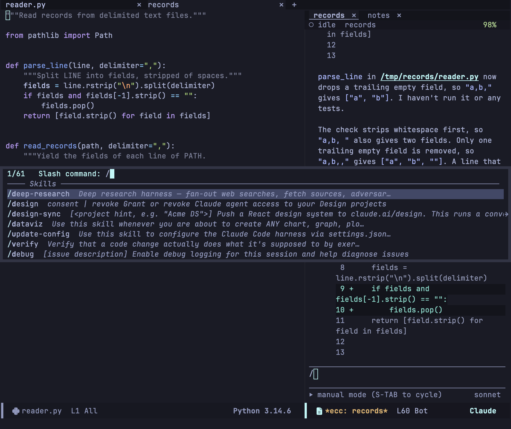
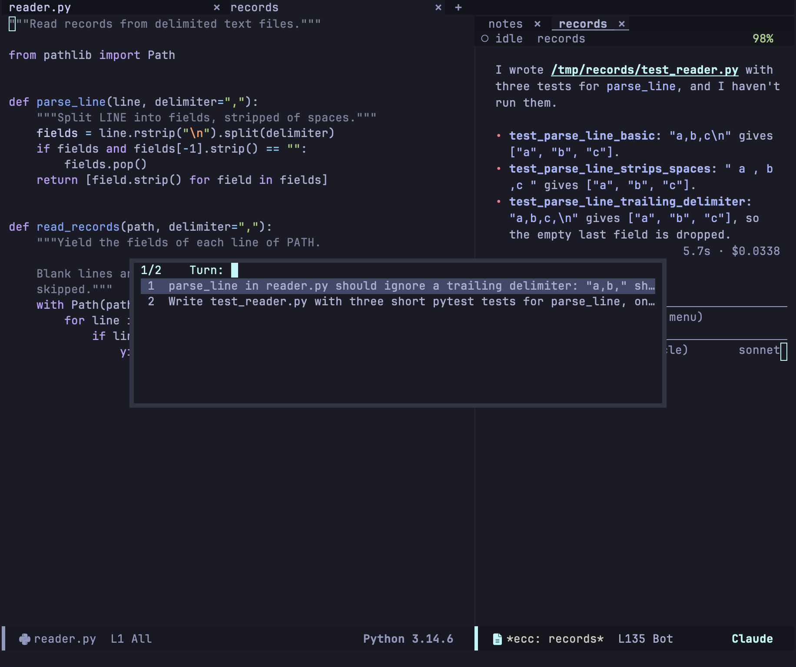

import Video from '../../../../components/Video.astro';

セッションバッファには、上からトランスクリプト、区切り線の下のプロンプト領域、フッターが並びます。読み取り専用のトランスクリプトでは、1 文字のキーでコマンドが動きます。プロンプト領域ではキーを押せば普段どおり文字が入り、コマンドは `C-c C-` のキーにあります。

## プロンプト領域

| キー | 動作 |
|---|---|
| `C-c C-c` | プロンプトを送信 |
| `RET` | 改行（`ecc-chat-return-sends` がオンなら送信） |
| `S-RET`、`C-j` | 改行 |
| `TAB` | スラッシュコマンドか [`@` 参照](/emacs-claude-code/ja/features/send/#プロンプトの--参照)を補完 |
| `C-c C-k` | プロンプト領域をクリア |
| `C-k`、`C-a`、`C-e` | 表示行の末尾まで削除、表示行の中を移動 |
| `M-p` / `M-n`、`C-<up>` / `C-<down>` | 履歴の前 / 次のプロンプト |
| `C-c C-r` | 過去のプロンプトを選んでポイントに挿入 |
| `C-c C-s` | CLI が提案したプロンプトを採用 |
| `C-c C-z` | 実行中のターンを中断 |
| `C-c C-q` | キューに入ったプロンプトを表示 |
| `C-c C-a` / `C-c C-d` | リクエストを[許可 / 拒否](/emacs-claude-code/ja/features/permissions/) |
| `C-c C-x` | [エディタのコンテキスト](/emacs-claude-code/ja/features/send/#エディタのコンテキスト)のオン・オフ |
| `C-c C-i` | 画像を挿入 |
| `C-c C-y` | クリップボードの画像を貼り付け |
| `C-c C-b` | `/btw` の質問を表示 |
| `C-c C-n` / `C-c C-p` | 次 / 前のターン |
| `C-c C-t` | ウィンドウを別のセッションに切り替え |
| `C-c C-e` | 会話を Markdown で書き出す |
| `S-TAB` | [権限モード](/emacs-claude-code/ja/features/permissions/#権限モード)を切り替え |
| `C-c ?` | [メニュー](/emacs-claude-code/ja/reference/menu/)を開く |

プロンプトの履歴はすべてのセッションで共有されます。`M-p` はプロンプト全体を置き換え、`C-c C-r` は選んだプロンプトをポイントに挿入します。Claude が動いている間に送ったプロンプトは、Remote Control で始まったターンと同じくキューで待ちます。フッターには権限モードとモデルが表示されます。

### 提案

`ecc-prompt-suggestions-enabled` をオンにすると、ターンのあとに CLI が次のプロンプトを提案することがあります。提案は空のプロンプト領域にゴーストテキストで表示され、`C-c C-s` で下書きとして採用できます。提案しないモデルもあります。

<Video name="suggestion" label="空のプロンプト領域に表示された提案を C-c C-s で採用して送信する様子" />

## スラッシュコマンド

空のプロンプトの先頭で `/` を押すと、CLI の説明付きでコマンドが並びます。`TAB` はプロンプトのどこでもコマンドを補完します。`/model`、`/effort`、`/permissions`、`/config`、`/btw` は、先に引数を尋ねます。ターミナルでしか使えないコマンドは並びませんが、全部入力すれば実行できます。

次のコマンドは Emacs が処理し、モデルには届きません: `/btw`、`/hooks`、`/plugins`、`/login`、`/logout`、`/auth-status`、`/resume`。

### `/btw` で横から質問する

`/btw <質問>` は、ここまでの会話を知っている、ツールなしの別の CLI に質問します。実行中のターンはそのまま続きます。質問と答えは、トランスクリプトにも記録にも残りません。

<Video name="btw" label="トランスクリプトの回答生成が続く横で、サイドクエリが並行して回答される様子" />

`C-c C-b` でセッションの質問を一覧します。`a` で別の質問、`c` で答えをコピー、`k` で実行中の質問を取り消し、`x` で一覧を消去、`q` で閉じます。続けて質問しても、含まれるのは直近の数往復だけです（`ecc-btw-history-limit`）。`ecc-btw-display` で、答えをウィンドウに出すか posframe のポップアップに出すかを決めます。

### `/resume` で別の会話へ

`/resume` は、このプロジェクトのどの記録を続けるかを尋ね、このウィンドウをその会話に切り替えます。ウィンドウ、タブ、バッファ、セッション名はそのままです。`/resume <session-id>` は直接その会話へ移ります。2 つのプロセスが 1 つの記録に書き込まないよう、Emacs は先に実行中のプロセスを止めます。ターンやキューに入ったプロンプトがある会話を離れるときは確認します。離れた会話はディスクに残ります。

## 画像

`C-c C-y` でクリップボードの画像を貼り付けます。`M-x yank-media` でも同じです。バッファへのドロップや、`C-c C-i` でファイルから挿入することもできます。どの画像も `ecc-image-dir` に保存され、パスとして CLI に渡されます。貼り付けた画像は PNG で保存されます。macOS のスクリーンショットは TIFF で Emacs に届くため、macOS に付属の `sips` で変換します。`sips` がなければ TIFF のまま保存され、API が受け付けないことがあります。セッションの終了時に削除するかは `ecc-image-cleanup` で決めます。

<Video name="image" label="画像をプロンプトにパスとして挿入し、回答で画像が解説される様子" />

画像は、一緒に来たプロンプトや呼び出しの下に表示されます。`I` で GIF を止めたり動かしたりでき、動画は `ffmpeg` が `PATH` にあれば最初のフレームが出ます。`RET` でファイルを開きます。`ecc-image-inline`（メニューの `I`）をオフにすると、ファイル名の行だけになります。

## トランスクリプト

<Video name="fold" label="トランスクリプトの折りたたみ: 全体を畳み、階層ごとに開き、TAB で特定ノードを開閉する様子" />

トランスクリプトは普通の読み取り専用のテキストなので、`isearch`、`occur`、ナローイング、`M-w` が使えます。

| キー | 動作 |
|---|---|
| `TAB` | ポイントのノードを開閉 |
| `1`〜`4` | その深さまでツリーを開く |
| `+` / `-` | すべて開く / 畳む |
| `n` / `p` | 次 / 前の見出し |
| `M-n` / `M-p` | 次 / 前の兄弟 |
| `^` | 親の見出しへ |
| `]` / `[` | 次 / 前のブロック |
| `T` | プロンプトで[ターンへジャンプ](#タイムライン) |
| `F` / `P` | [Files セクション](#files-セクション) / プランへジャンプ |
| `SPC` / `DEL` | 下 / 上へスクロール |
| `v` / `i` | プロンプト領域へ移動 |
| `RET` | ポイントのものを開く: リンク、[ソースの行](#ソースを開く)、サブエージェントのトランスクリプト、ツールの結果全体 |
| `o` | ノード全体（入力、diff、結果）を表示 |
| `w` | ポイントのコードブロック、なければ回答全体をコピー |
| `I` | ポイントの GIF を止める / 動かす |
| `a` / `d` | リクエストを許可 / 拒否（リクエスト以外では `d` で diff を表示） |
| `g` | トランスクリプトを再描画 |
| `L` | プロトコルのログを表示 |
| `t` / `R` | [ターミナルへ引き渡す](/emacs-claude-code/ja/features/sessions/#ターミナルへ引き渡す) / セッションを再開 |
| `C-c C-k` | プロンプト領域をクリア |
| `S-TAB` | 権限モードを切り替え |
| `q` | バッファを隠す |
| `?` | メニューを開く |

応答待ちのリクエストの上では、ほかにもキーが使えます。[権限とプラン](/emacs-claude-code/ja/features/permissions/#リクエストに答える)を参照してください。

### ソースを開く

トランスクリプトのコードで `RET` を押すと、セッションの横にファイルをその行で開きます。クリックでは開かないので、ポイントを動かすためにクリックしてもソースのウィンドウはそのままです。URL はクリックでもブラウザーで開きます。

| ポイントの位置 | 開くもの |
|---|---|
| 編集や Bash コマンドの diff の行 | その行。削除行は元の位置 |
| Bash コマンドの diff の上の `Updated`/`Created`/`Deleted` の行 | そのファイルで最初に変わった行 |
| ファイルを扱うツール呼び出しの見出し | Read の開始行、または最初に変わった行 |
| Files セクションや権限リクエストの diff の行 | その行 |
| Claude の返答中のパス（`foo.el:12`、`a/b.el`、`x.el#L3`） | そのファイルのその行 |

行番号は、そのあとのセッションによる同じファイルの変更に合わせて補正されるので、今その行がある位置で開きます。動画や音声のファイルはシステムのプレーヤーで開きます。コードブロックの中のパスはリンクになりません。`(setq ecc-markdown-linkify-paths nil)` でパスのリンクをやめられます。ファイルのない見出しでは、`RET` でツールの結果全体を表示します。

:::note[Bash コマンドの diff]
CLI がどの権限モードでも Bash コマンドの変更したファイルを報告するのは、`~/.claude/settings.json` に `"bashEditDiffEnabled": true` があるときだけです。プロジェクトの設定では効かず、対象は git リポジトリの中のファイルに限ります。
:::

### Files セクション

<Video name="files" label="Files セクションでファイルを展開して diff を表示し、そのファイルだけをレビューする様子" />

トランスクリプトの末尾には、セッションで扱ったファイルが並びます。パス、読み込み・編集・書き込みの回数（`R×n`、`E×n`、`W×n`）、変わった行数（`+n −n`）が表示されます。`F` でここへジャンプします。ファイルの上で `TAB` を押すと diff を開き、`RET` でファイルを開き、`d` でそのファイルだけを[レビュー](/emacs-claude-code/ja/features/review/)します。`(setq ecc-render-summary-position 'top)` でセクションを先頭に置けます。

### タイムライン

`T` でターンをプロンプトで一覧し、選んだターンへジャンプします。`C-c C-n` と `C-c C-p` で順に移動します。

