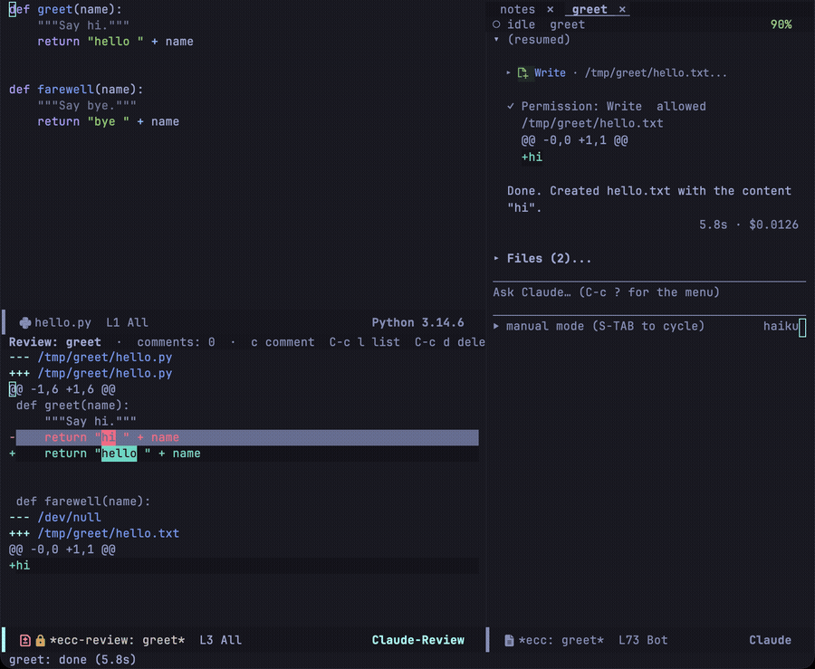
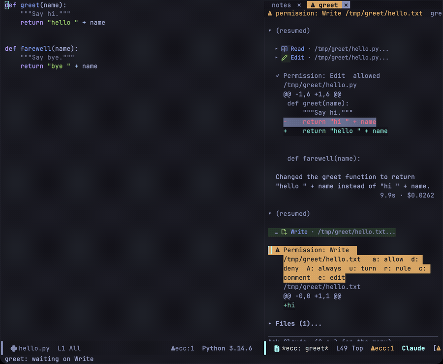
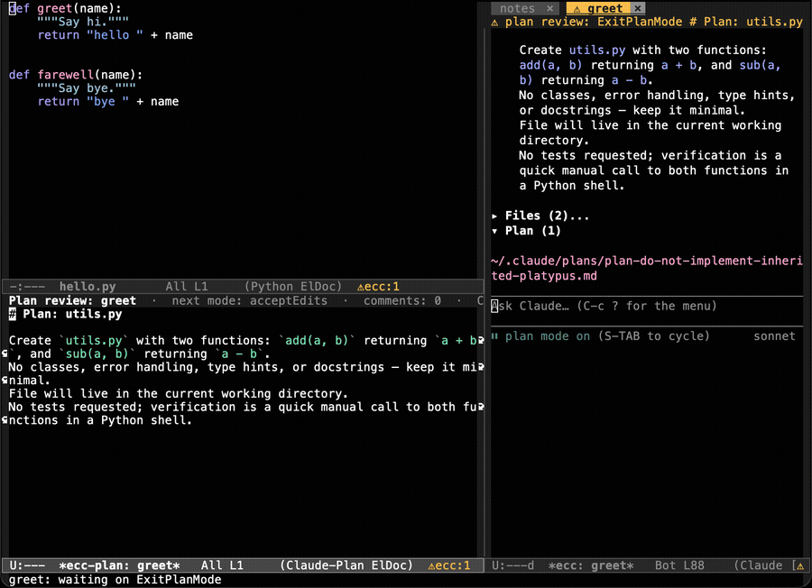
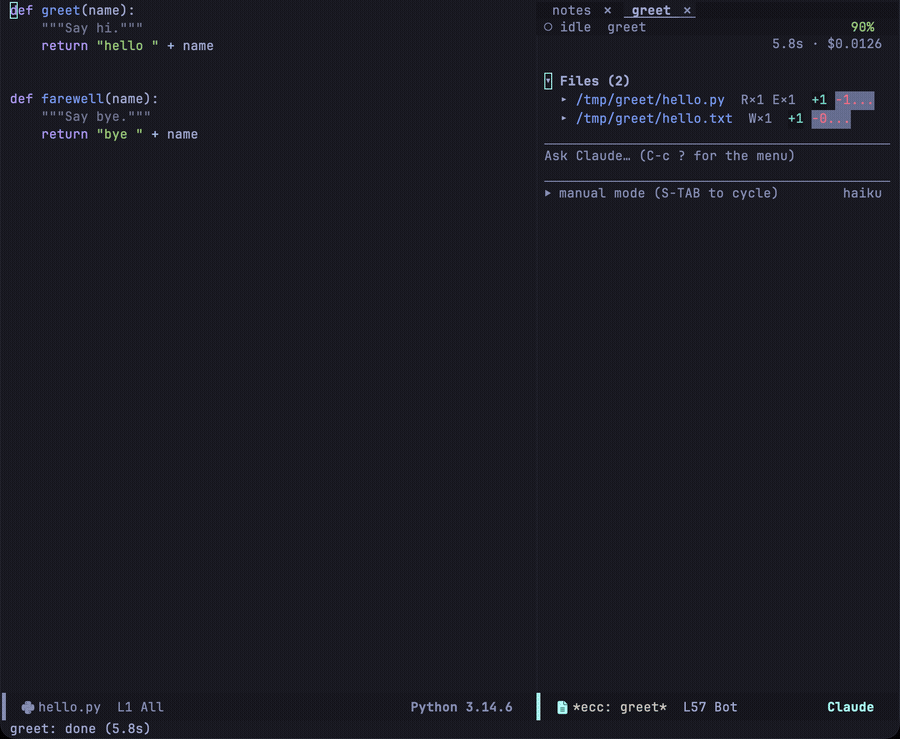
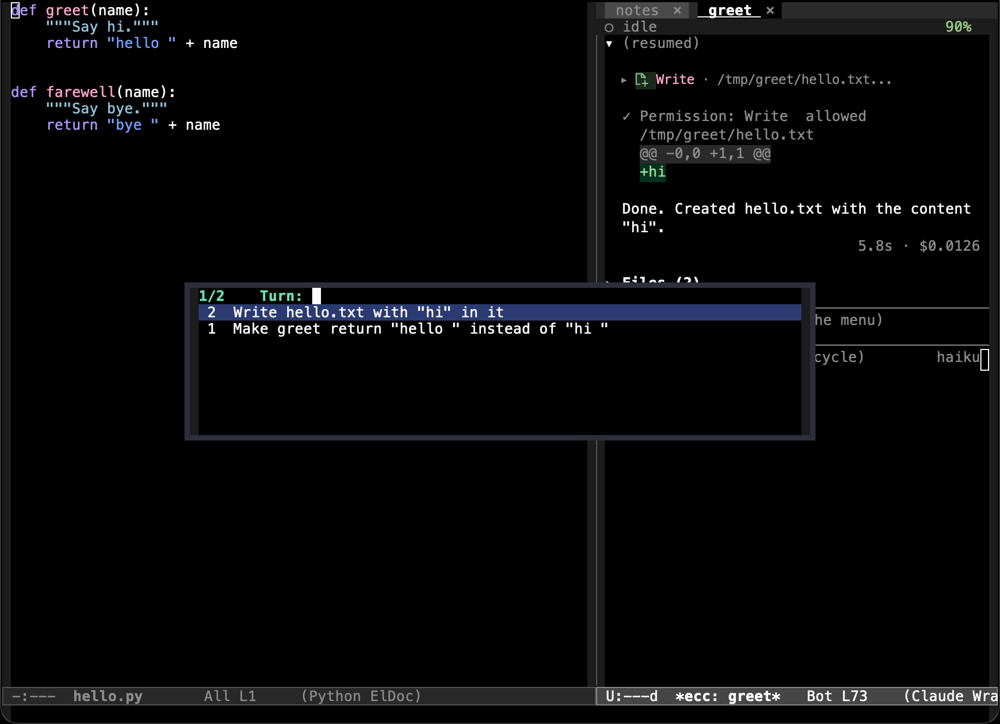

セッション内で行われたすべての変更を 1 つの統合 diff として確認し、修正が必要なハンクにコメントを付け、それらを 1 つのプロンプトにまとめて Claude へフィードバックできます。同一の diff バッファは、ファイル変更が実際に適用される前の個別提案のレビューや、プランモードで作成された計画の確認にも利用できます。

## セッション全体の変更をレビューする

Transient メニューで `D` を押すか、`C-c c D`、または `M-x ecc-review` を実行します。プレフィクス引数（`C-u D`）を渡すと対象ファイルを個別に指定できます。



Git 管理下のファイルは `git diff` で差分が計算されます（**作業ツリー内の未コミットな手作業の変更も含まれます**）。リポジトリ外のファイルや未追跡ファイルは、そのセッションで最初に行われた変更の直前の状態と比較されます。

| キー | 動作 |
|---|---|
| `c` | ポイント位置のハンクにコメントを付与 |
| `l` | 追加済みコメントの一覧から選んで該当ハンクへジャンプ |
| `d` | このハンクのコメントを削除 |
| `e` | 提案内容を直接編集（単一提案のレビュー時） |
| `C-c C-c` | コメントをプロンプトとして送信 |
| `C-c C-k` | レビューを終了し、コメントを破棄 |
| `g` | 差分を再読み込み |
| `q` | レビューバッファを埋める（bury-buffer） |

バッファは読み取り専用の `diff-mode` であるため、標準のナビゲーションキー（`n`, `p`, `RET`）でハンク間を移動したり、該当ソース行へジャンプしたりできます。

コメントは対象ハンクに直接紐付けられます。コメントが付いたハンクの見出しは太字になり、その直下にコメント内容が表示され、ヘッダーラインに合計コメント数がカウントされます。コメント済みのハンクで再度 `c` を押すと、以前入力した内容を再編集できます。

`C-c C-c` を押すと、すべてのコメントが 1 つのプロンプトバッファに集約されます:

````
## hello.py  L1-L6
```diff
 def greet(name):
     """Say hi."""
-    return "hi " + name
+    return "hello " + name
```
Comment: docstring の表記が hi のままになっています
````

このバッファ上で最終確認や加筆修正が可能です。`C-c C-c` で送信し、`C-c C-k` で送信せずに diff 画面へ戻ります。

## 適用前の提案をレビューする



トランスクリプト上の未承認リクエストに対して、`c` を押すとその変更箇所の diff レビューバッファが開きコメントを入力できます。また `e` を押すと提案されたコード全文を直接編集できます。どちらのキーもリクエストノード上で直接操作可能です（詳細は [プロンプトとトランスクリプト](/emacs-claude-code/ja/features/prompt/#回答待ちリクエストノード上での操作) を参照）。

ここでのコメントは **拒否の理由（rejection reason）** として Claude に送られます。そのため、一度変更を適用してから後から修正させるのではなく、提案を差し戻して最初から修正済みの案を出させることができます。

`e` を押すと、対象ファイルのメジャーモードが適用されたバッファで提案テキストが開きます。`C-c C-c` を押すと、Claude の提案ではなくあなたが編集したコード内容でリクエストが承認され、`C-c C-k` で承認を保留して戻ります。手動で内容を変更した場合、ecc は実際に何が適用されたかを示す diff を自動的に次のメッセージに付加します。

## プランモード

Claude がプランモードを終了しようとすると、作成した実行計画の全文を含むリクエストが届きます。ecc はセッション画面の横に、計画内容を編集できる専用バッファを開きます。



計画に対するフィードバック方法は 3 通りあります:

| フィードバック方法 | 操作手順 |
|---|---|
| 行コメント | 対象行で `C-c C-a` を押してコメントを追加（`C-c C-r` で削除） |
| インライン指示 | 任意の行に `@claude: …` と直接書き込む |
| 計画の直接編集 | テキストを直接編集（`C-c C-d` で元の提案との差分を確認可能） |

いずれかのフィードバックが存在する場合、`C-c C-c` は計画を承認せず、コメントや編集差分を添えて計画を差し戻し、再提案を求めます。フィードバックが何もない状態で `C-c C-c` を押すと計画を承認し、通常の実行モードへ移行します。移行先の権限モードは `C-c C-p` で選択でき、未選択時は `ecc-plan-default-mode`（既定値: `"acceptEdits"`）になります。

| キー | 動作 |
|---|---|
| `C-c C-c` | 計画を承認（フィードバックがある場合は差し戻し送信） |
| `C-c C-k` | 理由を添えて計画を却下 |
| `C-c C-a` / `C-c C-r` | 現在行にコメントを追加 / 削除 |
| `C-c C-d` | 元の計画に対する編集差分を表示 |
| `C-c C-p` | 承認後の移行先権限モードを選択 |
| `C-c C-n` | 前回の計画から変更された次の行へジャンプ |

再提案されたプランでは、前回の計画から新しく変更された行のマージンにマークが付き、ヘッダーラインに `+N −N` の差分行数が表示されます。

## 変更ファイル一覧 (Files セクション)



セッション内で変更されたすべてのファイルは、トランスクリプトの末尾に一覧表示されます。ファイルパス、実行された操作（`R×n` 読み込み、`E×n` 編集、`W×n` 書き込み）、および増減行数（`+n −n`）が確認できます。`TAB` を押すとそのファイルに対する全変更の累積 diff が展開され、`RET` でファイルを開き、`d` でそのファイル単体の diff レビューを開始できます。

トランスクリプト上で `f` を押すか（メニューでは `F`）、このセクションへ直接ジャンプできます。`ecc-render-summary-position` を `'top` に設定すると、このセクションを末尾ではなくトランスクリプトの先頭に配置することも可能です。

## タイムライン

トランスクリプト上で `T` を押すと、各ターンの開始プロンプト一覧が表示され、目的のターンへ瞬時にジャンプできます。`C-c C-n` と `C-c C-p` でターン単位の前後移動も可能です。



## レビュー表示時のウィンドウ配置

diff やプランのレビューには十分な画面スペースが必要です。レビュー開始時のウィンドウの挙動は以下の 2 つの変数で制御できます:

| 変数 | 説明 |
|---|---|
| `ecc-window-hide-on-review` | `'project` で現在レビュー中のプロジェクトのセッションを非表示、`'all` で全セッションを非表示、`nil` でウィンドウをそのまま維持 |
| `ecc-window-review-focus` | `'review` でレビューバッファにフォーカスを移動、`'session` でトランスクリプト側にポイントを維持、`nil` で元のフォーカスを維持 |

`ecc-toggle` はカレントプロジェクトの非表示セッションウィンドウを再表示し、`ecc-toggle-all` は全プロジェクトのものを再表示します。その他の設定項目は [設定リファレンス](/emacs-claude-code/ja/reference/configuration/) をご覧ください。
