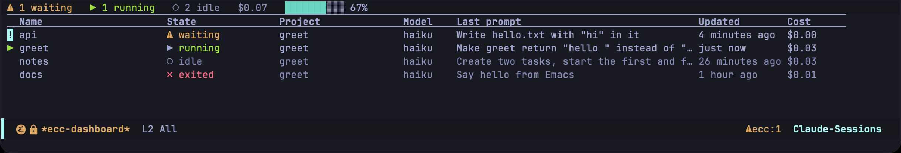
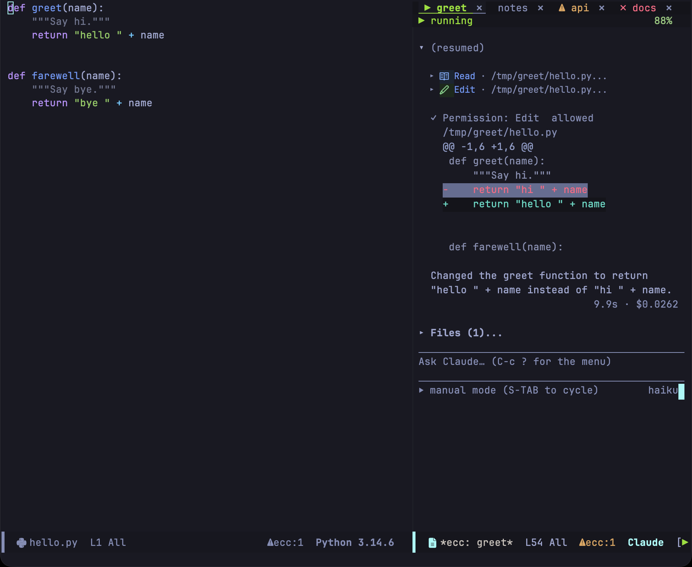

1 つのセッションは、実行中の `claude` プロセス、会話が描画されるトランスクリプトバッファ、そしてセッション名で構成されます。プロジェクトで最初のセッションを開始すると自動的にそのディレクトリ名が付けられ、同一プロジェクトで 2 つめ以降を開始する場合はセッション名の入力を求められます。セッションバッファを kill すると CLI プロセスも停止しますが、会話の記録はディスク上に保持されます。

## 会話の再開

Transient メニューで `r` を押すか（[メニュー解説](/emacs-claude-code/ja/features/menu/#r--resume)）、`M-x ecc-resume-menu` を実行します。現在の Emacs で動いているセッションが先頭に、続いて現在のプロジェクトで記録された過去の会話が、最近使われた順に一覧表示されます。


| アイコン | 状態 |
|---|---|
| ▶ | この Emacs インスタンスで実行中のアクティブセッション |
| ● | この Emacs 内にあるが、CLI プロセスが停止しているセッション |
| ◉ | 別のプロセスで実行されている会話 |
| ↺ | ディスク上に保存されている過去の記録 |

各項目にはセッション名、最終更新日時、ディレクトリ（過去の記録の場合は最初のプロンプト）が表示されます。`-f` スイッチを付けると、選択した会話を直接引き継ぐのではなく、新しい会話として分岐（フォーク）して開始できます。

:::caution[実行中の会話を再開すると履歴が分岐します]
同一のセッション ID に対して 2 つのプロセスが同時に書き込みを行うと、ファイルロック機構がないため記録ファイルが破損する恐れがあります。この状態は ◉ アイコンで示され、ecc は再開前に確認ダイアログを表示します。
:::

会話の記録は Claude Code 本体の保存先（`~/.claude/projects` 配下）に保存されるため、ターミナルで実行した会話もすべてここに一覧表示されます。各会話はツリー構造を形成しており、プロンプトの編集や中断、再開によって新しいブランチが作られます。

`h` を押すとプロセスを起動せずに記録だけを閲覧でき、そこから `r` で再開することも可能です。CLI プロセスが不意に停止した場合、ecc は自動的に再開するかどうかを促すメッセージを表示します。

## 過去の会話を検索する

セッション名ではなくやりとりの内容から探したい場合は、発言内容の文字列から会話を検索できます。Transient メニューで `/` を押すか、`C-c c /`、または `M-x ecc-search` を実行します。現在のプロジェクトの記録から検索文字列を含む会話が新しい順に、該当行とともに一覧表示されます。`RET` または `o` でカーソル位置のセッションを開きます。前置引数（`C-u`）を付けると、現在のプロジェクトだけでなく全プロジェクトを対象に検索します。

```
3 sessions said permission prompt in ~/Projects/emacs-claude-code/

Permission prompt rendering  2026-09-08 14:07  2d4f54c9  2 hits
    › how does the permission prompt decide which diff to show?
    ‹ …the block is drawn by `ecc-perm.el`, and a permission prompt keeps the tool input…

Dashboard columns  2026-09-06 10:22  f6743727  1 hit
    ‹ …an idle row is dimmed, and a permission prompt puts `!` in the gutter…
```

`›` はユーザーのプロンプト、`‹` は Claude の回答を表します。各ブロックの見出しには、会話のタイトル、最終更新日時、短縮セッション ID、およびヒット件数が表示されます。

| キー | 動作 |
|---|---|
| `RET` / `o` | カーソル位置の会話を開く |
| `n` / `p` | 次 / 前のセッションへ移動 |
| `g` | 同じ文字列で再検索 |

検索対象は会話のテキスト（プロンプトおよび回答の文章）に限定されます。ツールの実行結果やツール呼び出しの JSON、モデルが読み込んだファイルの内容などは検索対象から除外されています。これらを含めると、対象ファイルを読み込んだだけの無関係なセッションが大量にヒットしてしまうためです。検索文字列は大文字・小文字を区別しないリテラル文字列として照合され、正規表現ではありません。

セッション記録は 1 つで数万件ものメッセージを含むことがあるため、ecc はファイルを開く前にまず `rg` や `grep` を利用して文字列を含む記録ファイルを高速に絞り込み、該当する行だけを解析します。これにより、記録が 100 件・合計 100 MB 規模のプロジェクトであっても、1 秒未満で検索が完了します。どちらの外部コマンドも `PATH` に存在しない場合は全記録を直接読み込みます。処理時間は長くなりますが、同じ検索結果が得られます。

:::note[巻き戻し・破棄されたブランチも検索対象となります]
会話のアクティブな分岐（ブランチ）を厳密に判定するにはセッション記録の全行を走査する必要があり、高速な事前絞り込みのメリットが失われてしまいます。そのため、プロンプトの再編集や巻き戻しによって破棄された過去の分岐内の発言であっても検索結果にヒットし、該当セッションを開くことができます。
:::

## ダッシュボード

Transient メニューで `b`、`C-c c b`、または `M-x ecc-dashboard` を実行するとダッシュボードが開きます。



ダッシュボードには、この Emacs インスタンスが管理している全セッションが一覧表示されます。内部状態から直接描画されるため、不要なポーリングは行われません。外部プロセスで実行中の会話や過去の記録は、`r` や `h` からアクセスできます。

| 列 | 説明 |
|---|---|
| Name | セッション名（タブやモードラインに表示される名称） |
| State | 現在の動作状態およびユーザーの応答待ち有無 |
| Project | ディレクトリの末尾名（ツールチップにフルパスを表示） |
| Model | CLI から報告された使用中モデル |
| Last prompt | 直近のターンで送信されたプロンプト |
| Updated | 最後の応答があった時刻 |
| Cost | ここまでの累計コスト |

応答待ちのセッションが最上部に並び、残りのセッションが最近アクティブだった順に並びます。ガターには、ユーザーの操作を待っている行に `!`、画面上に表示されている行に `▶` が付き、アイドル状態の行は減光表示されます。ヘッダーラインには、各状態のセッション数、合計コスト、および現在最も逼迫しているレート制限の余裕度が表示されます（CLI から受け取った情報に基づき算出）。

| キー | 動作 |
|---|---|
| `RET` | 該当セッションへ移動 |
| `+` | 新しいセッションを開始 |
| `k` | プロセスを停止しバッファを閉じる（記録は保持） |
| `D` | ディスク上の記録ファイルを完全に削除 |
| `r` | セッション名を変更 |
| `R` | セッションを再開 |
| `a` / `d` | 待機中の最古のリクエストを許可 / 拒否 |
| `C` | セッションのケイパビリティ（能力一覧）を表示 |
| `U` | 使用量とレート制限を表示 |
| `g` | ダッシュボードを再描画 |

`k` はプロセスのみを停止して記録は残すため、後から `r` で再開できます。`D` は記録ファイル自体を完全に削除します。`a` と `d` の動作詳細は [プロンプトとトランスクリプト](/emacs-claude-code/ja/features/prompt/) をご覧ください。

## タブライン

セッションウィンドウ上部のタブラインには、各セッションがタブとして並びます。



| マーク | 状態 | 表示色 |
|---|---|---|
| `⚠` | ユーザーの回答待ち | 点滅する警告ハイライト |
| `▶` | 処理中（作業中） | 緑 |
| `✗` | プロセス停止 | 赤 |
| (なし) | アイドル（待機中） | 減光表示 |

現在のウィンドウに表示されているセッションのタブは太字と下線で強調され、バックグラウンドで処理中のセッションは控えめな緑色で表示されます。点滅が不要な場合は `ecc-tab-blink` を `nil` に設定してください。

タブはセッションが開始された順序で並ぶため、作業中に位置が動くことはありません。タブを `mouse-1` でクリックするか、キーボードから `S` を押すと、そのウィンドウの表示対象をそのセッションに切り替えます。タブ右端の `x` をクリックすると確認のうえセッションを終了します。

Emacs 全体のタブライン（tab-bar）にも同様の `⚠` や `▶` を反映したい場合は、`ecc-tab-bar-state` を有効にし、`tab-bar-tab-name-function #'ecc-tab-bar-tab-name` を設定してください。

タブの下にあるヘッダーラインには、左側にセッションの現在状態、右側にコンテキストウィンドウの残り容量が表示されます（容量が逼迫してくると黄色、赤色へと変化します）。

## 応答を待っているセッションの把握

- **モードラインの `⚠ecc:N`**: `N` は全セッションで保留されているリクエストの合計数を示します。クリックするとダッシュボードが開きます。
- **イベント通知**: `ecc-notify-level`（`'message`, `'pulse`, `'desktop`, `nil`）および `ecc-notify-events`（ターン完了、承認リクエスト、プロセス終了）により、適切な強さで通知を受け取れます。
- **タブライン表示**: 前述のタブアイコンと色分けにより一目で状態がわかります。

`n` および `N` を押すと、保留中のリクエストがある次のセッションへ即座に移動できます（`n` は全セッション対象、`N` はカレントプロジェクト内のみ対象）。どちらも `ecc-global-map` を経由して任意のバッファから実行可能です。

これらの通知インジケーターは、セッションの応答待ちを見落とさないようデフォルトですべて有効化されています。

各設定項目の詳細は [設定リファレンス](/emacs-claude-code/ja/reference/configuration/) をご覧ください。
