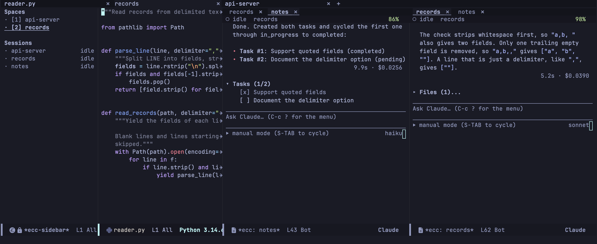
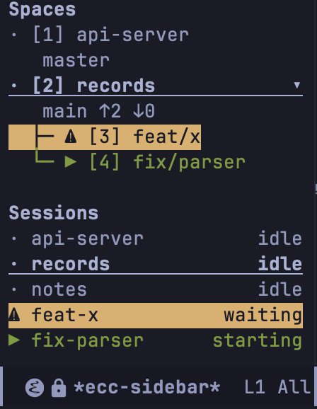

**Space** は、Emacs のタブを 1 つ持つプロジェクトです。git の worktree も専用の Space になり、元のリポジトリの下に表示されます。Space はデフォルトでオンです（`ecc-use-spaces`）。使わないときのレイアウトは[最後](#space-を使わないとき)にまとめています。

## Space の仕組み



左にサイドバー、上にプロジェクトごとのタブがあり、トランスクリプトはソースの右に並びます。新しいトランスクリプトは、いちばん右のウィンドウを分割して開きます。どれも普通のウィンドウなので、分割、移動、削除は自由です。Space を離れて戻ると、ウィンドウの配置も戻ります。

トランスクリプトは `ecc-space-session-min-width`（80）より狭くしません。並びがいっぱいになると、いちばん長く使っていないセッションがウィンドウを譲り、ウィンドウなしで動き続けます。サイドバーか `C-c c V` で戻せます。

何も動いていない Space に移るとセッションが始まり、最後のセッションを kill すると Space も閉じます。以前の会話を続けるには、開いたセッションで `/resume` と入力します。`ecc-space-always-session` をオフにすると、Space はソースだけで開き、プロジェクトの最後のバッファを kill するまで残ります。

| キー | コマンド | 動作 |
|---|---|---|
| `C-c c j` | `ecc-space-goto` | 名前で Space へ移動。記録しかないプロジェクトも選べる |
| `C-c c z` | `ecc-space-zoom` | このウィンドウをタブいっぱいに広げる。もう一度で戻す |
| `C-c c V` | `ecc-space-reset-windows` | Space を新しいタブの配置に戻す。ソースが左、トランスクリプトがその横 |
| `C-c c ?` → `X` | `ecc-space-close` | この Space を閉じ、worktree も含めて中で動くものをすべて止める。そのあと worktree を削除するか尋ねる |
| — | `ecc-space-jump` | サイドバーの番号で N 番目の Space へ移動 |

タブバーを描くかどうかは `tab-bar-show` が決めます。ecc が自分で `tab-bar-mode` をオンにすることはありません。`(setq tab-bar-show nil)` でも Space は同じように動き、サイドバーが一覧になります。

## サイドバー



`C-c c b`（`ecc-sidebar-focus`）でサイドバーを開き、ポイントをそこへ移します。もう一度押すとポイントが元に戻ります。

上半分は Space の一覧で、状態、番号、名前が並びます。リポジトリにはブランチと upstream との差が表示され、その下に worktree が並びます。下半分はセッションの一覧で、印は[タブライン](/emacs-claude-code/ja/features/sessions/#タブライン)と同じです。

| キー | 動作 |
|---|---|
| `RET` | その行の Space かセッションへ移動 |
| `n`、`p` | 次 / 前の行 |
| `TAB` | リポジトリの worktree を開閉 |
| `1`〜`9` | その番号の Space へ移動 |
| `c` | この Space でセッションを開始 |
| `W` | この Space から worktree を作り、そこでセッションを開始 |
| `k` | このセッションを停止 |
| `K` | この worktree のディレクトリを削除 |
| `X` | この Space を閉じる |
| `a`、`d` | このセッションが待っているものを許可 / 拒否。[ダッシュボード](/emacs-claude-code/ja/features/sessions/#ダッシュボード)と同じ |
| `g` | git の状態を更新して再描画 |
| `q` | サイドバーを隠す |

幅は `ecc-sidebar-width`（28 桁）です。`ecc-sidebar-sessions-sort` はセッションの並び順を決めます。`spaces`（デフォルト）はそれぞれの Space の下に、`priority` は応答待ちのものを先に並べます。

## worktree

git の worktree は、リポジトリの別のブランチを持つもう 1 つの作業ツリーです。2 つのセッションが、互いの編集を見ずに 1 つのプロジェクトで作業できます。次のコマンドは、Space のオン・オフにかかわらず使えます。

| キー | コマンド | 動作 |
|---|---|---|
| `C-c c ?` → `W c` | `ecc-start-worktree` | リポジトリの隣にブランチをチェックアウトし、セッションを開始 |
| `C-c c ?` → `W o` | `ecc-start-in-worktree` | 既存の worktree でセッションを開始 |
| `C-c c ?` → `W k` | `ecc-remove-worktree` | worktree のセッションを止め、worktree を削除 |

`ecc-start-worktree` は既存のブランチを候補に出します。既存のブランチはそのままチェックアウトし、新しいブランチは `HEAD` から作ります。別の worktree がすでにそのブランチを持っていれば、そこでセッションを始めるかを尋ねます。

worktree は `ecc-worktree-directory`（デフォルトは `.claude/worktrees`）に置きます。相対パスならリポジトリの下（`<repo>/.claude/worktrees/feat-x`）に置きます。絶対パスならすべてのリポジトリで共有します（`<directory>/<repository>/feat-x`）。

worktree の最後のセッションが終わると、ecc はその worktree を削除するか尋ねます。**ブランチは削除しません**。worktree の削除で消えるのはディレクトリだけです。未コミットの変更や未追跡のファイルがあれば、ecc は worktree の名前を示してもう一度尋ねてから、削除を強制します。

## 作業を worktree のセッションに引き渡す

[Emacs の MCP サーバー](/emacs-claude-code/ja/start/installation/#mcp-サーバーの有効化)が有効（`ecc-mcp-enabled`）なら、セッションに worktree での作業を頼むと、モデルに `start_worktree_session` が示されます。モデルはブランチ名を決めて依頼文を書きます。Emacs は `HEAD` から worktree を作って Space として開き、そこでセッションを始めて依頼文を渡します。依頼文には、会話が触れたファイル、そのプラン、記録、未コミットの変更を書き足します。その作業は先にコミットするか、未コミットであることを依頼文に書いてください。

モデルが自分で worktree を作ろうとすると、Emacs はそのリクエストを拒否してツールを使うよう伝えます。worktree に触れた下書きには、ツールのことをモデルに思い出させる 1 行が添えられ、プロンプトの下に "1 line Emacs added" として折りたたんで表示されます。別の worktree でチェックアウト済みのブランチは拒否されるので、2 つのセッションが 1 つの worktree を共有することはありません。Lisp からは `ecc-worktree-delegate` で呼べます。

MCP サーバーがなければ、CLI が自分で `git worktree add` を実行し、同じ会話のまま続けます。

[Space で 1 つの仕事を終えるまで](/emacs-claude-code/ja/usecases/spaces/)で、この流れを追っています。

## Space を使わないとき

```elisp
(setq ecc-use-spaces nil)
```

Space がオフのとき、トランスクリプトは main、sub-1、sub-2 の役割を持つサイドウィンドウに開きます。タブ、サイドバー、Space のコマンドはありません。worktree は使えます。

| 設定 | 既定値 | 説明 |
|---|---|---|
| `ecc-window-large-frame-min-height` | `80` | 3 つ目のセッションウィンドウに必要なフレームの高さ（行数）。これより低いと、セッションは 2 つのウィンドウを分け合い、タブラインで切り替える |
| `ecc-window-sub-height` | `0.33` | 3 つ目のセッションウィンドウの高さ（比率か行数）。主な領域から取る |

`M-x ecc-focus-project` は 1 つのプロジェクトのセッションとソースだけを表示し、ほかのプロジェクトのセッションウィンドウを画面から外します。何も kill せず、プロセスも止めません。
