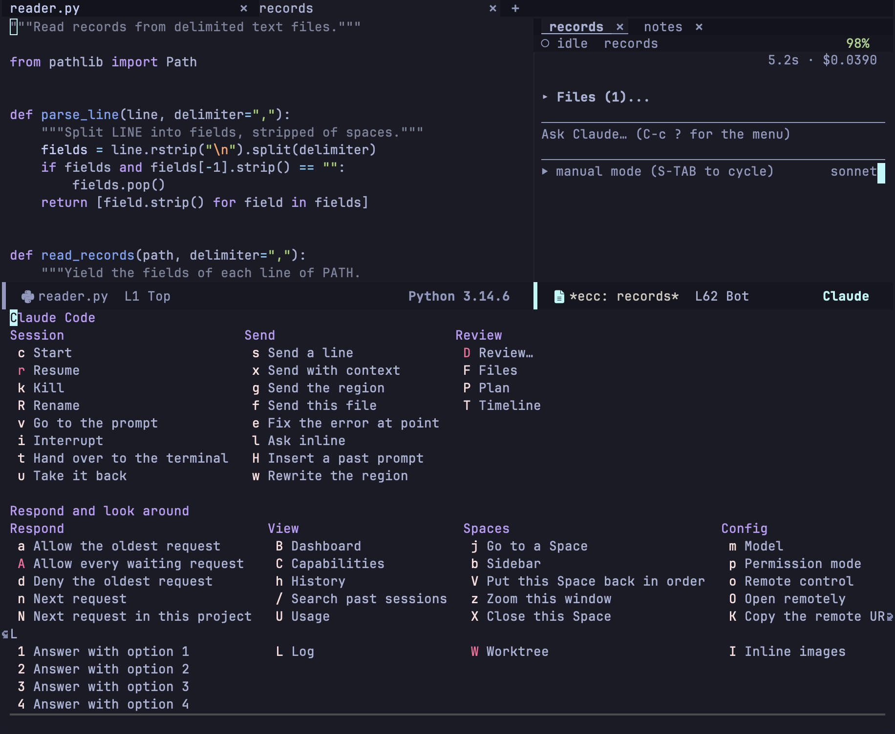

セッションバッファでは `C-c ?`、どのバッファからでも `C-c c ?` か `M-x ecc-menu` で、[transient](https://magit.vc/manual/transient/) で作ったメニューが開きます。`C-g` で閉じます。`-` で始まる行は、そのあとのコマンドのスイッチです。

メニューは今のバッファのセッションを対象にします。それがなければ、プロジェクトにただ 1 つあるセッション、画面にただ 1 つあるセッション、最後に使ったセッションの順に選びます。決められないときは一度だけ尋ね、その答えをバッファに記憶します。

## Session

| キー | 動作 | 参照 |
|---|---|---|
| `c` | セッションを開始（`C-u c` でディレクトリと名前を尋ねる） | [セッション](/emacs-claude-code/ja/features/sessions/#セッションを始める場所) |
| `r` | 会話を再開（`-f` で分岐） | [再開](/emacs-claude-code/ja/features/sessions/#会話を再開する) |
| `k` | プロセスを止め、バッファを kill。記録は残る | [セッション](/emacs-claude-code/ja/features/sessions/) |
| `R` | セッションの名前を変更 | [セッション](/emacs-claude-code/ja/features/sessions/) |
| `v` | セッションを表示し、プロンプトへ移動 | [セッション](/emacs-claude-code/ja/features/sessions/) |
| `i` | ターンを中断 | [セッション](/emacs-claude-code/ja/features/sessions/) |
| `t` / `u` | ターミナルへ引き渡す / 取り戻す | [引き渡し](/emacs-claude-code/ja/features/sessions/#ターミナルへ引き渡す) |

## Send

| キー | 動作 | 参照 |
|---|---|---|
| `s` / `x` / `g` / `f` | 1 行 / コンテキスト付きの 1 行 / リージョン / ファイルを送る | [コードから送る](/emacs-claude-code/ja/features/send/#行リージョンファイルを送る) |
| `e` | ポイントのエラーを直す | [エラーを直す](/emacs-claude-code/ja/features/send/#ポイントのエラーを直す) |
| `l` | インラインで質問 | [インラインで質問](/emacs-claude-code/ja/features/send/#インラインで質問する) |
| `H` | 過去のプロンプトを挿入 | [プロンプト](/emacs-claude-code/ja/features/prompt/#プロンプト領域) |
| `w` | リージョンを書き換える | [書き換え](/emacs-claude-code/ja/features/send/#リージョンを書き換える) |

## Review

| キー | 動作 | 参照 |
|---|---|---|
| `D` | レビューのメニューを開く | [変更のレビュー](/emacs-claude-code/ja/features/review/) |
| `F` / `P` | Files セクション / プランへジャンプ | [Files セクション](/emacs-claude-code/ja/features/prompt/#files-セクション) |
| `T` | ターンへジャンプ | [タイムライン](/emacs-claude-code/ja/features/prompt/#タイムライン) |

## Respond

| キー | 動作 | 参照 |
|---|---|---|
| `a` / `d` | 最も古いリクエストを許可 / 拒否 | [権限](/emacs-claude-code/ja/features/permissions/#リクエストに答える) |
| `A` | 応答待ちのリクエストをすべて許可（`-r` でツールを記憶） | [権限](/emacs-claude-code/ja/features/permissions/#リクエストに答える) |
| `n` / `N` | 次の応答待ちのリクエスト（全体 / このプロジェクト） | [応答待ちのセッション](/emacs-claude-code/ja/features/sessions/#応答待ちのセッション) |
| `1`〜`4` | 質問にその選択肢で答える | [質問](/emacs-claude-code/ja/features/permissions/#質問) |

## View

| キー | 動作 | 参照 |
|---|---|---|
| `B` | ダッシュボード | [ダッシュボード](/emacs-claude-code/ja/features/sessions/#ダッシュボード) |
| `C` | ケイパビリティ | [ケイパビリティ](/emacs-claude-code/ja/features/other/#ケイパビリティ) |
| `h` | 記録された会話を読む。そこで `r` を押すと再開 | [再開](/emacs-claude-code/ja/features/sessions/#会話を再開する) |
| `/` | 過去の会話を検索 | [検索](/emacs-claude-code/ja/features/sessions/#過去の会話を検索する) |
| `U` | 使用量とレート制限 | [使用量](/emacs-claude-code/ja/features/other/#使用量) |
| `L` | プロトコルのログ（`<<` が受信、`>>` が送信）。問題の調査やバグ報告に使う | [設定](/emacs-claude-code/ja/reference/configuration/#ログ) |

## Spaces

| キー | 動作 | 参照 |
|---|---|---|
| `j` | Space へ移動 | [Space](/emacs-claude-code/ja/features/spaces/#space-の仕組み) |
| `b` | サイドバー | [サイドバー](/emacs-claude-code/ja/features/spaces/#サイドバー) |
| `V` / `z` | この Space のウィンドウを並べ直す / このウィンドウを広げる | [Space](/emacs-claude-code/ja/features/spaces/#space-の仕組み) |
| `X` | この Space を閉じる | [Space](/emacs-claude-code/ja/features/spaces/#space-の仕組み) |
| `W` | worktree: `c` 新規、`o` 開く、`k` 削除 | [worktree](/emacs-claude-code/ja/features/spaces/#worktree) |

## Config

| キー | 動作 | 参照 |
|---|---|---|
| `m` | 実行中のセッションのモデルを変える | |
| `p` | 権限モードを変える | [権限モード](/emacs-claude-code/ja/features/permissions/#権限モード) |
| `o` | Remote Control のオン・オフ。Claude の Web アプリやデスクトップアプリからセッションを操作できる | |
| `O` / `K` | セッションを claude.ai/code で開く / その URL をコピー（Remote Control が必要） | |
| `I` | トランスクリプトの画像の表示・非表示 | [画像](/emacs-claude-code/ja/features/prompt/#画像) |
