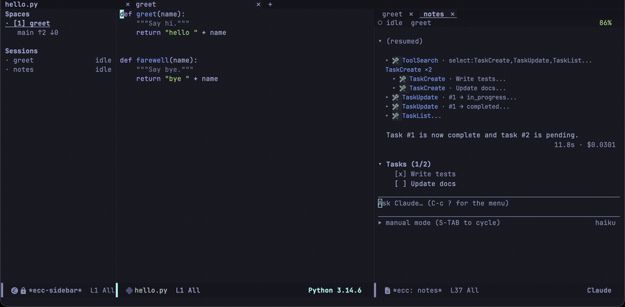
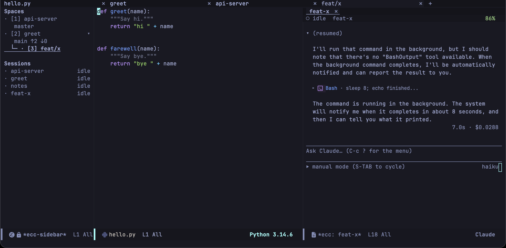

[Space](/emacs-claude-code/ja/features/spaces/) を使った作業の流れの一例です。プロジェクトを選んで会話を進め、実装を専用の worktree に任せ、終わったら両方を片付けます。

## プロジェクトへ移動する

`C-c c j`（`ecc-space-goto`）を押すと、どの Space に移動するか尋ねられます。候補に並ぶのは、現在開いている Space だけではありません。ecc は CLI の会話記録を読むため、**これまでに一度でもセッションを開いたことのあるプロジェクトはすべて候補になります**。先月作業したきりでプロセスもタブも残っていないプロジェクトでも、`RET` ひとつですぐに戻れます。

選ぶと、その Space がサイドバーに追加され、セッションが開始されます。

## 会話する

セッションはプロジェクトのソースの隣に開きます。あとは普段どおり、質問し、読み、答えていきます。やがて会話が実装へと進んだら、このウィンドウから作業を切り出すタイミングです。

「worktree を切ってそこでやって」と依頼すると、[Emacs の MCP サーバー](/emacs-claude-code/ja/start/installation/)が有効（`ecc-mcp-enabled`）であれば、Claude が `start_worktree_session` を呼び出します。Emacs は worktree を作成し、リポジトリ配下に専用の Space として開き、セッションを開始して指示内容を渡します。元の会話には引き渡し先が報告され、そのままやり取りを続けられます。

## 片付ける

実装が終わったら、worktree セッションのバッファを kill します。その Space には他に何もないため自動で閉じ、隣の Space に戻ります。あわせて ecc が worktree のディレクトリも削除するか確認します。どちらを選んでもブランチは残ります。
