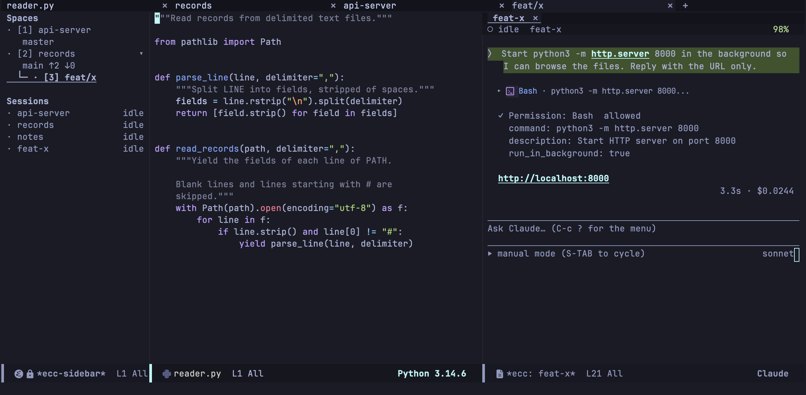

import Video from '../../../../components/Video.astro';

[Space](/emacs-claude-code/ja/features/spaces/) を使った作業の流れの一例です。プロジェクトを選んで会話を進め、実装を専用の worktree に任せ、終わったら両方を片付けます。

## プロジェクトへ移動する

`C-c c j`（`ecc-space-goto`）を押すと、どの Space に移動するか尋ねられます。候補は今開いているものだけではありません。ecc は CLI の会話記録を読むので、これまでにセッションを始めたことのあるプロジェクトがすべて候補に並びます。先月作業したきりで、プロセスもタブも残っていないプロジェクトにも `RET` ひとつで移れます。

選ぶと、その Space がサイドバーに加わり、そこでセッションが始まります。

<Video name="usecase-goto" label="一覧からプロジェクトを選択: 専用タブが現れ、サイドバーに行が追加され、ソースの隣にセッションが開く" />

## 会話する

セッションはプロジェクトのソースの隣に開きます。あとは普段どおり、質問し、読み、答えます。会話が実装の段階に入ったら、作業をこのウィンドウから切り出します。

「worktree を切ってそこでやって」のように worktree を頼みます。[Emacs の MCP サーバー](/emacs-claude-code/ja/start/installation/)が有効（`ecc-mcp-enabled`）なら、Claude が `start_worktree_session` を呼び出します。Emacs は worktree を作り、リポジトリの下に専用の Space として開き、そこでセッションを始めて指示を渡します。元の会話には引き渡し先が報告され、会話はそのまま続きます。

## 片付ける

実装が終わったら、worktree のセッションのバッファを kill します。その Space にはほかに何もないので Space が閉じ、隣の Space に戻ります。このとき ecc は、worktree のディレクトリも削除するかを尋ねます。どちらを選んでもブランチは残ります。
